.. _formulations:

************
Formulations
************

.. meta::
   :description: GAMSPy User Guide
   :keywords: User, Guide, GAMSPy, gamspy, GAMS, gams, mathematical modeling, sparsity, performance, piecewise, linear, function

Formulations in GAMSPy provide an intuitive and user-friendly way to define
complex relations without delving deeply into the underlying mathematical
details. You can focus on what you want to achieve rather than how it is
implemented. For those interested in exploring the mechanics, GAMSPy also
provides full visibility into the underlying formulation. We've implemented a
variety of versatile formulations, including piecewise linear functions and
neural network construction blocks, empowering you to seamlessly integrate
advanced concepts into your optimization workflows.

Neural Network Related Formulations
-----------------------------------

GAMSPy supports following neural network related formulations:

- :meth:`Linear <gamspy.formulations.Linear>`
- :meth:`Conv1d <gamspy.formulations.Conv1d>`
- :meth:`Conv2d <gamspy.formulations.Conv2d>`
- :meth:`MaxPool2d <gamspy.formulations.MaxPool2d>`
- :meth:`MinPool2d <gamspy.formulations.MinPool2d>`
- :meth:`AvgPool2d <gamspy.formulations.AvgPool2d>`
- :meth:`RNN <gamspy.formulations.RNN>`
- :meth:`GRU <gamspy.formulations.GRU>`
- :meth:`flatten_dims <gamspy.formulations.flatten_dims>`

You can find more info at :ref:`nn-formulations`.

Piecewise Linear Functions
--------------------------

Piecewise linear functions are a cornerstone of practical optimization, as they
naturally arise in countless real-world scenarios. Whether modeling cost
structures, approximating nonlinear relationships, or defining breakpoints in
decision processes, their versatility and prevalence make them indispensable.
Recognizing this, we implemented robust support for piecewise linear
formulations in GAMSPy, enabling users to seamlessly incorporate these
essential tools into their models.

GAMSPy supports the following three formulations for implementing piecewise
linear functions:

- :meth:`pwl_interval_formulation <gamspy.formulations.pwl_interval_formulation>`
- :meth:`pwl_convexity_formulation <gamspy.formulations.pwl_convexity_formulation>`
- :meth:`pwl_dlog_formulation <gamspy.formulations.pwl_dlog_formulation>`

These formulation-specific functions accept separate x and y coordinates.
Alternatively, :class:`PWLCurve <gamspy.formulations.PWLCurve>` describes the
curve independently of a container, and
:meth:`pwlinear <gamspy.formulations.pwlinear>` selects one of the three
formulations when the curve is used.

Basic Usage
^^^^^^^^^^^

To define a piecewise linear function, specify the x and y coordinates of its
breakpoints. Consider the following graph:

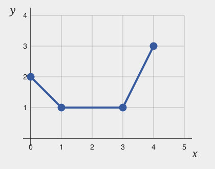

  A piecewise linear graph with four breakpoints.

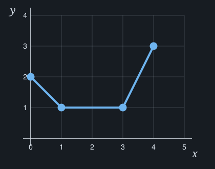

  A piecewise linear graph with four breakpoints.

The same graph can be modeled through any of the following interfaces:

.. tab-set::

   .. tab-item:: Interval formulation

      .. code-block:: python

         import gamspy as gp

         m = gp.Container()
         x = gp.Variable(m)
         y, eqs = gp.formulations.pwl_interval_formulation(
             x,
             x_points=[0, 1, 3, 4],
             y_points=[2, 1, 1, 3],
         )

   .. tab-item:: Convexity formulation

      .. code-block:: python

         import gamspy as gp

         m = gp.Container()
         x = gp.Variable(m)
         y, eqs = gp.formulations.pwl_convexity_formulation(
             x,
             x_points=[0, 1, 3, 4],
             y_points=[2, 1, 1, 3],
         )

   .. tab-item:: DLog formulation

      .. code-block:: python

         import gamspy as gp

         m = gp.Container()
         x = gp.Variable(m)
         y, eqs = gp.formulations.pwl_dlog_formulation(
             x,
             x_points=[0, 1, 3, 4],
             y_points=[2, 1, 1, 3],
         )

   .. tab-item:: Curve API

      .. code-block:: python

         import gamspy as gp

         m = gp.Container()
         x = gp.Variable(m)
         curve = gp.formulations.PWLCurve(
             [(0, 2), (1, 1), (3, 1), (4, 3)]
         )
         y, eqs = gp.formulations.pwlinear(x, curve, method="dlog")

The Curve API keeps the curve description separate from its formulation.
Changing ``method`` to ``"interval"``, ``"convexity"``, or ``"dlog"`` selects
the implementation without changing the points. All four interfaces return the
dependent variable ``y`` and a list of equations that must be included in the
model.

Representing Graph Structures
^^^^^^^^^^^^^^^^^^^^^^^^^^^^^

A piecewise linear graph can contain connected segments, unbounded rays,
excluded ranges, discontinuities, and overlapping chains. The following figure
summarizes these structures:

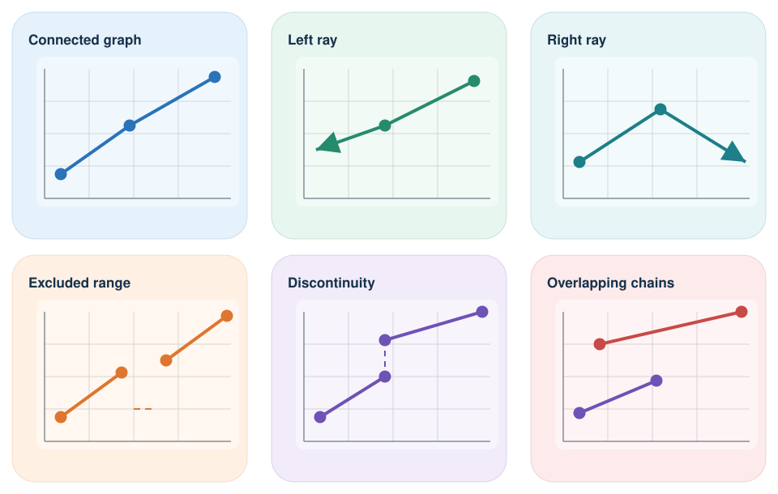

  Common piecewise linear graph structures supported by GAMSPy.

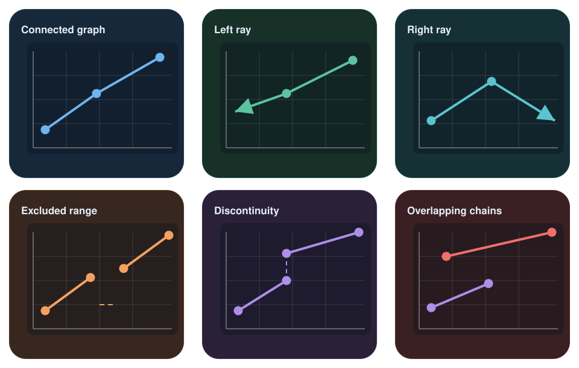

  Common piecewise linear graph structures supported by GAMSPy.

In a ``PWLCurve`` point stream, increasing x-coordinates continue a chain,
equal x-coordinates create a discontinuity, ``None`` disconnects two chains,
and a decrease in x starts a new independent chain. The same structures can be
represented with matching ``x_points`` and ``y_points``.

Connected Graphs
~~~~~~~~~~~~~~~~

An ordinary connected graph needs only increasing x-coordinates. For example,
``PWLCurve([(0, 0), (2, 4), (4, 6)])`` connects all three points. The equivalent
paired data is ``x_points=[0, 2, 4]`` and ``y_points=[0, 4, 6]``. Every
formulation supports this case.

Unbounded Rays
~~~~~~~~~~~~~~

A ray extends a graph beyond its first or last finite point. With the
formulation-specific functions, setting ``bound_left`` or ``bound_right`` to
``False`` extends the corresponding outer segment and uses that segment's
gradient:

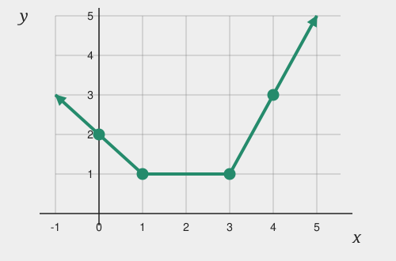

  A piecewise linear graph whose outer segments extend as rays.

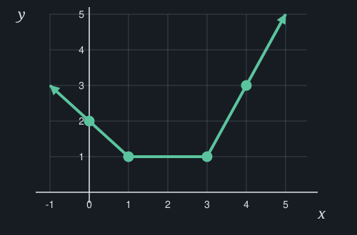

  A piecewise linear graph whose outer segments extend as rays.

.. code-block:: python

   import gamspy as gp

   m = gp.Container()
   x = gp.Variable(m)
   y, eqs = gp.formulations.pwl_interval_formulation(
       x,
       x_points=[0, 1, 3, 4],
       y_points=[2, 1, 1, 3],
       bound_left=False,
       bound_right=False,
   )

To choose gradients independently of the outer segments, define explicit rays.
The following two examples describe the same graph: the left ray has gradient
2, and the right ray has gradient -1.

.. tab-set::

   .. tab-item:: Curve API

      .. code-block:: python

         curve = gp.formulations.PWLCurve(
             [(0, 1), (2, 4), (4, 3)],
             left_gradient=2,
             right_gradient=-1,
         )
         y, eqs = gp.formulations.pwlinear(x, curve, method="dlog")

   .. tab-item:: Paired points

      .. code-block:: python

         import math

         y, eqs = gp.formulations.pwl_dlog_formulation(
             x,
             x_points=[-math.inf, 0, 2, 4, math.inf],
             y_points=[2, 1, 4, 3, -1],
         )

For paired data, ``-math.inf`` and ``math.inf`` mark the left and right rays,
and the matching values in ``y_points`` are their gradients. ``PWLCurve`` uses
``left_gradient`` and ``right_gradient`` for the same purpose.

.. note::
    ``PWLCurve`` points and gradients must be finite. Define unbounded rays with
    ``left_gradient`` and ``right_gradient`` rather than infinity coordinates.

Excluded Ranges
~~~~~~~~~~~~~~~

Place ``None`` between two chains to exclude the range between their endpoints.
For example, the following graph allows ``x`` from 0 through 1.5 or from 2
through 4, but does not allow a value strictly between 1.5 and 2:

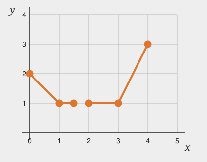

  A piecewise linear graph with no valid values between ``x = 1.5`` and
  ``x = 2``.

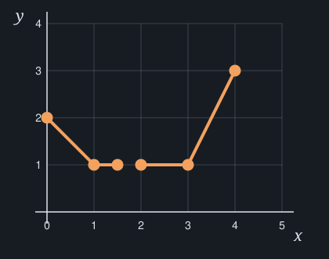

  A piecewise linear graph with no valid values between ``x = 1.5`` and
  ``x = 2``.

.. tab-set::

   .. tab-item:: Curve API

      .. code-block:: python

         curve = gp.formulations.PWLCurve(
             [
                 (0, 2),
                 (1, 1),
                 (1.5, 1),
                 None,
                 (2, 1),
                 (3, 1),
                 (4, 3),
             ]
         )
         y, eqs = gp.formulations.pwlinear(x, curve, method="interval")

   .. tab-item:: Paired points

      .. code-block:: python

         y, eqs = gp.formulations.pwl_interval_formulation(
             x,
             x_points=[0, 1, 1.5, None, 2, 3, 4],
             y_points=[2, 1, 1, None, 1, 1, 3],
         )

``None`` must occur in both paired sequences. It cannot appear first or last,
and two ``None`` values cannot be consecutive.

Advanced Multivalued Curves
^^^^^^^^^^^^^^^^^^^^^^^^^^^

Discontinuities and overlapping chains are multivalued: they can allow more
than one y-value for the same x-value.

.. important::
    Because this behavior may be unintentional, GAMSPy applies the safeguards
    described below when formulations are created from such curves.

Discontinuities
~~~~~~~~~~~~~~~

A repeated x-coordinate represents a discontinuity. In the example below,
``y`` can be either 1 or 2 when ``x`` is 3. The two points are endpoints of
different segments; the vertical line between them is not part of the graph.

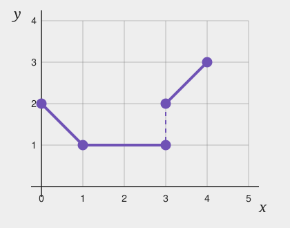

  A piecewise linear graph with a discontinuity at ``x = 3``.

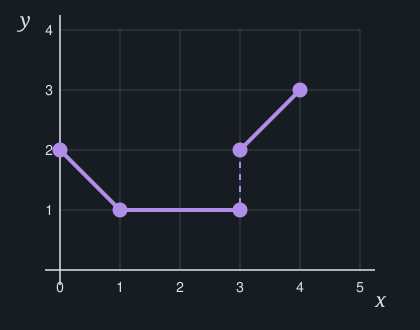

  A piecewise linear graph with a discontinuity at ``x = 3``.

By default, GAMSPy emits a warning for a point discontinuity but still builds
the formulation. Pass ``allow_multivalued=True`` to acknowledge the behavior
and suppress the warning. For the Curve API, this check occurs when
``pwlinear`` uses the curve, not when the ``PWLCurve`` object is created.

.. tab-set::

   .. tab-item:: Curve API

      .. code-block:: python

         curve = gp.formulations.PWLCurve(
             [(0, 2), (1, 1), (3, 1), (3, 2), (4, 3)]
         )
         y, eqs = gp.formulations.pwlinear(
             x,
             curve,
             method="dlog",
             allow_multivalued=True,
         )

   .. tab-item:: Paired points

      .. code-block:: python

         y, eqs = gp.formulations.pwl_dlog_formulation(
             x,
             x_points=[0, 1, 3, 3, 4],
             y_points=[2, 1, 1, 2, 3],
             allow_multivalued=True,
         )

Overlapping Chains
~~~~~~~~~~~~~~~~~~

A decrease in x starts a new independent chain. Here, the first chain covers
``x`` from 0 to 3 and the second covers ``x`` from 2 to 5, so the graph has two
valid y-values between 2 and 3:

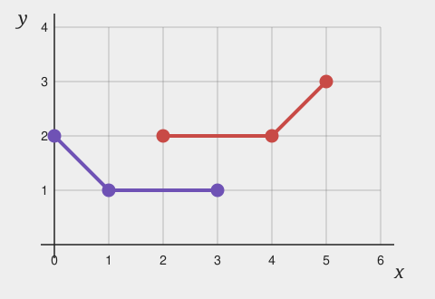

  Two independent chains provide two valid y-values between ``x = 2`` and
  ``x = 3``.

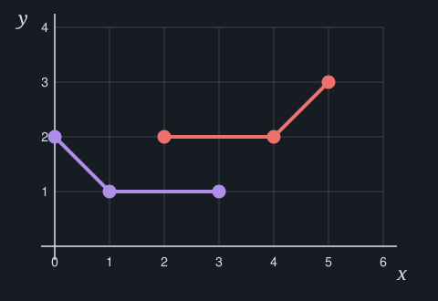

  Two independent chains provide two valid y-values between ``x = 2`` and
  ``x = 3``.

.. tab-set::

   .. tab-item:: Curve API

      .. code-block:: python

         curve = gp.formulations.PWLCurve(
             [(0, 2), (1, 1), (3, 1), (2, 2), (4, 2), (5, 3)]
         )
         y, eqs = gp.formulations.pwlinear(
             x,
             curve,
             method="dlog",
             allow_multivalued=True,
         )

   .. tab-item:: Paired points

      .. code-block:: python

         y, eqs = gp.formulations.pwl_dlog_formulation(
             x,
             x_points=[0, 1, 3, 2, 4, 5],
             y_points=[2, 1, 1, 2, 2, 3],
             allow_multivalued=True,
         )

Overlapping chains raise an error by default. Interval and DLog accept them
when ``allow_multivalued=True``. Convexity requires one non-decreasing SOS2
ordering and therefore rejects overlapping chains regardless of this argument.

Scalar, Broadcast, and Indexed Data
^^^^^^^^^^^^^^^^^^^^^^^^^^^^^^^^^^^

The formulation-specific functions accept ``x_points`` and ``y_points`` as
two sequences (Python lists or tuples), or as two matching
:class:`Parameters <gamspy.Parameter>`.
``pwlinear`` accepts one ``PWLCurve`` or, for an indexed input, a dictionary
whose keys are domain labels and values are curves for that domain label.

.. note::
    ``x_points`` and ``y_points`` must both be sequences or both be Parameters;
    the two forms cannot be mixed. To define row-specific curves, use indexed
    Parameters or a dictionary of ``PWLCurve`` objects instead.

    Indexed ``input_x`` variables must use non-empty explicit Set or Alias
    domains. Wildcard and ``UniverseAlias`` domains are rejected before
    formulation symbols are created.

Curve domains must retain their order in ``input_x.domain``. For example, if
the input domains are ``[scenario, product, year]``, then ``[product]`` and
``[scenario, year]`` are valid curve domains, while ``[year, scenario]`` is not.

.. list-table::
   :header-rows: 1
   :widths: 32 24 44

   * - Input data
     - ``input_x``
     - Behavior
   * - Two sequences or one-dimensional Parameters
     - Scalar
     - Define one graph
   * - Two sequences or one-dimensional Parameters
     - Indexed
     - Define one graph that is broadcast to every row
   * - Parameters over an ordered subset of input domains and a breakpoint domain
     - Indexed
     - Define curves by the selected domains and broadcast over omitted domains
   * - One ``PWLCurve``
     - Scalar or indexed
     - Define one graph, broadcast when the input is indexed
   * - Dictionary of domain labels and ``PWLCurve`` values
     - Indexed
     - Define curves by ``curve_domain`` and broadcast over omitted domains

Broadcast Data
~~~~~~~~~~~~~~

Sequences define one graph. When ``input_x`` is indexed, GAMSPy broadcasts that
graph to every domain entry:

.. tab-set::

   .. tab-item:: Sequences

      .. code-block:: python

         m = gp.Container()
         product = gp.Set(m, records=["basic", "premium"])
         x = gp.Variable(m, domain=product)
         y, eqs = gp.formulations.pwl_interval_formulation(
             x,
             x_points=[0, 2, 4],
             y_points=[1, 5, 9],
         )

   .. tab-item:: Parameters

      .. code-block:: python

         m = gp.Container()
         product = gp.Set(m, records=["basic", "premium"])
         breakpoint = gp.Set(m, records=["p0", "p1", "p2"])
         x = gp.Variable(m, domain=product)
         x_points = gp.Parameter(
             m,
             domain=breakpoint,
             records=[("p0", 0), ("p1", 2), ("p2", 4)],
         )
         y_points = gp.Parameter(
             m,
             domain=breakpoint,
             records=[("p0", 1), ("p1", 5), ("p2", 9)],
         )
         y, eqs = gp.formulations.pwl_interval_formulation(
             x, x_points, y_points
         )

Both examples apply the same graph to ``basic`` and ``premium``.

Indexed Parameter Data
~~~~~~~~~~~~~~~~~~~~~~

Parameters can define curves over any ordered subset of the ``input_x``
domains. The selected domains are followed by one breakpoint domain, and each
curve is broadcast over the omitted input domains. Using every input domain
defines a different curve for every row. All three formulation-specific
functions support this behavior. Matching internal
``gp.SpecialValues.NA`` values disconnect chains, like matching ``None`` values
in sequences. Matching trailing ``NA`` values pad rows that use fewer
breakpoints:

.. note::
    ``x_points`` and ``y_points`` must belong to the same container as
    ``input_x`` and have identical domains.

.. code-block:: python

   import numpy as np

   m = gp.Container()
   scenario = gp.Set(m, records=["low", "high"])
   product = gp.Set(m, records=["basic", "premium"])
   breakpoint = gp.Set(m, records=["p0", "p1", "p2", "p3", "p4"])
   x = gp.Variable(m, domain=[scenario, product])
   na = gp.SpecialValues.NA

   x_points = gp.Parameter(
       m,
       domain=[product, breakpoint],
       records=np.array(
           [[0, 2, na, 4, 6], [0, 3, 5, na, na]]
       ),
   )
   y_points = gp.Parameter(
       m,
       domain=[product, breakpoint],
       records=np.array(
           [[0, 4, na, 8, 12], [1, 7, 9, na, na]]
       ),
   )
   y, eqs = gp.formulations.pwl_dlog_formulation(
       x, x_points, y_points
   )

Here, ``basic`` has an excluded range between 2 and 4, while ``premium`` uses
three breakpoints and two trailing padding positions. The product curves are
reused for both scenarios because ``scenario`` is omitted from the Parameter
domains. Both kinds of ``NA`` must occur at the same positions in the two
Parameters.

Indexed Curve Dictionaries
~~~~~~~~~~~~~~~~~~~~~~~~~~

For ``pwlinear``, ``curve_domain`` declares which input domains are represented
by the dictionary keys. The curves are broadcast over omitted domains:

.. code-block:: python

   m = gp.Container()
   scenario = gp.Set(m, records=["low", "high"])
   product = gp.Set(m, records=["basic", "premium"])
   x = gp.Variable(m, domain=[scenario, product])
   curves = {
       "basic": gp.formulations.PWLCurve([(0, 0), (2, 4)]),
       "premium": gp.formulations.PWLCurve([(0, 0), (1, 3), (2, 5)]),
   }
   y, eqs = gp.formulations.pwlinear(
       x,
       curves,
       curve_domain=[product],
       method="interval",
   )

This applies each product curve to both scenarios. For a one-dimensional
``curve_domain``, dictionary keys are labels such as ``"basic"``. Multiple
curve domains use tuples in the declared order. If ``curve_domain`` is omitted,
it defaults to all ``input_x`` domains; a full two-dimensional dictionary then
uses keys such as ``("low", "basic")``.

.. note::
    Curve dictionaries require explicit domain Sets and must contain exactly
    one curve for every label combination in ``curve_domain``. Missing or extra
    keys and wildcard domains are rejected.

Passing one curve instead of a dictionary broadcasts it to every row:

.. code-block:: python

   shared_curve = gp.formulations.PWLCurve([(0, 0), (2, 4)])
   y, eqs = gp.formulations.pwlinear(x, shared_curve)

Choosing a Formulation
^^^^^^^^^^^^^^^^^^^^^^

.. list-table::
   :header-rows: 1
   :widths: 18 30 22 30

   * - Formulation
     - Representation
     - Discrete variables
     - Suitable graphs
   * - Interval
     - One position and one selector for each finite segment
     - Approximately one binary variable per selectable unit
     - All supported graph features, including overlapping chains
   * - Convexity
     - One shared weight per breakpoint with SOS2 adjacency
     - Native SOS2 or a logarithmic binary encoding, plus ray gating
     - Graphs with one non-decreasing SOS2 ordering
   * - DLog
     - Two endpoint weights for each finite segment
     - ``ceil(log2(k))`` address bits for ``k`` selectable units, plus ray gating
     - All supported graph features, including overlapping chains

With ``pwlinear``, ``method`` defaults to ``"interval"`` and can also be set to
``"convexity"`` or ``"dlog"``. Convexity uses its binary implementation by
default; pass ``using="sos2"`` to use native SOS2 variables instead. With
Interval or DLog, an explicit ``using`` value is ignored and produces a
warning. The formulation-specific Convexity function provides the same choice
through its ``using`` argument.

The relative performance of Interval, Convexity, and DLog depends on the
surrounding model, graph structure, and solver. Although DLog generally uses
fewer binary variables as the number of selectable segments grows, a smaller
binary-variable count does not necessarily translate into shorter solve times.
We encourage GAMSPy users to benchmark the supported formulations with their
intended solvers on representative problem instances and share the results on
the `GAMSPy Forum <https://forum.gams.com/c/gamspy/10>`_. We would be delighted
to learn from your experience.

For a complete application, see the
`transportation model with PWL formulations <https://github.com/GAMS-dev/gamspy-examples/blob/master/models/trnspwl/trnspwl_formulations.py>`_.
It applies the Convexity and Interval APIs to three versions of the same
piecewise-linear approximation and shows the equivalent Curve API calls.

API Reference
^^^^^^^^^^^^^

For complete argument and return-value details, refer to:

- :meth:`pwl_interval_formulation <gamspy.formulations.pwl_interval_formulation>`
- :meth:`pwl_convexity_formulation <gamspy.formulations.pwl_convexity_formulation>`
- :meth:`pwl_dlog_formulation <gamspy.formulations.pwl_dlog_formulation>`
- :class:`PWLCurve <gamspy.formulations.PWLCurve>`
- :meth:`pwlinear <gamspy.formulations.pwlinear>`
