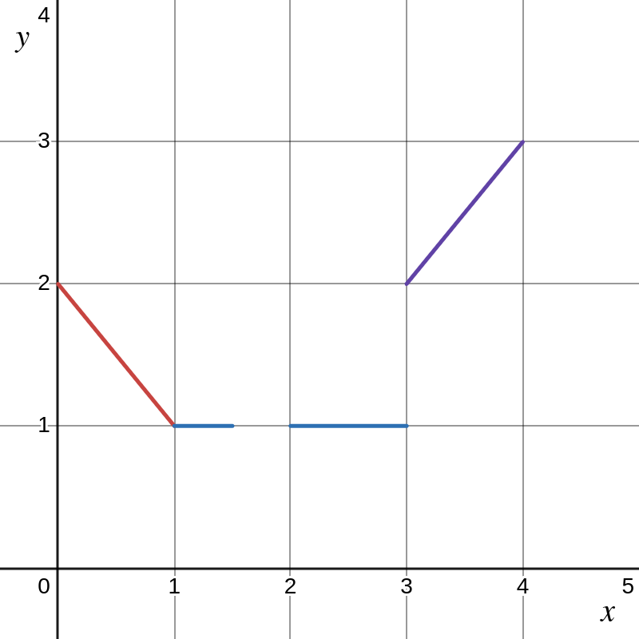

.. _formulations:

************
Formulations
************

.. meta::
   :description: GAMSPy User Guide
   :keywords: User, Guide, GAMSPy, gamspy, GAMS, gams, mathematical modeling, sparsity, performance, piecewise, linear, function

Formulations in GAMSPy provide an intuitive and user-friendly way to define
complex relations without delving deeply into the underlying mathematical
details. You can focus on what you want to achieve rather than how it is
implemented. For those interested in exploring the mechanics, GAMSPy also
provides full visibility into the underlying formulation. We've implemented a
variety of versatile formulations, including piecewise linear functions and
neural network construction blocks, empowering you to seamlessly integrate
advanced concepts into your optimization workflows.

Neural Network Related Formulations
-----------------------------------

GAMSPy supports following neural network related formulations:

- :meth:`Linear <gamspy.formulations.Linear>`
- :meth:`Conv1d <gamspy.formulations.Conv1d>`
- :meth:`Conv2d <gamspy.formulations.Conv2d>`
- :meth:`MaxPool2d <gamspy.formulations.MaxPool2d>`
- :meth:`MinPool2d <gamspy.formulations.MinPool2d>`
- :meth:`AvgPool2d <gamspy.formulations.AvgPool2d>`
- :meth:`flatten_dims <gamspy.formulations.flatten_dims>`

You can find more info at :ref:`nn-formulations`.

Piecewise Linear Functions
--------------------------

Piecewise linear functions are a cornerstone of practical optimization, as they
naturally arise in countless real-world scenarios. Whether modeling cost
structures, approximating nonlinear relationships, or defining breakpoints in
decision processes, their versatility and prevalence make them indispensable.
Recognizing this, we implemented robust support for piecewise linear
formulations in GAMSPy, enabling users to seamlessly incorporate these
essential tools into their models.

We currently support following two formulations for implementing piecewise
linear functions:

- :meth:`pwl_interval_formulation <gamspy.formulations.pwl_interval_formulation>`
- :meth:`pwl_convexity_formulation <gamspy.formulations.pwl_convexity_formulation>`

To define a piecewise linear function, you need to specify x and y coordinates
of the breakpoints. Let's imagine we want to model the following function:

With using either formulation, we can do as following:

.. tabs::
   .. tab:: Interval formulation
      .. code-block:: python

         import gamspy as gp

         m = gp.Container()
         x = gp.Variable(m)
         y, eqs = gp.formulations.pwl_interval_formulation(
             x,
             x_points=[0, 1, 3, 3, 4],
             y_points=[2, 1, 1, 2, 3],
         )

   .. tab:: Convexity formulation
      .. code-block:: python

         import gamspy as gp

         m = gp.Container()
         x = gp.Variable(m)
         y, eqs = gp.formulations.pwl_convexity_formulation(
             x,
             x_points=[0, 1, 3, 3, 4],
             y_points=[2, 1, 1, 2, 3],
         )

**Discontinuities**

In the `x_points`, point 3 is repeated twice. It is because
when you have discontinuities in your piecewise linear function you can
represent them by repeating the x coordinate with a new y value.

**Variable Bounds**

By default, x is limited to be in the range you defined, in this case betwen 0
and 4. If you want x to be not limited in the range you defined, you can set
`bound_left` and/or `bound_right` to `False`. When either is set to `False`, it is assumed
that the corresponding line segments are extended. However, to accomplish
that new `SOS1` and `binary` type variables are introduced.

.. code-block:: python

   import gamspy as gp

   m = gp.Container()
   x = gp.Variable(m)
   y, eqs = gp.formulations.pwl_interval_formulation(
       x,
       [0, 1, 3, 3, 4],
       [2, 1, 1, 2, 3],
       bound_left=False,
       bound_right=False,
   )

**Excluded Ranges**

You can exclude certain ranges in your piecewise linear function to ensure
x value never gets a value within that range. Let's say we want to ensure
x does not get a value between 1.5 and 2. You can do it by inserting `None`
between x values that you like to exclude.

.. code-block:: python

   import gamspy as gp

   m = gp.Container()
   x = gp.Variable(m)
   y, eqs = gp.formulations.pwl_interval_formulation(
       x,
       [0, 1, 1.5, None, 2, 3, 3, 4],
       [2, 1, 1,   None, 1, 1, 2, 3],
   )

**Comparison between the interval and the convexity formulation**

For detailed implementation insights, refer to :meth:`pwl_interval_formulation
<gamspy.formulations.pwl_interval_formulation>` and :meth:`pwl_convexity_formulation
<gamspy.formulations.pwl_convexity_formulation>`. Our empirical analysis
suggests that the interval formulation often results in faster solve times.
However, since the formulations are designed to be easily interchangeable, we
encourage you to experiment with both to determine which works best for your
use case.
