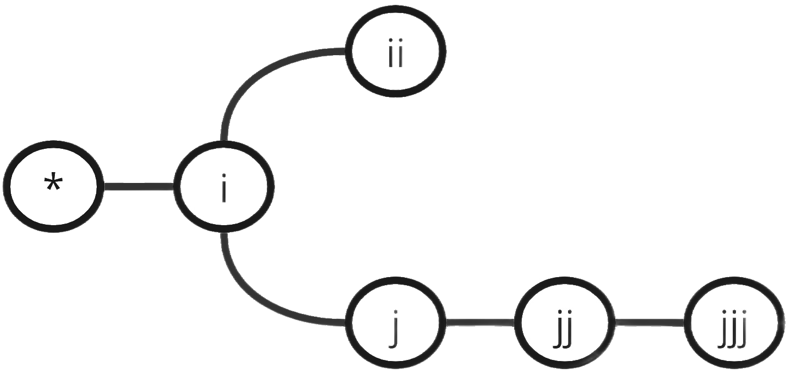

.. _gams_set:

.. meta::
   :description: Documentation of GAMSPy Set (gamspy.Set)
   :keywords: Set, GAMSPy, gamspy, mathematical modeling, sparsity, performance

***
Set
***

Simple Sets
===========

Introduction
------------

Sets are the basic building blocks of a GAMSPy model, corresponding exactly 
to the indices in the algebraic representations of models. A simple set 
consists of a set name and the elements of the set. Example: ::

    from gamspy import Container, Set

    m = Container()
    i = Set(m, name="i", records=["seattle", "san-diego"], description="plants")
    j = Set(m, name="j", records=["new-york", "chicago", "topeka"], description="markets")

.. note::
    In case the name is not provided, it will be autogenerated.

The effect of these statements is probably self-evident. We declared two sets using 
the :meth:`gamspy.Set` class and gave them the names ``i`` and ``j``. We also 
assigned members to the sets as follows:

- :math:`i = \{seattle, san-diego\}`
- :math:`j = \{new-york, chicago, topeka\}`

They are labels, but are often referred to as elements or members. The optional ``description`` 
may be used to describe the set for future reference and to ease readability.

.. note::
    One can also use ranges for the set records. For example: `Set(m, "my_set", records=range(2,5))`.
    This is a convenient way to initialize a set in case you do not have distinct labels that are 
    important for the model that you are developing. In general, using proper label names are highly 
    recommended for the readability of the model. Referencing is by name, not by address. So `my_set[2]`
    does not refer to the third element (zero based) in `my_set` but to the element with name `2`.

Besides using the :meth:`Set <gamspy.Set>` class directly, one can also facilitate the :meth:`addSet <gamspy.Container.addSet>` function: ::

    from gamspy import Container

    m = Container()
    i = m.addSet(name="i", records=["seattle", "san-diego"], description="plants")

Set declaration and data assignment can also be done separately: ::
    
    from gamspy import Container, Set

    m = Container()
    i = Set(m, "i", description="plants")
    i.setRecords(["seattle", "san-diego"])

Not only sets themselves, but also the individual elements can have a description, 
which is called *element text*: ::
     
    from gamspy import Container, Set

    m = Container()
    i = Set(
        m,
        "i",
        records=[
            ("seattle", "home of sub pop records"),
            ("san-diego",),
            ("washington_dc", "former gams hq"),
        ],
    )

::

    In [1]: i.records
    Out[1]:
                 uni             element_text
    0        seattle  home of sub pop records
    1      san-diego
    2  washington_dc           former gams hq

The order in which the set members are listed is usually not important. 
However, if the members represent, for example, time periods, then it 
may be useful to refer to the *next* or *previous* member. 
There are special operations to do this, and they are  discussed in 
chapter :ref:`ordered-sets`. For now, 
it is enough to remember that the order in which set elements are 
specified is not relevant, unless and until some operation implying 
order is used. At that time, the rules change, and the set becomes what 
we will later call an *ordered* set. 

.. note::

    Notice that :meth:`Set <gamspy.Set>` is different than builtin `set <https://docs.python.org/3/library/functions.html#func-set>`_ 
    operation of Python.

Subsets
--------

It is often necessary to define sets whose members must all be members of 
some larger set. For instance, we may wish to define the sectors in an 
economic model: ::

    from gamspy import Container, Set

    m = Container()
    i = Set(
        m,
        name="i",
        description="all sectors",
        records=["light-ind", "food+agr", "heavy-ind", "services"],
    )
    t = Set(
        m,
        name="t",
        domain=i,
        description="traded sectors",
        records=["light-ind", "food+agr", "heavy-ind"],
    )
    nt = Set(m, name="nt", description="non-traded sectors", records=["services"])

Some types of economic activity, for example exporting and importing,
may be logically restricted to a subset of all sectors. In order to model
the trade balance we need to know which sectors are traded, and one obvious
way is to list them explicitly, as in the definition of the set ``t`` above.
The *domain* specification for Set ``t`` means that each member of the set ``t`` 
must also be a member of the set ``i``. GAMSPy will enforce this relationship, 
which is called *domain checking*. Obviously, the order of declaration and definition 
is important: the membership of ``i`` must be known before ``t`` is defined,
otherwise checking cannot be done. If domain checking detects a violation, GAMSPy
throws an exception: ::

    from gamspy import Container, Set

    m = Container()    
    i = Set(
        m,
        name="i",
        description="all sectors",
        records=["light-ind", "food+agr", "heavy-ind", "services"],
    )
    t = Set(
        m,
        name="t",
        domain=i,
        description="traded sectors",
        records=["light-ind", "food&agr", "heavy-ind"],
    )

::

     gamspy.exceptions.GamspyException: There was a compilation error. Check /tmp/tmpbzdhtq7w/_a4907087-2ff2-4c91-ade4-a7909647d768.lst for more information.
     =============
     Error Summary
     =============
     --- LOAD  t = 1:t
     **** Unique domain errors for symbol t
      Dim  Elements
        1  food&agr

.. note::
    All elements of the subset must also be elements of the superset.

It is legal but unwise to define a subset without reference to the larger set, 
as is done above for the set ``nt``. In this case domain checking cannot be 
performed: if services were misspelled no error would be marked, but the model 
may give incorrect results. Hence, it is recommended to use domain checking 
whenever possible. It catches errors and allows to write models that are 
conceptually cleaner because logical relationships are made explicit.

An alternative way to define elements of a subset is with assignments: ::

    from gamspy import Container, Set

    m = Container()
    i = Set(
        m,
        name="i",
        description="all sectors",
        records=["light-ind", "food+agr", "heavy-ind", "services"],
    )
    t = Set(
        m,
        name="t",
        domain=i,
        description="traded sectors",
        records=["light-ind", "heavy-ind"],
    )
    t["food+agr"] = True

In the last line the element ``food+agr`` of the set ``i`` is assigned to the subset 
``t``. Assignments may also be used to remove an element from a subset: ::

    t["light-ind"] = False

.. note::
    - Note that if a subset is assigned to, it then becomes a :ref:`dynamic set <dynamic-sets>`.
    - A subset can be used as a domain in the declaration of other sets, variables, 
      parameters and in equations as long as it is no dynamic set.

.. _multi-dimensional-sets:

Multi-Dimensional Sets
=======================

It is often necessary to provide mappings between elements of different sets. For 
this purpose, GAMSPy allows the use of multi-dimensional sets. GAMSPy sets can
have up to 20 dimensions. The next two subsections explain how 
to express one-to-one and many-to-many mappings between sets.

.. note::
    The same Python data can be used for one and two dimensional sets based on the domain specifications.
    With missing domain (or ``domain = ['*']``) the second part of the tuple is interpreted as
    element text, while with ``domain = ['*','*']`` the data populates a two-dimensional set with empty
    element text ::

        from gamspy import Container, Set

        m = Container()
        i = Set(m, records=[('i1', 'e1'), ('i2', 'e2')])

    ::

        In [1]: i.records
        Out[1]:
          uni element_text
        0  i1           e1
        1  i2           e2

    ::

        i = Set(m, domain=['*', '*'], records=[('i1', 'e1'), ('i2', 'e2')])

    ::

        In [1]: i.records
        Out[1]:
           uni_0 uni_1 element_text
        0    i1    e1
        1    i2    e2

The records of the multi-dimensional sets can be filtered as follows: ::

    import gamspy as gp

    m = gp.Container()

    i = gp.Set(m, "i", records=[f"i{i}" for i in range(2)])
    j = gp.Set(m, "j", records=[f"j{i}" for i in range(2)])
    k = gp.Set(m, "k", records=[f"k{i}" for i in range(2)])
    l = gp.Set(m, "l", records=[f"l{i}" for i in range(2)])
    a = gp.Set(m, "a", [i, j, k, l])
    a.generateRecords()
  
::

  In [0]: a.records
  Out[0]:
         i   j   k   l element_text
    0   i0  j0  k0  l0             
    1   i0  j0  k0  l1             
    2   i0  j0  k1  l0             
    3   i0  j0  k1  l1             
    4   i0  j1  k0  l0             
    5   i0  j1  k0  l1             
    6   i0  j1  k1  l0             
    7   i0  j1  k1  l1             
    8   i1  j0  k0  l0             
    9   i1  j0  k0  l1             
    10  i1  j0  k1  l0             
    11  i1  j0  k1  l1             
    12  i1  j1  k0  l0             
    13  i1  j1  k0  l1             
    14  i1  j1  k1  l0             
    15  i1  j1  k1  l1

  In [1]: a['i0', ...].records
  Out[1]:
        i   j   k   l element_text
    0  i0  j0  k0  l0             
    1  i0  j0  k0  l1             
    2  i0  j0  k1  l0             
    3  i0  j0  k1  l1             
    4  i0  j1  k0  l0             
    5  i0  j1  k0  l1             
    6  i0  j1  k1  l0             
    7  i0  j1  k1  l1

  In [2]: a["i0", :, 'k1', 'l0'].records
  Out[2]:
        i   j   k   l element_text
    2  i0  j0  k1  l0             
    6  i0  j1  k1  l0

Cell 0 shows all the elements of the multi-dimensional set `a`.
Cell 1 shows all rows where `i` dimension is 'i0' and matches all the rest with an ellipsis operator.
Cell 2 shows all rows where `i` dimension is 'i0', `k` dimension is 'k1' and `l` dimension is 'l0'. It also 
matches all elements of `j` dimension with a slice operator. 

One-to-one Mapping
-------------------

Consider a set whose elements are pairs: :math:`A = \{(b,d),(a,c),(c,e)\}`. In this 
set there are three elements and each element consists of a pair of letters. This kind 
of set is useful in many types of modeling. In the following example a port has to be 
associated with a nearby mining region: ::

    from gamspy import Container, Set

    m = Container()
    i = Set(
        m,
        name="i",
        description="mining regions",
        records=["china", "ghana", "russia", "s-leone"],
    )
    n = Set(
        m,
        name="n",
        description="ports",
        records=["accra", "freetown", "leningrad", "shanghai"],
    )

    multi_in = Set(
        m,
        name="in",
        domain=[i, n],
        description="mines to ports map",
        records=[
            ("china", "shanghai"),
            ("ghana", "accra"),
            ("russia", "leningrad"),
            ("s-leone", "freetown"),
        ],
    )

::

    In [1]: multi_in.records
    Out[1]:
    	      i	        n	element_text
    0	  china	 shanghai	
    1	  ghana     accra	
    2	 russia	leningrad	
    3	s-leone	 freetown	

Here ``i`` is the set of mining regions, ``n`` is the set of ports and ``multi_in`` is a two 
dimensional set that associates each port with a mining region. 
The set ``multi_in`` has four elements, and each 
element consists of a region-port pair. The ``domain = [i,n]`` indicates that the 
first member of each pair must be a member of the set ``i`` of mining regions, and 
that the second must be in the set ``n`` of ports. GAMSPy will domain check the set 
elements to ensure that all members belong to the appropriate sets.

Many-to-Many Mapping
---------------------

A many-to-many mapping is needed in certain cases. Consider the following sets: ::

    from gamspy import Container, Set

    m = Container()
    i = Set(m, name="i", records=["a", "b"])
    j = Set(m, name="j", records=["c", "d", "e"])

    ij1 = Set(m, domain=[i, j], records=[("a", "c"), ("a", "d")])
    ij2 = Set(m, domain=[i, j], records=[("a", "c"), ("b", "c")])
    ij3 = Set(m, domain=[i, j], records=[("a", "c"), ("b", "c"), ("a", "d"), ("b", "d")])

Here the set ``ij1`` presents a *one-to-many* mapping where one element of the set ``i`` 
maps onto many elements of the set ``j``. The set ``ij2`` represents a *many-to-one* 
mapping where many elements of the set ``i`` map onto one element of the set ``j``. 
The set ``ij3`` is the most general case: a *many-to-many* mapping where many elements 
of the set ``i`` map to many elements of the set ``j``:

::

    In [1]: ij3.records
    Out[1]:
    	i	j	element_text
    0	a	c	
    1	b	c	
    2	a	d	
    3	b	d	

Projection and Aggregation of Sets 
-----------------------------------

In GAMSPy aggregation operations on sets may be performed with an assignment and 
the :meth:`Sum <gamspy.Sum>` operator. Assignments and the sum operator are introduced 
and discussed in detail in chapter :ref:`indexed-operations`. Here we only show how 
they may be used in the context of sets to perform projections and aggregations. 
The following example serves as illustration. ::

    from gamspy import Container, Set, Parameter, Sum

    m = Container()
    i = Set(m, "i", records=[(f"i{i}", i) for i in range(1, 4)])
    j = Set(m, "j", records=[(f"j{j}", j) for j in range(1, 3)])
    k = Set(m, "k", records=[(f"k{k}", k) for k in range(1, 5)])

    ijk = Set(m, name="ijk", domain=[i, j, k])
    ijk.generateRecords()

    # Method 1: Using an assignment and the sum operator for a projection
    ij = Set(m, name="ij1a", domain=[i, j])
    ij[i, j] = Sum(k, ijk[i, j, k])

    # Method 2: Using an assignment and the sum operator for aggregations
    ij_count = Parameter(m, domain=[i, j])
    ij_count[i, j] = Sum(ijk[i, j, k], 1)

Note that the set ``ijk`` is a three-dimensional set, its elements are 3-tuples and all 
permutations of the elements of the three sets ``i``, ``j`` and ``k`` make up its data. 
Thus the number of elements of the set ``ijk`` is 3 x 2 x 4 = 24. The set ``ij1a`` is a two-dimensional
set that is declared in the set statement but without data. 
The first assignment statement defines the members of the set ``ij``. This is a projection 
from the set ``ijk`` to the set ``ij`` where the three-tuples of the first set are mapped 
onto the pairs of the second set, such that the dimension ``k`` is eliminated. This means 
that the four elements ``"i1.j1.k1"``, ``"i1.j1.k2"``, ``"i1.j1.k3"`` and ``"i1.j1.k4"`` of 
the set ``ijk`` are all mapped to the element ``"i1.j1"`` of the set ``ij``. Note that in 
this context, the result of the :meth:`Sum <gamspy.Sum>` operation decides about set membership
(0 not a member, ≠0 is member). The 
assignments to ``ij_count`` are aggregations, where the number of elements of the two sets 
are computed. As already mentioned, the result of the first aggregation is 24 and the result 
of the second aggregation is 6 = 24 / 4.

Singleton Sets
===============

A singleton set in GAMSPy is a special set that has at most one element (zero elements 
are allowed as well). Like other sets, singleton sets may have a domain with several 
dimensions. Singleton sets are declared with the boolean ``is_singleton`` in the 
:meth:`Set <gamspy.Set>` class (or the :meth:`addSet <gamspy.Container.addSet>` function). ::

    from gamspy import Container, Set

    m = Container()
    i = Set(m, name="i", records=["a", "b", "c"])
    j = Set(m, name="j", is_singleton=True, records=["d"])
    k = Set(m, name="k", is_singleton=True, domain=i, records=["b"])
    l = Set(m, name="l", is_singleton=True, domain=[i, i], records=[("b", "c")])

::

    In [1]: i.records
    Out[1]:
      uni	element_text
    0	a	
    1	b	
    2	c	

    In [2]: j.records
    Out[2]:
      uni	element_text
    0	d	

    In [3]: k.records
    Out[3]:
      uni	element_text
    0	b	

    In [4]: l.records
    Out[4]:
      i_0	i_1	element_text
    0	b	  c	

The sets ``j``, ``k`` and ``l`` are declared as singleton sets, each of them has just 
one element. The set ``k`` is a subset of the set ``i`` and the set ``l`` is a 
two-dimensional set.

Note that a data statement for a singleton set with more than one element will create 
a GAMSPy exception: ::

    from gamspy import Container, Set

    m = Container()
    j = Set(m, name="j", is_singleton=True, records=range(1,5))

::
   
    GamspyException: Singleton set records size cannot be more than one.

It also possible to assign an element to a singleton set. In this case the singleton set 
is automatically cleared of the previous element first. For example, adding the following 
line to the code above will result in set ``k`` containing only element ``a`` after 
execution: ::

    k["a"] = True

Singleton sets can be especially useful in assignment statements since they do not need to 
be controlled by a controlling index or an indexed operator like other sets. Consider the 
following example: ::

    from gamspy import Container, Set, Parameter

    m = Container()
    i = Set(m, name="i", records=["a", "b", "c"])
    k = Set(m, name="k", is_singleton=True, domain=i, records=["b"])
    h = Set(m, name="h", is_singleton=True, domain=i, records=["a"])
    n = Parameter(m, domain=i, records=[["a", 2], ["b", 3], ["c", 5]])

    z1 = Parameter(m)
    z2 = Parameter(m)

    z1[...] = n[k]
    z2[...] = n[k] + 100 * n[h]

The singleton sets ``k`` and ``h`` are both subsets of the set ``i``. The parameter ``n`` 
is defined over the set ``i``. The scalar ``z1`` is assigned a value of the parameter ``n`` 
without naming the respective label explicitly in the assignment. It is already specified 
in the definition of the singleton set ``k``. The assignment statement for the scalar ``z2`` 
contains an expression where the singleton sets ``k`` and ``h`` are referenced without a 
controlling index or an indexed operation.

.. note::
    Singleton sets cannot be used as domains.

.. _the-universal-set:

The Universal Set: ``*`` as Set Identifier
==========================================

GAMSPy provides the universal set denoted by ``*`` for cases where the user wishes not to 
specify a domain set but have only a placeholder for it. The following examples show two ways 
how the universal set is introduced in a model. We will discuss the advantages and 
disadvantages of using the universal set later. First example:  ::

    from gamspy import Container, Set, Parameter

    m = Container()
    r = Set(m, name="r", description="raw materials", records=["scrap", "new"])
    misc = Parameter(
        m,
        domain=["*", r],
        records=[
            ["max-stock", "scrap", 400],
            ["max-stock", "new", 275],
            ["storage-c", "scrap", 0.5],
            ["storage-c", "new", 2],
            ["res-value", "scrap", 15],
            ["res-value", "new", 25],
        ],
    )

In our example, the first index of parameter ``misc`` is the universal set ``"*"`` and the 
second index is the previously defined set ``r``. Since the first index is the universal set 
any entry whatsoever is allowed in this position. In the second position elements of the set 
``r`` must appear, they are domain checked, as usual.

Alternatively, :meth:`UniverseAlias <gamspy.UniverseAlias>` can be used instead of ``*``.
This allows to use a column name in the data frame other than ``uni``:  ::
    
    from gamspy import Container, Set, Parameter, UniverseAlias

    m = Container()
    r = Set(m, name="r", description="raw materials", records=["scrap", "new"])
    misc = Parameter(
        m,
        domain=[UniverseAlias(m, "attributes"), r],
        records=[
            ["max-stock", "scrap", 400],
            ["max-stock", "new", 275],
            ["storage-c", "scrap", 0.5],
            ["storage-c", "new", 2],
            ["res-value", "scrap", 15],
            ["res-value", "new", 25],
        ],
    )

::

    In [1]: misc.records
    Out[1]:
      attributes      r  value
    0  max-stock  scrap  400.0
    1  max-stock    new  275.0
    2  storage-c  scrap    0.5
    3  storage-c    new    2.0
    4  res-value  scrap   15.0
    5  res-value    new   25.0

The :meth:`UniverseAlias <gamspy.UniverseAlias>` statement links the universal set with the column name 
``attributes``.

.. note::
    It is recommended to not use the universal set for data input, since there is no domain 
    checking and thus typos will not be detected and data that the user intends to be in the 
    model might actually not be part of it.

Observe that in GAMSPy a simple set is always regarded as a subset of the universal set. Thus the 
set definition ::

    i = Set(m, "i", records=range(1, 10))

is the same as ::

    i = Set(m, "i", domain="*", records=range(1, 10))

GAMSPy follows the concept of a domain tree for domains in GAMSPy. It is assumed that a set and its 
subset are connected by an arc where the two sets are nodes. Now consider the following one 
dimensional subsets: ::

    from gamspy import Container, Set

    m = Container()
    i = Set(m, "i")
    ii = Set(m, "ii", domain=i)
    j = Set(m, "j", domain=i)
    jj = Set(m, "jj", domain=j)
    jjj = Set(m, "jjj", domain=jj)

These subsets are connected with arcs to the set ``i`` and thus form a domain tree that is rooted 
in the universe node ``"*"``. This particular domain tree may be represented as follows:

Observe that the universal set is assumed to be ordered and operators for ordered sets such as 
:meth:`Ord <gamspy.Ord>` and :meth:`Lag/Lead <gamspy.Set.lag>` may be applied to any sets aliased with 
the universal set.

.. _set-and-set-element-referencing:

Set and Set Element Referencing
===============================

Sets or set elements are referenced in many contexts, including assignments, calculations, and
equation definitions. GAMSPy statements refer either to the whole set or a single set 
element. In addition, GAMSPy provides several ways to refer to more than one, but not all elements 
of a set. In the following subsections we will show by example how this is done. 

Referencing the Whole Set
-------------------------

Most commonly whole sets are referenced as in the following examples: ::

    from gamspy import Container, Set, Parameter, Sum

    m = Container()
    i = Set(m, "i", records=[(f"i{i}", i) for i in range(10)])

    k = Parameter(m, domain=i)
    k[i] = 4

    z = Parameter(m)
    z[...] = Sum(i, k[i])

::    

    In [1]: k.records
    Out[1]:
        i  value
    0  i0    4.0
    1  i1    4.0
    2  i2    4.0
    3  i3    4.0
    4  i4    4.0
    5  i5    4.0
    6  i6    4.0
    7  i7    4.0
    8  i8    4.0
    9  i9    4.0

    In [2]: z.records
    Out[2]:
       value
    0   40.0

The parameter ``k`` is declared over the set ``i``, in the assignment statement in the next line 
all elements of the set ``i`` are assigned the value 4. The scalar ``z`` is defined to be the 
:meth:`Sum <gamspy.Sum>` of all values of the parameter ``k``, so equals to 4⋅10=40.

Referencing a Single Element
----------------------------

Sometimes it is necessary to refer to specific set elements. This is done by using quotes around 
the label(s). We may add the following line to the example above: ::

    k["i7"] = 15

Referencing a Part of a Set
----------------------------

There are multiple ways to restrict the domain to more than one element, e.g. subsets, 
conditionals and tuples. Suppose we want the parameter ``k`` from the example above to be 
assigned the value 10 for the first 5 elements of the set ``i``. The following two lines of 
code illustrate how easily this may be accomplished with a subset: ::
    
    j = Set(m, "j", domain=i, records=i.records[0:5])
    k[j] = 10

::

    In [3]: k.records
    Out[3]:
        i  value
    0  i0   10.0
    1  i1   10.0
    2  i2   10.0
    3  i3   10.0
    4  i4   10.0
    5  i5    4.0
    6  i6    4.0
    7  i7   15.0
    8  i8    4.0
    9  i9    4.0

First we define the set ``j`` to be a subset of the set ``i`` with exactly the elements we are 
interested in. Then we assign the new value to the elements of this subset. The other values of 
the parameter ``k`` remain unchanged. For examples using conditionals and tuples, see sections 
:ref:`restricting-the-domain-conditionals` and :ref:`restricting-the-domain-tuples` respectively.

Set Attributes
==============

A GAMSPy set has several attributes attached to it. For a complete list see :meth:`Set <gamspy.Set>`. 
The attributes may be accessed like in the following example: ::

    p[set] = set.attribute

Here ``p`` is a parameter, ``set`` is the set object and ``.attribute`` is one of 
the attributes listed in :meth:`Set <gamspy.Set>`. The following example serves as illustration: ::

    from gamspy import Container, Set, Parameter

    m = Container()
    id = Set(
        m,
        "id",
        records=[
            ("Madison", "Wisconsin"),
            ("tea-time", "5"),
            ("-inf", ""),
            ("-7", ""),
            ("13.14", ""),
        ],
    )

    attr = Parameter(m, "attr", domain=[id, "*"], description="Set attribute values")
    attr[id, "position"] = id.pos
    attr[id, "reverse"] = id.rev
    attr[id, "offset"] = id.off
    attr[id, "length"] = id.len
    attr[id, "textLength"] = id.tlen
    attr[id, "first"] = id.first
    attr[id, "last"] = id.last

The parameter ``attr`` is declared to have two dimensions with the set ``id`` in the first 
position and the universal set in the second position. In the following seven statements the 
values of ``attr`` are defined for seven entries of the universal set. ::

    import pandas as pd
    pd.options.display.float_format = "{:,.0f}".format
    attr.pivot()

              position  reverse  offset  length  textLength  first  last
    Madison          1        4       0       7           9      1     0
    tea-time         2        3       1       8           1      0     0
    -inf             3        2       2       4           0      0     0
    -7               4        1       3       2           0      0     0
    13.14            5        0       4       5           0      0     1    

Implicit Set Definition (via Domain Forwarding)
===============================================

As seen above, sets can be defined through data statements in the declaration. Alternatively, sets can be 
defined implicitly through data statements of other symbols which use these sets as domains. This is called
domain forwarding and is illustrated in the following example: ::
    
    from gamspy import Container, Set, Parameter

    m = Container()
    i = Set(m, name="i", description="plants")
    j = Set(m, name="j", description="markets")

    d = Parameter(
        m,
        domain=[i, j],
        description="distance in thousands of miles",
        records=[
            ["seattle", "new-york", 2.5],
            ["seattle", "chicago", 1.7],
            ["seattle", "topeka", 1.8],
            ["san-diego", "new-york", 2.5],
            ["san-diego", "chicago", 1.8],
            ["san-diego", "topeka", 1.4],
        ],
        domain_forwarding=True,
    )

The ``domain_forwarding = True`` in the declaration of :meth:`Parameter <gamspy.Parameter>` ``d`` 
forces set elements to be recursively included in all parent sets. Here set ``i`` 
will therefore contain all elements which define the first dimension of symbol ``d`` 
and set ``j`` will contain all elements which define the second dimension of symbol 
``d``. ::

    In [1]: d.pivot()
    Out[1]:
                   new-york  chicago  topeka
    seattle         2.5      1.7     1.8
    san-diego       2.5      1.8     1.4

    In [2]: i.records
    Out[2]:
    	      uni	element_text
    0	  seattle	
    1	san-diego	

    In [3]: j.records
    Out[3]:
             uni	element_text
    0	new-york	
    1	 chicago	
    2	  topeka	
        
Note, that ``domain_forwarding`` can also pass as a list of *bool* to control which 
domains to forward. Also ``domain_forwarding`` is not limited to one symbol. One 
domain set can be defined through multiple symbols using the same domain.

.. _dynamic-sets:

Dynamic Sets
============

Introduction
-------------

In this section we introduce a special type of sets: *dynamic sets*. The sets that 
we discuss in detail above have their elements stated and the membership is usually
given at object creation time or through the :meth:`addRecords <gamspy.Set.addRecords>`
function. Therefore they are called *static sets*. In contrast, the elements of dynamic sets are not 
fixed, but may be changed by GAMSPy assignment statements. Dynamic sets are most often used as 
:ref:`controlling indices in assignments <dynamic-sets-in-conditional-assignments>` 
or 
:ref:`equation definitions <conditional-equations-with-dynamic-sets>` 
and as the conditional set in an 
:ref:`indexed operation <conditional-indexed-operations-with-dynamic-sets>`. 
We will first show how assignments 
are used to change set membership in dynamic sets. Then we will introduce set 
operations and the last part of this chapter covers dynamic sets in the context 
of conditions.

Assigning Membership to Dynamic Sets
-------------------------------------

The Syntax
^^^^^^^^^^
Like any other set, a dynamic set has to be declared before it may be used in the 
model. Often, a dynamic set is declared as subset of a static set. Dynamic sets in 
GAMSPy may also be multi-dimensional like static sets. GAMSPy sets can
have up to 20 dimensions. For 
multi-dimensional dynamic sets the index sets can also be specified explicitly at 
declaration. That way dynamic sets are domain checked. Of course it is also possible 
to use dynamic sets that are not domain checked. This provides additional power and 
flexibility but also a lack of intelligibility and danger. Any label is legal as long 
as such a set's dimension, once established, is preserved.

In general, the syntax for assigning membership to dynamic sets in GAMSPy is: ::

    set_name[index_list | label] = True | False

``Set_name`` is the internal name of the set in GAMSPy, ``index_list`` refers to the 
domain of the dynamic set and ``label`` is one specific element of the domain. An 
assignment statement may assign membership to the dynamic set either to the whole 
domain or to a subset of the domain or to one specific element. Note that, as usual, 
a label must appear in quotes.

Illustrative Example
^^^^^^^^^^^^^^^^^^^^^

We start with assignments of membership to dynamic sets ::

    from gamspy import Container, Set

    m = Container()
    item = Set(
        m, name="item", records=["dish", "ink", "lipstick", "pen", "pencil", "perfume"]
    )
    subitem1 = Set(
        m,
        domain=item,
        records=["pen", "pencil"],
    )
    subitem2 = Set(m, domain=item)

    subitem1["ink"] = True
    subitem1["lipstick"] = True
    subitem2[item] = True
    subitem2["perfume"] = False

Note that the sets ``subitem1`` and ``subitem2`` are declared like any other set. The 
two sets become dynamic as soon as they are assigned to. They are also domain checked: 
the only members they will ever be able to have must also be members of the set 
``item``.
The first assignment not only makes the set ``subitem1`` dynamic, it also has the effect 
that its superset ``item`` becomes a static set and from then on its membership is 
frozen. The first two assignments each add one new element to ``subitem1``. Note that both 
are also elements of ``item``, as required. The third assignment is an example of the 
familiar indexed assignment: ``subitem2`` is assigned all the members of ``item``. The last 
assignment removes the label ``"perfume"`` from the dynamic set ``subitem2``. ::

    In [1]: subitem1.toList()
    Out[1]: ['ink', 'lipstick', 'pen', 'pencil']

    In [2]: subitem2.toList()
    Out[2]: ['dish', 'ink', 'lipstick', 'pen', 'pencil']

Note that even though the labels ``"pen"`` and ``"pencil"`` were declared to be members of 
the set ``subitem1`` before the assignment statements that added the labels ``"ink"`` and 
``"lipstick"`` to the set, they appear in the listing above at the end. The reason is that 
elements are displayed in the internal order, which in this case is the order specified in 
the declaration of the set item.

Dynamic Sets with Multiple Indices
^^^^^^^^^^^^^^^^^^^^^^^^^^^^^^^^^^
Dynamic sets may be multi-dimensional. The following lines continue the example above and 
illustrate assignments for multi-dimensional sets. ::

    sold = Set(m, "sold", domain=item, records=["pencil", "pen"])
    sup  = Set(m, "sup", records=["bic", "parker", "waterman"])
    supply = Set(m, domain=[sold, sup])
    
    supply["pencil", "bic"] = True
    supply["pen", sup] = True

::

    In [1]: supply.pivot()
    Out[1]:
             bic  parker  waterman
    pen     True    True      True
    pencil  True   False     False

.. _equations-defined-over-the-domain-of-dynamic-sets:

Equations Defined over the Domain of Dynamic Sets
^^^^^^^^^^^^^^^^^^^^^^^^^^^^^^^^^^^^^^^^^^^^^^^^^^

Dynamic sets are not permitted as domains in *declarations* of :ref:`sets <gams_set>`, 
:ref:`variables <variable>`, :ref:`parameters <parameter>` and :ref:`equations <equation>`. 
However, they may be *referenced* and sometimes it is necessary 
to define an equation over a dynamic set.

.. note::
    The trick is to declare the equation over the entire domain but define it over the dynamic 
    set.

For example, defining an equation over a dynamic set can be necessary in models that will be 
solved for arbitrary groupings of regions simultaneously. We assume there are no explicit links 
between regions, but that we have a number of independent models with a common data definition 
and common logic. We illustrate with an artificial example, leaving out lots of details.

 ::

    from gamspy import Container, Set, Parameter, Variable, Equation

    m = Container()
    allr = Set(
        m, "allr", records=["N", "S", "W", "E", "N-E", "S-W"], description="all regions"
    )
    r = Set(m, "r", domain=allr, description="region subset for particular solution")
    type = Set(m, "type", description="set for various types of data")

    price = Parameter(m, "price", records=10)
    data = Parameter(m, "data", domain=[allr, type], description="all other data ...")

    activity1 = Variable(m, "activity1", domain=allr, description="first activity")
    activity2 = Variable(m, "activity2", domain=allr, description="second activity")
    revenue = Variable(m, "revenue", domain=allr, description="revenue")

    resource1 = Equation(
        m, "resource1", domain=allr, description="first resource constraint ..."
    )
    prodbal1 = Equation(
        m, "prodbal1", domain=allr, description="first production balance ..."
    )

    resource1[r] = activity1[r] <= data[r, "resource-1"]
    prodbal1[r] = activity2[r] * price == revenue[r]

To repeat the important point: the equation is *declared* over the set ``allr``, but 
*defined* over ``r``, a subset. Note that the variables and data are *declared* over 
``allr`` but referenced over ``r``. Then the set ``r`` may be assigned arbitrary 
combinations of elements of the set ``allr``, and the model may be solved any number 
of times for the chosen groupings of regions.

Assigning Membership to Singleton Sets
^^^^^^^^^^^^^^^^^^^^^^^^^^^^^^^^^^^^^^

Singleton sets have only one element. Hence any assignment to a singleton set first 
clears or empties the set, no explicit action to clear the set is necessary. This is 
illustrated with the following example: ::

    from gamspy import Container, Set

    m = Container()
    i = Set(m, "i", records=["a", "b", "c"], description="Static Set")
    ii = Set(m, "ii", domain=i, records="b", description="Dynamic Set")
    si = Set(
        m,
        "si",
        domain=i,
        records="b",
        is_singleton=True,
        description="Dynamic Singleton Set",
    )

    ii["c"] = True
    si["c"] = True

Note that both ``ii`` and ``si`` are subsets of the set ``i``, but only ``si`` is declared as a 
*singleton set*. The assignment statements assign to both sets the element ``"c"``. While ``"c"`` 
is *added* to the set ``ii``, it *replaces* the original element in the singleton set ``si``: ::

    In [1]: ii.toList()
    Out[1]: ['b', 'c']

    In [2]: si.toList()
    Out[2]: ['c']

Set Operations
---------------

GAMSPy provides symbols for arithmetic set operations that may be used with dynamic sets. An 
overview of the set operations in GAMSPy is given below. Examples and alternative formulations 
for each operation follow. Note that in the table below the set ``i`` is the static superset 
and the sets ``j`` and ``k`` are dynamic sets.

=====================================  ===============  =====================================================================================================
Set Operation                          Operator         Description
=====================================  ===============  =====================================================================================================
Set Union                              j[i] + k[i]      Returns a subset of i that contains all the elements of the sets j and k.
Set Intersection                       j[i] & k[i]      Returns a subset of i that contains the elements of the set j that are also elements of the set k.
Set Complement                         ~ j[i]           Returns a subset of i that contains all the elements of the set i that are not elements of the set j.
Set Difference                         j[i] - k[i]      Returns a subset of i that contains all the elements of the set j that are not elements of the set k.
=====================================  ===============  =====================================================================================================

Example: The set ``item`` is the superset of the dynamic sets ``subitem1`` and ``subitem2``. 
We add new dynamic sets for the results of the respective set operations. 

::

    from gamspy import Container, Set, Number

    m = Container()    
    item = Set(
        m, name="item", records=["dish", "ink", "lipstick", "pen", "pencil", "perfume"]
    )
    subitem1 = Set(m, domain=item, records=["pen", "pencil"])
    subitem2 = Set(m, domain=item)

    subitem1["ink"] = True
    subitem1["lipstick"] = True
    subitem2[item] = True
    subitem2["perfume"] = False

    union1 = Set(m, domain=item)
    union2 = Set(m, domain=item)
    union1[item] = subitem2[item] + subitem1[item]
    union2[subitem1] = True
    union2[subitem2] = True

    intersection1 = Set(m, domain=item)
    intersection2 = Set(m, domain=item)
    intersection1[item] = subitem2[item] * subitem1[item]
    intersection2[item] = Number(1).where[subitem1[item] & subitem2[item]]

    complement1 = Set(m, domain=item)
    complement2 = Set(m, domain=item)
    complement1[item] = ~subitem1[item]
    complement2[item] = True
    complement2[subitem1] = False

    difference1 = Set(m, domain=item)
    difference2 = Set(m, domain=item)
    difference1[item] = subitem2[item] - subitem1[item]
    difference2[item] = Number(1).where[subitem2[item]]
    difference2[subitem1] = False

::

    In [1]: intersection1.toList()
    Out[1]: ['ink', 'lipstick', 'pen', 'pencil']

Looking at the results of each operation will show that the above assignment statements 
for each operation result in the same dynamic set like using the set operator. Observe 
that the alternative formulations for the set intersection and set difference involve 
conditional assignments. Conditional assignments in the context of dynamic sets are 
discussed in depth in the next section.

.. note::
    The indexed operation :meth:`Sum <gamspy.Sum>` may be used for set unions. Similarly, 
    the indexed operation :meth:`Product <gamspy.Product>` may be used for set intersections. 
    For examples see section :ref:`conditional-indexed-operations-with-dynamic-sets` below.

Controlling Dynamic Sets
-------------------------

Recall that set membership of subsets and dynamic sets may be used as a logical 
condition. Set membership may also be a building block in complex logical conditions 
that are constructed using the logical python operators ``~`` (not), ``&`` (and), 
``|`` (or), ``^`` (xor), and 
``==`` (logical equivalence). Moreover, the set operations introduced in the previous 
section may also be used in logical conditions. Dynamic sets can be controlled in the 
context of assignments, indexed operations and equations. We will discuss in detail 
each of these in the following subsections.

Apart from being part of logical conditions, dynamic sets may be assigned members 
with conditional assignments. Examples are given in the next subsection.

.. _dynamic-sets-in-conditional-assignments:

Dynamic Sets in Conditional Assignments
^^^^^^^^^^^^^^^^^^^^^^^^^^^^^^^^^^^^^^^^

Dynamic sets may be used in two ways in conditional assignments: they may be the item 
on the left-hand side that is assigned to and they may be part of the logical 
condition. Below we present examples for both. ::

    from gamspy import Container, Set

    m = Container()
    item = Set(
        m, name="item", records=["dish", "ink", "lipstick", "pen", "pencil", "perfume"]
    )
    subitem1 = Set(m, domain=item, records=["ink", "lipstick", "pen", "pencil"])
    subitem2 = Set(m, domain=item)

    subitem2[item].where[subitem1[item]] = True

The conditional assignment adds the members of dynamic set ``subitem1`` to the dynamic set 
``subitem2``. Thus ``subitem2`` will have the following elements: ::

    In [1]: subitem2.toList()
    Out[1]: ['ink', 'lipstick', 'pen', 'pencil']

Note that instead of using ``subitem1`` in ``where[]`` we could also write: ::

    subitem2[subitem1] = True

In the next example of a conditional assignment, a dynamic set features in the 
logical condition on the right-hand side. The first statement clears the set 
``subitem2`` of any previously assigned members and the second statement assigns 
all members of ``subitem1`` to ``subitem2`` using :meth:`Number <gamspy.Number>`. The 
following conditional assignment will have the same result: ::

    subitem2[item] = False
    subitem2[item] = Number(1).where[subitem1[item]]

The logical condition in this assignment is ``subitem1[item]``. It is satisfied 
for all members of the set ``subitem1``. Hence the statement assigns all elements 
of the domain ``item`` that are members of the set ``subitem1`` to the dynamic set 
``subitem2``. Note that in this assignment the ``where[]`` is on the right. 
Conditional assignments with ``where[]`` on the right-hand side imply an 
``if-then-else`` structure where the ``else`` case is automatically zero. Unlike 
parameters, dynamic sets cannot be assigned the value of zero, they are assigned 
``False`` instead. Therefore a more explicit formulation of the conditional 
assignment above would be:

::

    subitem2[item] = False
    subitem2[item] = Number(1).where[subitem1[item]] + Number(0).where[~ subitem1[item]]

A more simplified way to accomplish making ``subitem1`` equal (with respect to element membership)
to ``subitem1`` would be the shorter assignment statement: ::
    
    subitem2[item] = subitem1[item]

.. _conditional-indexed-operations-with-dynamic-sets:

Conditional Indexed Operations with Dynamic Sets
^^^^^^^^^^^^^^^^^^^^^^^^^^^^^^^^^^^^^^^^^^^^^^^^^

Indexed operations in GAMSPy may be controlled by ``where[]`` conditions. The domain 
of conditional indexed operations is often restricted by a set, called the 
*conditional set*. Dynamic sets may be used as conditional sets or they may be assigned 
to with a statement that features a conditional indexed operation on the right-hand 
side. We will illustrate both cases with examples.

Suppose we have a set of origins, a set of destinations and a parameter specifying the 
flight distance between them: ::

    from gamspy import Container, Set, Parameter, Smax, Domain

    m = Container()
    d = Parameter(
        m,
        domain=[i, j],
        description="distance (miles)",
        domain_forwarding=True,
        records=[
            ["Chicago", "Vancouver", 1777],
            ["Chicago", "Bogota", 2691],
            ["Chicago", "Dublin", 3709],
            ["Chicago", "Rio", 5202],
            ["Chicago", "Marrakech", 4352],
            ["Philadelphia", "Vancouver", 2438],
            ["Philadelphia", "Bogota", 2419],
            ["Philadelphia", "Dublin", 3306],
            ["Philadelphia", "Rio", 4695],
            ["Philadelphia", "Marrakech", 3757],
        ],
    )

We wish to find the longest distance that we can travel given that we have a limit of 
3500 miles. ::

    can_do = Set(m, domain=[i, j], description="connections with less than 3500 miles")
    can_do[i, j].where[d[i, j] < 3500] = True
    
    maxd = Parameter(m, "maxd", description="longest distance possible")
    maxd[...] = Smax(Domain(i, j).where[can_do[i, j]], d[i, j])

The dynamic set ``can_do`` contains all connections that are less than 3500 miles. 
The scalar ``maxd`` is defined by a conditional assignment where the indexed operation 
:meth:`Smax <gamspy.Smax>` scans all entries of the parameter ``d`` whose label combinations 
are members of the set ``can_do`` and chooses the largest value. ::

    In [1]: can_do.pivot()
    Out[1]: 
    	           Vancouver	Bogota	Dublin
    Chicago             True	  True	 False
    Philadelphia        True	  True	  True

    In [2]: maxd.records
    Out[2]: 
    	 value
    0	3306.0

Finally, we also wish to know which flight connection is linked to the longest possible 
distance. Consider the following two lines: ::

    maxc = Set(m, domain=[i, j], is_singleton=True, description="maximum distance connection")
    maxc[i,j] = Number(1).where[can_do[i, j] & (d[i, j] == maxd)]

Which gives ::

    In [1]: maxc.records
    Out[1]:
                   i	       j	element_text
    0	Philadelphia	  Dublin	

The dynamic singleton set is assigned the member of the dynamic set ``can_do`` whose 
distance equals the maximum distance.

There is a shorter alternative formulations for these assignment; see subsection 
:ref:`Filtering through Dynamic Sets <filtering-through-dynamic-sets>` below for details.

The full power of indexed operators becomes apparent with multi-dimensional dynamic sets ::

    from gamspy import Container, Set, Sum, Product

    m = Container()    
    dep = Set(m, "dep", description="departments")
    sup = Set(m, "sup", description="suppliers")
    item = Set(m, "item", description="items_sold")

    sales = Set(
        m,
        name="sales",
        domain=[dep, item],
        domain_forwarding=True,
        description="departments and items sold",
        records=[
            ("cosmetics", "lipstick"),
            ("cosmetics", "perfume"),
            ("hardware", "ink"),
            ("household", "dish"),
            ("household", "pen"),
            ("stationary", "dish"),
            ("stationary", "ink"),
            ("stationary", "pen"),
            ("stationary", "pencil"),
            ("toy", "ink"),
            ("toy", "pen"),
            ("toy", "pencil"),
        ],
    )

    # Note this is a compact notation of the supply data.
    # GAMSPy still needs flat data in the end
    supply_data = {
        "dish": ["bic", "dupont"],
        "ink": ["bic", "parker"],
        "lipstick": ["revlon"],
        "pen": ["parker", "revlon"],
        "pencil": ["bic", "parker"],
        "perfume": ["revlon"],
    }

    supply = Set(
        m,
        domain=[item, sup],
        domain_forwarding=True,
        description="items and suppliers",
        records=[(sd[0], s) for sd in supply_data.items() for s in sd[1]],
    )

    gParker = Set(m, domain=dep, description="departments selling items supplied by Parker")
    gParker[dep] = Sum(item.where[supply[item, "parker"]], sales[dep, item])

The assignment above is used to create the set of departments that sell items supplied 
by ``"parker"``. Note that the set ``gParker`` is a subset of the set ``dep``. Its members 
are specified by assignment, hence it is a dynamic set. Note that the assignment is made 
to a set, therefore the indexed operator :meth:`Sum <gamspy.Sum>` refers to a set union (and 
not to an addition as would be the case if the assignment were made to a parameter). 
The indexed operation is controlled by the two-dimensional set ``supply`` with the label 
``"parker"`` in the second index position. This logical condition is True for all members 
of the set ``supply`` where the second index is ``"parker"``. Hence the summation is over 
all items sold, provided that the supplier is ``"parker"``. Given the declaration of the 
set ``supply``, this means ``"ink"``, ``"pen"`` and ``"pencil"``. The associated departments are 
thus all departments except for ``"cosmetics"``: ::

    In [1]: gParker.toList()
    Out[1]: ['hardware', 'household', 'stationary', 'toy']

Now suppose we are interested in the departments that are selling *only* items supplied by 
``"parker"``. We introduce a new dynamic set ``gParkerOnly`` and the following assignment adds the 
desired departments: ::

    gParkerOnly = Set(m, domain = dep, description = "departments only selling items supplied by parker")
    gParkerOnly[dep] = Product(sales[dep,item], supply[item,"parker"]);

Note that the indexed operation :meth:`Product <gamspy.Product>` refers to set intersections in the 
context of assignments to dynamic sets. From all departments linked with items only those 
are included where *all* items sold are supplied by ``"parker"``. This means that 
departments that additionally sell items that are not supplied by ``"parker"`` are 
excluded. Hence, only ``"hardware"`` and ``"toy"`` are added to ``gParkerOnly``. ::

    In [1]: gParkerOnly.toList()
    Out[1]: ['hardware', 'toy']

.. _conditional-equations-with-dynamic-sets:

Conditional Equations with Dynamic Sets
^^^^^^^^^^^^^^^^^^^^^^^^^^^^^^^^^^^^^^^^

``where[]`` conditions in the context of equations may restrict the domain of the equation 
and they may also feature in the algebraic formulation of the equation. In both instances 
dynamic sets may be used as part of the logical condition. ``where[]`` conditions with 
dynamic sets in the algebra of equations are similar to conditional assignments with dynamic 
sets; see section :ref:`dynamic-sets-in-conditional-assignments` above. The example that follows 
illustrates the use of a dynamic set to restrict the domain of definition of an equation. In 
section :ref:`equations-defined-over-the-domain-of-dynamic-sets` above we had the following 
equation definition: ::

    prodbal1[r] =   activity2[r]*price == revenue[r]

Recall that ``r`` is a dynamic set and a subset of the set ``allr``. Hence this equation may 
be rewritten in the following way: ::

    prodbal1[allr].where[r[allr]] =   activity2[allr]*price == revenue[allr]

Note that both formulations achieve the same result: restricting the domain of definition to 
those elements that belong to the dynamic set ``r``. While in the second formulation the 
condition is specified explicitly, in the first formulation the domain is filtered through 
the dynamic set ``r``. This is the topic of the next subsection.

.. _filtering-through-dynamic-sets:

Filtering through Dynamic Sets
^^^^^^^^^^^^^^^^^^^^^^^^^^^^^^^

In certain circumstances the filtering process is an alternative to the ``where[]`` condition 
to restrict the domain of equations, sets, variables, parameters and indexed operations. We 
already saw an example for restricting the domain of definition of an equation in the previous 
subsection. The next example refers to restricting the domain in an indexed operation. In 
section :ref:`conditional-indexed-operations-with-dynamic-sets` we had the following assignment: ::

    maxd[...] = Smax(Domain(i, j).where[can_do[i, j]], d[i, j])

Recall that ``maxd`` is a scalar, ``i`` and ``j`` are sets, ``can_do`` is a dynamic set and 
``d`` is a two-dimensional parameter. Note that the conditional set is the dynamic set 
``can_do``. The assignment may be rewritten in the following way: ::

    maxd[...] = Smax(can_do[i, j], d[i, j])

Here the indexed operation is filtered through the dynamic set ``can_do``, a ``where[]`` 
condition is not necessary. Similarly the assignment to determine the flight connection 
of the longest possible distance originally written as: ::

    maxc[i, j] = Number(1).where[can_do[i, j] & (d[i, j] == maxd)]

can be rewritten without ``where[]`` as follows: ::

    maxc[can_do] = d[can_do] == maxd

.. _ordered-sets:

Sets as Sequences: Ordered Sets
================================

Introduction
-------------

We initially stated that in general, sets in GAMSPy are regarded as an unordered collection 
of labels. However, in some contexts, say, multi-period planning models, some sets need to 
be treated as if they were sequences. In this chapter we will establish the notion *order* 
of a sets and we will cover their special features and the associated operations.

Examples where ordered sets are needed include economic models that explicitly represent 
conditions in different time periods that are linked, location problems where the formulation 
may require a representation of contiguous areas, as in a grid representation of a city, 
scheduling problems and programs that model stocks of capital with equations of the form 
'stocks at the end of period :math:`n` are equal to stocks at the end of period :math:`n-1` 
plus net gains during period :math:`n`.

.. note::
    Models involving sequences of time periods are often called dynamic models, because they 
    describe how conditions change over time. This use of the word dynamic unfortunately has 
    a different meaning from that used in connection with :ref:`dynamic-sets`, but this is 
    unavoidable.

Ordered Sets
------------

One-dimensional static sets may be treated as if they were a sequence. Every one-dimensional static set in GAMSPy is ordered, but the actual order of elements follows the *entry order* of labels and hence
might be somewhat unexpected.

.. note::
    - The GAMSPy entry order is the order in which the individual labels first appear in the GAMSPy program.
    - For the sake of simplicity, one-dimensional static sets are often just referred to as *ordered sets*.

GAMSPy maintains a *unique element list* where all labels that are used as elements in one or 
more sets are listed. The order of the elements in any one set is the same as the order of 
those elements in the unique element list. This means that the order of a set may not be 
what it appears to be if some of the labels were used in an earlier definition. The internal 
GAMSPy order of the labels can be made visible with the ``getUELs()`` method of the 
:meth:`Container <gamspy.Container>` class.

In the example below we show some unexpected order of ordered sets. The input is: ::

    from gamspy import Container, Set

    m  = Container()
    t1 = Set(m, records=["1987", "1988", "1989", "1990", "1991"])
    t2 = Set(m, records=["1983", "1984", "1985", "1986", "1987"])

::    

    In [1]: t2.toList()
    Out[1]:
    ['1987', '1983', '1984', '1985', '1986']

The label ``"1987"`` is the first label seen by GAMSPy. It appears again as the 
last label in the initialization list for the set ``t2``. This means that the actual order of
set ``t2`` is not the entry order in the constructor: ::

    In [1]: m.getUELs()
    Out[1]: ['1987', '1988', '1989', '1990', '1991', '1983', '1984', '1985', '1986']

.. note::
    An expected order can be accomplished by moving its declaration closer to the beginning of the program
    or by adding a dummy set with naturally ordered labels before the real data: ::

        from gamspy import Container, Set

        m  = Container()
        all_years = Set(m, records=range(1950, 2050))

        t1 = Set(m, records=["1987", "1988", "1989", "1990", "1991"])
        t2 = Set(m, records=["1983", "1984", "1985", "1986", "1987"])

    ::    

        In [1]: t2.toList()
        Out[1]:
        ['1983', '1984', '1985', '1986', '1987']

Ordered sets allow the use of :meth:`Ord <gamspy.Ord>` and :meth:`Lag/Lead <gamspy.Set.lag>` operations.