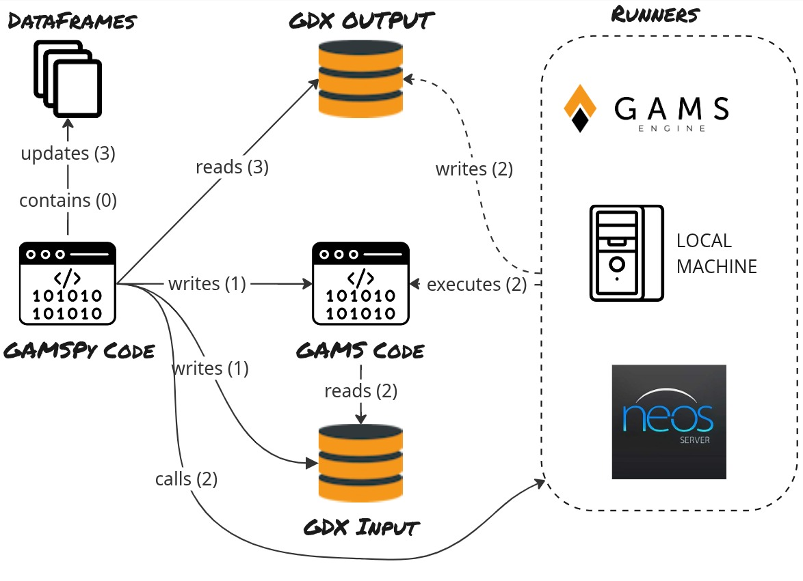

.. _developerguide:

***************
Developer Guide
***************

The Big Picture
===============

This picture shows the overall interaction of GAMSPy and GAMS. 

0. GAMSPy code contains DataFrames.
1. GAMSPy writes GAMS code to the disk. GAMSPy writes GDX input file for the GAMS code.
2. GAMSPy calls one of the runners (local machine, GAMS Engine or NEOS Server) and the runner starts executing. GAMS code reads the GDX input, and after the runner finishes, it writes an output GDX file.
3. Finally, GAMSPy reads the updated records from the output gdx and updates the DataFrames that it holds.

Get started with development
============================

This section covers the simplest way to get started developing GAMSPy so that you can contribute.
It uses automation and as few steps as possible to get things done.

Workflow for contributing changes
---------------------------------

We follow a typical flow:

- Open an issue (not necessary if the issue already exists).
- Create a branch starting with the issue number. For example, if the issue number is #187, the branch name should be 187-<your_branch_name>.
- Open a merge request.
- Work through code review.

The sections below cover the steps to take in more detail.

Cloning the repository
----------------------

First off you'll need your copy of the `gamspy` codebase. ::
    
    git clone git@git.gams.com:devel/gamspy.git && cd gamspy

Installing the necessary tools
------------------------------

For running the tests and building the documentation we use additional packages.
Here are a few helper tools that we use:

- `coverage <https://coverage.readthedocs.io>`_ shows the test coverage.
- `pre-commit <https://pre-commit.com/>`_ for automatically enforcing code standards and quality checks before commits. ::
    
    pip install .[test,dev,doc]

Setup pre-commit
----------------

``pre-commit`` allows us to run several checks on the codebase every time a new Git commit is made.
This ensures standards and basic quality control for our code.

To setup pre-commit, navigate to this repository's folder and activate it as follows: ::
    
    pre-commit install

This will install the necessary dependencies to run ``pre-commit`` every time you make a commit with Git.

Building the documentation
--------------------------

To build the documentation, run the following command: ::
    
    cd docs && make html

This will generate the html docs under ``docs/_build/html``

Running the tests
-----------------

Our tests have different markers such as ``unit``, ``integration``, ``model_library``, ``doc``, ``engine`` and ``neos``. To run all tests: 

To run the tests, run the following command: ::
    
    pytest

To run specific markers list the markers as follows: ::
    
    pytest -m 'unit or integration or model_library'

To learn about all markers, run: ::

    pytest --markers

Note: For GAMS Engine and NEOS credentials, you can either define the required environment variables manually or you can create a .env file. Tests will try to import all environment variables from .env file by using dotenv package. 

**Note**: Certain tests require additional solvers such as hansmge.py model. You can install the additional solver with ``gamspy install solver <solver_name1> <solver_name2>``

Running the performance benchmark
---------------------------------

We also have a performance benchmark for model generation. It compares the model generation time of GAMS and GAMSPy. ::

    python scripts/performance/performance.py

Checking the memory usage
-------------------------
We have a memory usage test to observe whether GAMSPy memory usage accumulates with repeated solves over time. ::

    python scripts/performance/memory_check.py

How to make a release
=====================

1. Update the version in ``pyproject.toml``.
2. Update the unit test that checks the version of the package. It's under ``tests/test_gamspy.py::test_version``.
3. Update the switcher. Switcher is the dropdown which shows the documentation versions of gamspy. Go to `GAMSPy Docs <https://gamspy.readthedocs.io>`_ and look at the top bar. You will see it there. To update it, open ``docs/_static/switcher.json`` and add the new version to the json. 
4. Add release notes. Release notes are under ``docs/release``. Add a new file there with the name ``release_<new_version>.rst``. Then, update ``docs/release/index.rst``. 
5. Update changelog. We use towncrier for that. Here is the command to do update the changelog: ::

    towncrier build --yes --version <new_version>

After you merge the release branch to master, you can simply run the job named ``upload`` to upload the wheel to PyPI and ``update_website`` to update gams.com. 

Note: One can automate all steps as follows: ::
    
    python scripts/update_version.py <new_version>

For example: ::
    
    python scripts/update_version.py 1.4.0

This will automatically update pyproject.toml, version test, switcher, docs/release/index.rst, docs/release/release\_<version>.rst and CHANGELOG.rst.