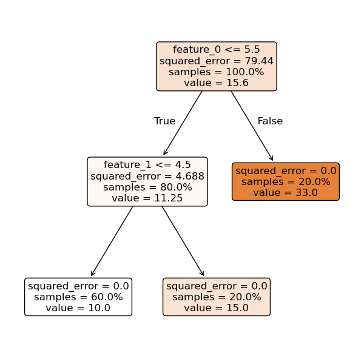

***********************
Classic ML Formulations
***********************

.. meta::
   :description: GAMSPy User Guide
   :keywords: Machine Learning, User, Guide, GAMSPy, gamspy, GAMS, gams, mathematical modeling

We often require classical machine learning approaches for our optimization workflows.
GAMSPy currently provides a formulation for decision trees that can be directly embedded in your optimization models.
We will roll out additional formulations for other classical machine learning algorithms in the future.

Supported formulations
======================

:meth:`RegressionTree <gamspy.formulations.RegressionTree>`
-----------------------------------------------------------

When a Decision Tree is trained to predict numerical values (rather than class labels), it is referred to as a :meth:`Regression Tree <gamspy.formulations.RegressionTree>`.
Here is an example where we train a Regression tree and use the formulation to embed in an optimization model.

It should be noted we are using the `sklearn.tree.DecisionTreeRegressor`_ for convenience. You can also provide the information from the trained decision tree as a :meth:`DecisionTreeStruct <gamspy.formulations.DecisionTreeStruct>` instance.

.. code-block:: python

   import numpy as np
   from sklearn.tree import DecisionTreeRegressor
   
   import gamspy as gp
   from gamspy.math import dim

   X = np.array(
      [
         [2, 3],
         [3, 1],
         [1, 2],
         [5, 6],
         [6, 4],
      ]
   )
   y = np.array([10, 10, 10, 15, 33])

   regressor = DecisionTreeRegressor(random_state=42)
   # This is the regressor that you want to include in
   # your optimization model
   regressor.fit(X, y)

   m = gp.Container()
   # Formulation requires the regressor
   dt_formulation = gp.formulations.RegressionTree(m, regressor)
   # Let's create a sample input
   m_input = gp.Parameter(m, "input", domain=dim((5, 2)), records=X)

   # y_pred = regressor(m_input) and eqns are the equations that
   # create this relation
   y_pred, eqns = dt_formulation(m_input)

   predict_values = gp.Model(
      m,
      "regressionTree",
      equations=eqns,
      problem="MIP",
   )
   predict_values.solve()
   print(y_pred.toDense().flatten())
   # [10. 10. 10. 15. 33.]

.. _sklearn.tree.DecisionTreeRegressor: https://scikit-learn.org/stable/modules/generated/sklearn.tree.DecisionTreeRegressor.html

:meth:`RandomForest <gamspy.formulations.RandomForest>`
-------------------------------------------------------

Random Forests fall into the category of ensembling techniques where multiple Decision trees are trained in parallel with random parts of the same data. The final prediction is then the average of all the Regression trees predictions.
Here is an example where we train a :meth:`Random Forest <gamspy.formulations.RandomForest>` and use the formulation to embed in an optimization model.

It should be noted we are using the `sklearn.ensemble.RandomForestRegressor`_ for convenience. You can also provide the information from the trained Random forest as a list of :meth:`DecisionTreeStruct <gamspy.formulations.DecisionTreeStruct>`

.. code-block:: python

   import numpy as np
   from sklearn.ensemble import RandomForestRegressor

   import gamspy as gp
   from gamspy.math import dim

   X = np.array(
      [
         [2, 3],
         [3, 1],
         [1, 2],
         [5, 6],
         [6, 4],
      ]
   )
   y = np.array([10, 10, 10, 15, 33])

   ensemble = RandomForestRegressor(random_state=42)
   # This is the ensemble that you want to include in
   # your optimization model
   ensemble.fit(X, y)

   m = gp.Container()
   # Formulation requires the trained ensemble
   rf_formulation = gp.formulations.RandomForest(m, ensemble)
   # Let's create a sample input
   m_input = gp.Parameter(m, "input", domain=dim((5, 2)), records=X)

   # y_pred = ensemble(m_input) and eqns are the equations that
   # create this relation
   y_pred, eqns = rf_formulation(m_input)

   predict_values = gp.Model(
      m,
      "randomForest",
      equations=eqns,
      problem="MIP",
   )
   predict_values.solve()
   print(y_pred.toDense().flatten())
   # [10.46 10.23 10.23 19.41 25.83]

.. note::
   Formulating a Random Forest with a large number of trees in GAMSPy can be time-intensive, as the formulation must traverse each tree individually.

.. _sklearn.ensemble.RandomForestRegressor: https://scikit-learn.org/stable/modules/generated/sklearn.ensemble.RandomForestRegressor.html

:meth:`GradientBoosting <gamspy.formulations.GradientBoosting>`
---------------------------------------------------------------

Gradient Boosted trees also fall into the category of ensembling techniques
where multiple Decision trees are trained sequentially, with each new tree
learning to correct the errors of the previous ones. The contribution of each
tree is scaled by a learning rate, and the final prediction is the weighted sum
of the outputs from all individual trees. Here is an example where we train a
:meth:`Gradient Boosted Tree <gamspy.formulations.GradientBoosting>` and use the
formulation to embed in an optimization model.

It should be noted we are using the `sklearn.ensemble.GradientBoostingRegressor`_ for convenience. You can also provide the information from the trained Gradient Boosted Tree as a list of :meth:`DecisionTreeStruct <gamspy.formulations.DecisionTreeStruct>`.

.. code-block:: python

   import numpy as np
   from sklearn.ensemble import GradientBoostingRegressor

   import gamspy as gp
   from gamspy.math import dim

   X = np.array(
      [
         [2, 3],
         [3, 1],
         [1, 2],
         [5, 6],
         [6, 4],
      ]
   )
   y = np.array([10, 10, 10, 15, 33])

   ensemble = GradientBoostingRegressor(n_estimators=100, learning_rate=0.1)
   # This is the ensemble that you want to include in
   # your optimization model
   ensemble.fit(X, y)

   m = gp.Container()
   # Formulation requires the trained ensemble
   gbt_formulation = gp.formulations.GradientBoosting(m, ensemble)
   # Let's create a sample input
   m_input = gp.Parameter(m, "input", domain=dim((5, 2)), records=X)

   # y_pred = ensemble(m_input) and eqns are the equations that
   # create this relation
   y_pred, eqns = gbt_formulation(m_input)

   predict_values = gp.Model(
      m,
      "gradientBoostedTrees",
      equations=eqns,
      problem="MIP",
   )
   predict_values.solve()
   print(y_pred.toDense().flatten())
   # [10.00014874 10.00014874 10.00014874 15.00001594 32.99953783]

.. note::
   Formulating Gradient Boosted Trees with a large number of trees in GAMSPy can be time-intensive, as the formulation must traverse each tree individually.

.. _sklearn.ensemble.GradientBoostingRegressor: https://scikit-learn.org/stable/modules/generated/sklearn.ensemble.GradientBoostingRegressor.html
