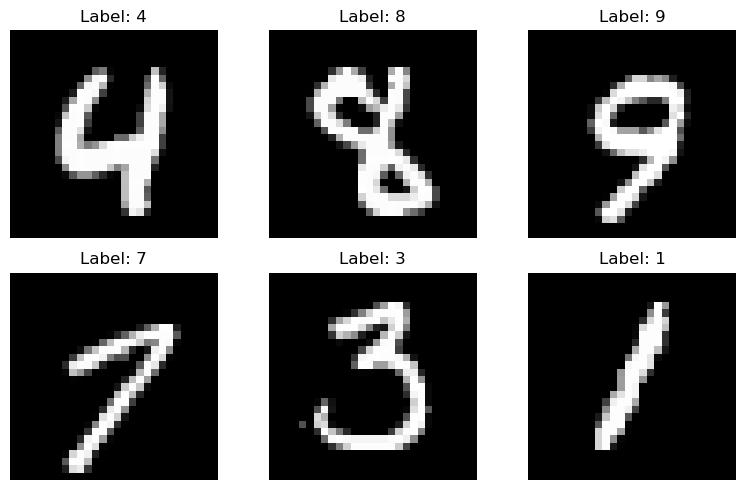
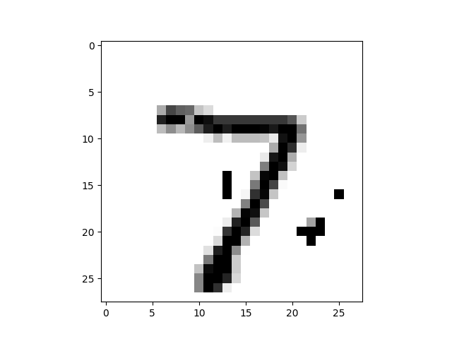

********************************************
Embedding a trained neural network in GAMSPy
********************************************

One of the most exciting applications in combining Machine Learning with
Optimization is embedding a trained neural network into your optimization model.

Let's assume you trained a very simple feed-forward neural network for optical
character recognition and you want to test robustness of this neural network.
For the sake of simplicity, we trained one for you on MNIST dataset. If you
want to follow this tutorial locally, you can download the `weights
<https://github.com/GAMS-dev/gamspy/blob/develop/docs/_static/data.pth?raw=true>`_.

MNIST from:
LeCun, Yann, et al. "Gradient-based learning applied to document recognition."
Proceedings of the IEEE 86.11 (1998): 2278-2324.

We trained the neural network using PyTorch, with a single hidden layer
consisting of 20 neurons with ReLU activation function.

Let's start with the imports

.. code-block:: python

   import sys

   import gamspy as gp
   import torch
   import torch.nn as nn
   import torch.nn.functional as F
   from gamspy.math.matrix import dim
   from torchvision import datasets, transforms

And then import the Neural Network, so we can get its weights:

.. code-block:: python

   hidden_layer_neurons = 20

   class SimpleModel(nn.Module):
       def __init__(self):
           super().__init__()
           self.l1 = nn.Linear(784, hidden_layer_neurons, bias=True)
           self.activation = nn.ReLU()
           self.l2 = nn.Linear(hidden_layer_neurons, 10, bias=True)

       def forward(self, x):
           x = torch.reshape(x, (x.shape[0], -1))
           x = self.l1(x)
           x = self.activation(x)
           logits = self.l2(x)
           output = F.log_softmax(logits, dim=1)
           return output

   network = SimpleModel()
   network.load_state_dict(torch.load("data.pth", weights_only=True))

To test the robustness of the network, we will get an image from the MNIST
and we will find the minimum change in the image so that it is misclassified
by our neural network.

.. code-block:: python

   mean = (0.1307,)
   std = (0.3081,)

   transform = transforms.Compose([transforms.ToTensor()])
   dataset1 = datasets.MNIST('../data', train=False, download=True, transform=transform)
   test_loader = torch.utils.data.DataLoader(dataset1)

   for data, target in test_loader:
       data, target = data, target
       break

   single_image = data[0]
   single_target = target[0]

   if torch.argmax(network(single_image)) == single_target:
       print("Model currently classifies correctly")
   else:
       print("Pick some other data")

Then we start creating GAMSPy parameters contaning the weights from the neural network:

.. code-block:: python

   # Let's get weights to numpy arrays
   l1_weight = network.l1.weight.detach().numpy()
   b1_weight = network.l1.bias.detach().numpy()

   l2_weight = network.l2.weight.detach().numpy()
   b2_weight = network.l2.bias.detach().numpy()

   image_data = single_image.numpy().reshape(-1)
   image_target = single_target.numpy()

   m = gp.Container()

   w1 = gp.Parameter(m, name="w1", domain=dim(l1_weight.shape), records=l1_weight)
   b1 = gp.Parameter(m, name="b1", domain=dim(b1_weight.shape), records=b1_weight)

   w2 = gp.Parameter(m, name="w2", domain=dim(l2_weight.shape), records=l2_weight)
   b2 = gp.Parameter(m, name="b2", domain=dim(b2_weight.shape), records=b2_weight)

   image = gp.Parameter(m, name="image", domain=dim(image_data.shape), records=image_data)

`w1` is a :math:`20 \times 784` matrix, `b1` is a vector of size :math:`20`,
`w2` is a :math:`10 \times 20` matrix, and `b2` is a vector of size :math:`10`.
The `image` is a vector of length `784`, which is obtained by flattening a
:math:`28 \times 28` pixel image. Our task is to define the forward propagation
process, where the `784` pixels are first mapped into :math:`\mathcal{R}^{20}`
and then further mapped into :math:`\mathcal{R}^{10}`. In the final layer, we
could apply the softmax function to obtain probabilities. However, we can also
choose to work directly with the logits, as softmax is a monotonically
increasing function.

.. code-block:: python

   noise = gp.Variable(m, name="xn", domain=dim([784]))

   a1 = gp.Variable(m, name="x1", domain=dim([784]))
   z2 = gp.Variable(m, name="a2", domain=dim([hidden_layer_neurons]))
   z3 = gp.Variable(m, name="a3", domain=dim([10]))

   add_noise_and_normalize = gp.Equation(m, "eq1", domain=dim([784]))
   add_noise_and_normalize[...] = a1 == (image + noise - mean[0]) / std[0]

   #ensure bounds
   a1.lo[...] =   - mean[0] / std[0]
   a1.up[...] = (1 - mean[0]) / std[0]

We create a new variable called `noise`, which will be used to perturb the
input image. The `noise` variable has the same dimensions as the input image.
The variable `a1` will serve as the input to the neural network. It is defined
by the `add_noise_and_normalize` equation, where the `noise` is added to the
image, followed by normalization, as the network was trained with normalized
inputs. We then ensure that `a1` stays within the valid range so that the
`noise` cannot change any pixel to a negative value or exceed a value of 1.

We are ready to do our first linear layer:

.. code-block:: python

   forward_1 = gp.Equation(m, "eq2", domain=dim([hidden_layer_neurons]))
   forward_1[...] = z2 == w1 @ a1 + b1

   a2 = gp.math.relu_with_binary_var(z2)

We define `z2` as the matrix multiplication of the weights and the previous
layer, plus the bias term. Note that we use
:meth:`relu_with_binary_var <gamspy.math.relu_with_binary_var>`
to declare the `a2` variable, which automatically creates the necessary
constraints and the activated variable for us.

Similarly we can define `z3`:

.. code-block:: python

   forward_2 = gp.Equation(m, "eq3", domain=dim([10]))
   forward_2[...] = z3 == w2 @ a2 + b2

This essentially concludes the embedding of the neural network into our
optimization problem. If we were particularly interested in obtaining real
probabilities, we could have also added:

.. code-block:: python

   # if you need the probabilities, however it comes at a cost
   # WE DO NOT ADD THIS, or you cannot use MIQCP but have to use MINLP
   a3 = gp.math.softmax(z3)

Next, we define the component that specifies the adversarial attack. Our goal
is to make the model confuse our digit with another digit while making the
minimal possible change. To achieve this, we introduce a binary variable to
select the digit with which to create the confusion:

.. code-block:: python

   confuse_with = gp.Variable(m, name="confuse_with", domain=dim([10]), type="binary")
   confuse_with.fx[str(image_target)] = 0 # cannot confuse with the correct label

   ensure_confusion = gp.Equation(m, "eq4")
   ensure_confusion[...] = gp.Sum(confuse_with.domain, confuse_with) == 1

We fix the correct target to 0, as confusing a target with itself would require
no change. Then, we specify that it is sufficient if just one other digit is
more likely than the correct digit. Then we write the equation that forces
other digit to be more likely than the correct one.

.. code-block:: python

   favor_confused = gp.Equation(m, "eq5", domain=dim([10]))
   digit = favor_confused.domain
   big_M = 20
   favor_confused[digit] = z3[digit] + (1 - confuse_with[digit]) * big_M >= z3[str(image_target)] + 0.1

Confusing the neural network by changing the image altogether would be trivial. We want the minimum
amount of change to the original image. Therefore we define our objective as the squared sum of
perturbations.

.. code-block:: python

   obj = gp.Variable(m, name="z")

   set_obj = gp.Equation(m, "eq6")
   set_obj[...] = obj == gp.math.vector_norm(noise) ** 2

Finally, bringing all together:

.. code-block:: python

   model = gp.Model(
       m,
       "min_noise",
       equations=m.getEquations(),
       objective=obj,
       sense="min",
       problem="MIQCP"
   )

   model.solve(output=sys.stdout, solver="cplex")

This takes a couple of seconds to solve, afterwards we can investigate:

.. code-block:: python

   confuse_with.toDense()

.. code-block::

   array([0., 0., 0., 1., 0., 0., 0., 0., 0., 0.])

You can see that the model chose to confuse the original digit with digit 3.
However, it's always beneficial to visually inspect the perturbed image and
verify that the network indeed misclassifies it.

.. code-block:: python

   noise_data = noise.toDense()

   nn_input = torch.Tensor((noise_data + image_data - mean[0]) / std[0]).reshape(1, 784)
   print(network(nn_input))

.. code-block::

   tensor([[ -6.5935, -16.1330,  -5.6939,  -0.6591, -14.1924,  -6.1585, -20.6591,
          -0.7591,  -4.9915,  -6.9858]], grad_fn=<LogSoftmaxBackward0>)

You can see that the largest logit in the last layer corresponds to digit 3,
confirming that our neural network is indeed misclassifying the new image. But
the question remains: would we also confuse the image?

.. code-block:: python

   import matplotlib.pyplot as plt
   import matplotlib.cm as cm

   draw_nn = noise_data + image_data
   plt.imshow(draw_nn.reshape(28, 28), cmap='binary', vmin=0, vmax=1)

A human would easily recognize this digit as a 7, not a 3, leading us to
conclude that this network lacks robustness.

We demonstrated how easily a trained neural network can be embedded in GAMSPy.
Since GAMSPy supports a wide range of solvers, you're not limited to specific
activation functions. For instance, we could have used `tanh` as the activation
function and employed a nonlinear solver to find the minimum change, requiring
just two lines of code modification. More importantly, we've shown that writing
forward propagation in GAMSPy closely mirrors how you would write it on paper.
