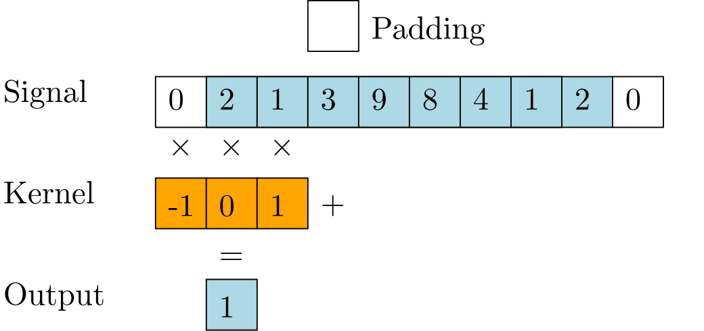

*********************************
NN Formulations (ReLU, Conv2d...)
*********************************

.. meta::
   :description: GAMSPy User Guide
   :keywords: Machine Learning, User, Guide, GAMSPy, gamspy, GAMS, gams, mathematical modeling, sparsity, performance

A key challenge in embedding ML blocks in optimization is to come up with
formulations. To help you with this task, we implement the most commonly used
activation functions and layers so you can easily start optimizing.

.. _nn-formulations:

Layer Formulations
==================

GAMSPy provides several formulations to help you embed your neural network
structures into your optimization model. We started with formulations
for computer vision-related structures such as convolution and pooling
operations.

Here is an example utilizing several different layers to easily
embed into your optimization model.

.. code-block:: python

   import gamspy as gp
   import numpy as np
   from gamspy.math import dim
   w1 = np.random.rand(2, 1, 3, 3)
   b1 = np.random.rand(2)
   m = gp.Container()
   conv1 = gp.formulations.Conv2d(
        m,
        in_channels=1,
        out_channels=2,
        kernel_size=(3, 3)
   )
   conv1.load_weights(w1, b1)
   maxpool1 = gp.formulations.MaxPool2d(m, (2, 2))

   inp = gp.Variable(m, domain=dim((10, 1, 24, 24)))
   out_var, eqs = conv1(inp)
   print([len(d) for d in out_var.domain])
   # [10, 2, 22, 22]

   out_var_2, eqs2 = maxpool1(out_var)
   print([len(d) for d in out_var_2.domain])
   # [10, 2, 11, 11]

   #out_var_2, eqs2 = maxpool1(out_var, big_m=10)

   out_var_3, eqs3 = gp.formulations.flatten_dims(out_var_2, [1, 2, 3])
   print([len(d) for d in out_var_3.domain])
   # [10, 242]

   w2 = np.random.rand(20, 242)
   b2 = np.random.rand(20)
   l1 = gp.formulations.Linear(m, 242, 20)
   l1.load_weights(w2, b2)

   out_var_4, eqs4 = l1(out_var_3)
   print([len(d) for d in out_var_4.domain])
   # [10, 20]

Supported formulations:

:meth:`Linear <gamspy.formulations.Linear>`
-------------------------------------------------------
Formulation generator for Linear layer in GAMS. It applies a linear mapping 
with a transformation and bias to the input data, expressed as :math:`y = x A^T + b`.

.. code-block:: python
   
   import gamspy as gp
   import numpy as np
   from gamspy.math import dim

   m = gp.Container()
   l1 = gp.formulations.Linear(m, 128, 64)
   w = np.random.rand(64, 128)
   b = np.random.rand(64)
   l1.load_weights(w, b)
   x = gp.Variable(m, "x", domain=dim([10, 128]))
   y, set_y = l1(x)

   [d.name for d in y.domain]
   # ['DenseDim10_1', 'DenseDim64_1']

:meth:`Conv1d <gamspy.formulations.Conv1d>`
-------------------------------------------------------
Formulation generator for 1D Convolution symbol in GAMS. It applies a 
1D convolution operation on an input signal.

|

|

.. code-block:: python

   import gamspy as gp
   import numpy as np
   from gamspy.math import dim

   w1 = np.array([[[-1, 0 , 1]]])
   b1 = np.array([0])
   m = gp.Container()
   # in_channels=1, out_channels=1, kernel_size=3
   conv1 = gp.formulations.Conv1d(m, 1, 1, 3, padding=1)
   conv1.load_weights(w1, b1)
   # 10 signals, 1 channel, Length 8
   inp = gp.Variable(m, domain=dim((10, 1, 8)))
   out, eqs = conv1(inp)

   type(out)
   # <class 'gamspy._symbols.variable.Variable'>
   [len(x) for x in out.domain]
   # [10, 1, 8]

:meth:`Conv2d <gamspy.formulations.Conv2d>`
-------------------------------------------------------
Formulation generator for 2D Convolution symbol in GAMS. It applies a 
2D convolution operation on an input signal consisting of multiple input planes.

.. code-block:: python

   import gamspy as gp
   import numpy as np
   from gamspy.math import dim

   w1 = np.random.rand(2, 1, 3, 3)
   b1 = np.random.rand(2)
   m = gp.Container()
   # in_channels=1, out_channels=2, kernel_size=3x3
   conv1 = gp.formulations.Conv2d(m, 1, 2, 3)
   conv1.load_weights(w1, b1)
   # 10 images, 1 channel, 24 by 24
   inp = gp.Variable(m, domain=dim((10, 1, 24, 24)))
   out, eqs = conv1(inp)

   type(out)
   # <class 'gamspy._symbols.variable.Variable'>
   [len(x) for x in out.domain]
   # [10, 2, 22, 22]

:meth:`MaxPool2d <gamspy.formulations.MaxPool2d>`
-------------------------------------------------------
Formulation generator for 2D Max Pooling in GAMS. It applies a 2D 
max pooling on an input signal consisting of multiple input planes.

.. code-block:: python

   import gamspy as gp
   from gamspy.math import dim

   m = gp.Container()
   # 2x2 max pooling
   mp1 = gp.formulations.MaxPool2d(m, (2, 2))
   inp = gp.Variable(m, domain=dim((10, 1, 24, 24)))
   out, eqs = mp1(inp)

   type(out)
   # <class 'gamspy._symbols.variable.Variable'>
   [len(x) for x in out.domain]
   # [10, 1, 12, 12]

:meth:`MinPool2d <gamspy.formulations.MinPool2d>`
-------------------------------------------------------
Formulation generator for 2D Min Pooling in GAMS. It applies a 2D 
min pooling on an input signal consisting of multiple input planes.

.. code-block:: python

   import gamspy as gp
   from gamspy.math import dim

   m = gp.Container()
   # 2x2 min pooling
   mp1 = gp.formulations.MinPool2d(m, (2, 2))
   inp = gp.Variable(m, domain=dim((10, 1, 24, 24)))
   out, eqs = mp1(inp)

   type(out)
   # <class 'gamspy._symbols.variable.Variable'>
   [len(x) for x in out.domain]
   # [10, 1, 12, 12]

:meth:`AvgPool2d <gamspy.formulations.AvgPool2d>`
-------------------------------------------------------
Formulation generator for 2D Avg Pooling in GAMS. It applies a 2D 
average pooling on an input signal consisting of multiple input planes.

.. code-block:: python

   import gamspy as gp
   from gamspy.math import dim

   m = gp.Container()
   # 2x2 avg pooling
   ap1 = gp.formulations.AvgPool2d(m, (2, 2))
   inp = gp.Variable(m, domain=dim((10, 1, 24, 24)))
   out, eqs = ap1(inp)

   type(out)
   # <class 'gamspy._symbols.variable.Variable'>
   [len(x) for x in out.domain]
   # [10, 1, 12, 12]

:meth:`flatten_dims <gamspy.formulations.flatten_dims>`
-------------------------------------------------------
It combines the domains specified by dims into a single unified domain.

.. code-block:: python

   import gamspy as gp
   from gamspy.math import dim
   m = gp.Container()
   inp = gp.Variable(m, domain=dim((10, 1, 24, 24)))
   out, eqs = gp.formulations.flatten_dims(inp, [2, 3])

   type(out)
   # <class 'gamspy._symbols.variable.Variable'>
   [len(x) for x in out.domain]
   # [10, 1, 576]

:meth:`TorchSequential <gamspy.formulations.TorchSequential>`
-------------------------------------------------------------
A convenience function that lets you embed your PyTorch Sequential
layer in your optimization models easily. As shown in the example,
it can be easily extended to include support for the layers that
we haven't included yet.

.. code-block:: python

   from functools import partial

   import gamspy as gp
   import torch
   from gamspy.math import dim

   class Flatten(torch.nn.Module):
       def __init__(self, dims_to_flatten: list[int]):
           super().__init__()
           self.dims_to_flatten = dims_to_flatten

       def forward(self, x):
           return torch.flatten(x, self.dims_to_flatten[0], self.dims_to_flatten[-1])

   # Mapping images of size 3 (RGB), 32 (Height), 32 (Width) to 4 classes
   model = torch.nn.Sequential(
       torch.nn.Conv2d(3, 4, (5, 5), bias=True),
       torch.nn.ReLU(),
       torch.nn.MaxPool2d((2, 2)),
       torch.nn.Conv2d(4, 4, (5, 5), bias=True),
       torch.nn.ReLU(),
       torch.nn.MaxPool2d((5, 5)),
       Flatten([1, 2, 3]),
       torch.nn.Linear(16, 4),
   )

   def convert_flatten(m: gp.Container, layer: Flatten):
       return partial(gp.formulations.flatten_dims, dims=layer.dims_to_flatten)

   m = gp.Container()

   seq_form = gp.formulations.TorchSequential(
       m, model, layer_converters={"Flatten": convert_flatten}
   )

   x = gp.Variable(m, domain=dim((10, 3, 32, 32)))

   out, eqs = seq_form(x)
   [len(d) for d in out.domain]
   # [10, 4]

.. _pooling-linearization:

Max/Min Pooling Implementation
------------------------------

Max pooling and min pooling use big-M notation and binary variables to pick the
minimum or maximum. If the input has upper and lower bounds, big-M is calculated
using those bounds. Otherwise, big-M is 1000. Generated variables also contain
the upper and lower bounds if the input already has them.

The real formulation is more complicated because it is not scalar but indexed.
For simplicity, let us demonstrate the following example.  We will do min/max
pooling on a 4x4 input where the filter size is 2x2. From the 4 regions, we
will have 4 values. :math:`a, b, c, d` are variables in the blue region, most
likely continuous, but there is no restriction. :math:`p` is the variable that is
the output of the pooling operation on the blue region. Depending on the operation,
it is either min or max of the corresponding input points.

|

.. image:: ../images/pooling.png
   :align: center

|

The linearization of the :math:`p = \max(a,b,c,d)` is as follows:

.. math::

   p \geq a \\
   p \geq b \\
   p \geq c \\
   p \geq d \\
   p \leq a + M(1 - x_a) \\
   p \leq b + M(1 - x_b) \\
   p \leq c + M(1 - x_c) \\
   p \leq d + M(1 - x_d) \\
   x_a + x_b + x_c + x_d = 1 \\
   x_a, x_b, x_c, x_d \in \{0, 1\} \\

:math:`x_i` is a binary variable when set to 1 it means :math:`p = i`. 

The linearization of the :math:`p = \min(a,b,c,d)` is as follows:

.. math::

   p + M(1 - x_a) \geq a \\
   p + M(1 - x_b) \geq b \\
   p + M(1 - x_c) \geq c \\
   p + M(1 - x_d) \geq d \\
   p \leq a \\
   p \leq b \\
   p \leq c\\
   p \leq d\\
   x_a + x_b + x_c + x_d = 1 \\
   x_a, x_b, x_c, x_d \in \{0, 1\} \\

:math:`x_i` is a binary variable when set to 1 it means :math:`p = i`. 

.. _activation-functions:

Activation Functions
====================

One of the key reasons neural networks can learn a wide range of tasks is their
ability to approximate complex functions, including non-linear ones. Activation
functions are essential components that introduce nonlinearity to neural
networks. While understanding functions like ReLU may be straightforward,
integrating them into optimization models can be challenging. To assist you, we
have started with a small list of commonly used activation functions. So far,
we have implemented the following activation functions:

:meth:`relu_with_binary_var <gamspy.math.relu_with_binary_var>`
---------------------------------------------------------------
Implements the ReLU activation function using binary variables.

:meth:`relu_with_complementarity_var <gamspy.math.relu_with_complementarity_var>`
---------------------------------------------------------------------------------
Implements the ReLU activation function using complementarity conditions.

:meth:`relu_with_sos1_var <gamspy.math.relu_with_sos1_var>`
-----------------------------------------------------------
Implements the ReLU activation function using `SOS1 <https://www.gams.com/47/docs/UG_LanguageFeatures.html?search=sos#UG_LanguageFeatures_SpecialOrderSetsOfType1-SOS1>`_ variables.

:meth:`softmax <gamspy.math.softmax>`
-------------------------------------
Implements the softmax activation function. This function strictly 
requires a GAMSPy Variable, y = softmax(x).

:meth:`log_softmax <gamspy.math.log_softmax>`
---------------------------------------------
Implements the log_softmax activation function. This function strictly 
requires a GAMSPy Variable, y = log_softmax(x). 

Activation Functions Explanation
--------------------------------
Unlike other mathematical functions, these activation functions return a
variable and a list of equations instead of an expression. This is because ReLU 
cannot be representedby a single expression. Directly writing ``y = max(x, 0)`` 
without reformulating it would result in a Discontinuous Nonlinear Program (``DNLP``) model, 
which is highly undesirable. Currently, you can either use
:meth:`relu_with_binary_var <gamspy.math.relu_with_binary_var>` to
introduce binary variables into your problem, or
:meth:`relu_with_complementarity_var <gamspy.math.relu_with_complementarity_var>`
to introduce nonlinearity.

Your model class changes depending on whether you want to embed a pre-trained
neural network into your problem or train a neural network within your problem.

If you are training a neural network, you must have non-linearity. Using
:meth:`relu_with_binary_var <gamspy.math.relu_with_binary_var>`
would result in a Mixed-Integer Nonlinear Program (``MINLP``) model. On the other
hand, :meth:`relu_with_complementarity_var <gamspy.math.relu_with_complementarity_var>`
would keep the model as a Nonlinear Program (``NLP``) model, though this does not
necessarily mean it will train faster.

If you are embedding a pre-trained neural network using
:meth:`relu_with_binary_var <gamspy.math.relu_with_binary_var>`,
you can maintain your model as a Mixed-Integer Programming (``MIP``) model,
provided you do not introduce nonlinearities elsewhere.

To read more about `classification of models
<https://www.gams.com/latest/docs/UG_ModelSolve.html#UG_ModelSolve_ModelClassificationOfModels>`_.

.. code-block:: python

   from gamspy import Container, Variable, Set
   from gamspy.math import relu_with_binary_var, log_softmax
   from gamspy.math import dim

   batch = 128
   m = Container()
   x = Variable(m, "x", domain=dim([batch, 10]))
   y, eqs1 = relu_with_binary_var(x)

   y2, eqs2 = log_softmax(x) # this creates variable and equations for you

Additionally, we offer our established functions that can also be used as
activation functions:

:meth:`tanh <gamspy.math.tanh>`
-------------------------------
It applies the Hyperbolic Tangent (Tanh) function element-wise.

:meth:`sigmoid <gamspy.math.sigmoid>`
-------------------------------------
It applies the Sigmoid function element-wise.

These functions return expressions like the other math functions. So, you
need to create equations and variables yourself.

.. code-block:: python

   from gamspy import Container, Variable, Set, Equation
   from gamspy.math import dim, tanh

   batch = 128
   m = Container()
   x = Variable(m, "x", domain=dim([batch, 10]))
   eq = Equation(m, "set_y", domain=dim([batch, 10]))
   y = Variable(m, "y", domain=dim([batch, 10]))
   eq[...] = y == tanh(x)

