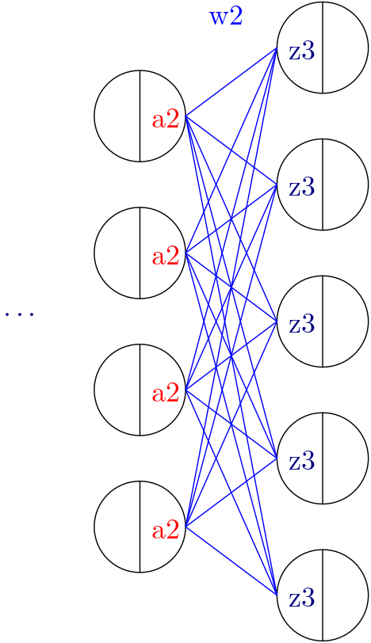

********************************
Matrix Operations - Introduction
********************************

.. meta::
   :description: GAMSPy User Guide
   :keywords: Machine Learning, User, Guide, GAMSPy, gamspy, GAMS, gams, mathematical modeling, sparsity, performance

Matrix operations are introduced to accompany the people who wants to use
machine learning with GAMS or for people who prefer using matrix notation. In
many machine-learning applications underlying algebra is written using matrix
operations rather than using an indexed algebra. While GAMS provides indexed
algebra to meet the demands of many common optimization applications, matrix
operations are introduced to complement indexed algebra. We still think with
the classical optimization problems indexed algebra is a better choice since it
is more intuitive.

However for ML practitioners writing this:

.. code-block:: python

   calc_mm_3[...] = z3 == a2 @ w2

is much easier than:

.. code-block:: python

   calc_mm_3[...] = z3[m, j] == Sum(k,  a2[m, i] @ w2[i, j])

In this context, m represents the batch dimension, i denotes the feature dimension of layer 2,
and j represents the feature dimension of layer 3.

Considering common operations in ML domain we have implemented:

* Implicit default domains
* Easy matrix declaration
* Matrix multiplication
* Convenience functions
   * Vector norms
   * Trace
   * Permute
* Improved domain tracking

In this introduction section, we summarize each of the features. You can find
more information about the features in their own respective pages.

Implicit default domains
========================

TODO Maybe document it somewhere else as well

We have extended GAMSPy to make it work without explicitly specifying the
indices. Let a, b, c be variables (e.g. matrices). When symbols are accessed
without specific domains, the domains specified when declaring the symbol is
used implicitly.

.. code-block:: python

   import gamspy as gp
   import numpy as np
   m = gp.Container()
   i = gp.Set(m, "i")
   j = gp.Set(m, "j")
   k = gp.Set(m, "k")

   a = gp.Variable(m, name="a", domain=[i, j, k])
   b = gp.Variable(m, name="b", domain=[j, k])
   c = gp.Variable(m, name="c", domain=[i, j])
   assign_1 = gp.Equation(m, name="assign_1", domain=[i, j, k])

The following works now:

.. code-block:: python

   assign_1[...] = a == b + c

where in the old times you would have to at least:

.. code-block:: python

   assign_1[...] = a[...] == b[...] + c[...]

or

.. code-block:: python

   assign_1[...] = a[i, j, k] == b[j, k] + c[i, j]

Easy matrix declaration
=======================

Sometimes you need to generate parameters or variables as a matrix and do not
put too much meaning to its indices. ``gp.math.dim`` function is our suggested
method for declaring matrices, however parameters or variables defined without
using it still can be used in matrix operations.

See the following example for using ``dim`` function:

.. code-block:: python

   import gamspy as gp
   import numpy as np
   from gamspy.math import dim

   w1_data = np.random.rand(50, 100)
   m = gp.Container()
   w = gp.Parameter(m, name="w1", domain=dim((50, 100)), records=w1_data)
   w.records

Output:

.. code-block:: text

        DenseDim50_1 DenseDim100_1     value
   0               0             0  0.429909
   1               0             1  0.831080
   2               0             2  0.656872
   3               0             3  0.959341
   4               0             4  0.758202
   ...           ...           ...       ...
   4995           49            95  0.847640
   4996           49            96  0.870642
   4997           49            97  0.369344
   4998           49            98  0.233120
   4999           49            99  0.704139

As you can see under the hood, GAMSPy generates two sets for you called
``DenseDim50_1`` and ``DenseDim100_1``. ``DenseDim50_1`` contains elements
``0, 1, ..., 49`` whereas ``DenseDim100_1`` contains elements
``0, 1, ..., 99``. The word ``DenseDim`` is followed by the dimension,
underscore and then the alias number where ``1`` refering the original set.

.. code-block:: python

   ...
   w2_data = np.random.rand(50, 50)
   w2 = gp.Parameter(m, name="w2", domain=dim((50, 50)), records=w2_data)
   w2.records

Output:

.. code-block:: text

        DenseDim50_1 DenseDim50_2     value
   0               0            0  0.902650
   1               0            1  0.268446
   2               0            2  0.133204
   3               0            3  0.931026
   4               0            4  0.283675
   ...           ...          ...       ...
   2495           49           45  0.931849
   2496           49           46  0.991170
   2497           49           47  0.754725
   2498           49           48  0.924075
   2499           49           49  0.437851

You can see in the output ``DenseDim50_2`` is used instead of repeating
the same set twice. ``DenseDim50_2`` is an alias of set ``DenseDim50_1``.
This is done because it is more convenient for us when doing matrix
multiplications.

In the same way you can generate variable matrices:

.. code-block:: python

   ...
   x = gp.Variable(m, name="x", domain=dim((50, 50)))

You are not limited to 2 dimensions. Many times in ML applications we need more than 2 dimensions:

.. code-block:: python

   ...
   y = gp.Variable(m, name="y", domain=dim((128, 500, 1000)))

However, you are limited to 20 dimensions as GAMS supports up to 20 dimensions:

.. code-block:: python

   ...
   # The following would not work
   z = gp.Variable(m, name="z", domain=dim(list(range(1, 100))))

Matrix Multiplication
=====================

We tried to follow matrix multiplication rules of PyTorch, ``torch.matmul``,
therefore, you are not limited to only rank-2 tensor multiplications. GAMSPy
symbols and expressions support matrix multiplication by overriding ``@``
operator.

.. admonition:: Information

   When performing matrix multiplication, the actual computation is not carried
   out immediately. Instead, an expression is generated. This approach is taken
   because matrix multiplication is computationally intensive, and since the
   elements involved include variables in addition to numbers, certain libraries
   and optimization techniques cannot be used to accelerate the process. By
   delegating this task to GAMS rather than handling it directly in Python, we
   achieve a faster model generation experience.

Validation of dimensions and shape of the output is determined by
dimensions of the tensors as follows:

1. If both tensors are vectors, the dot product is returned.
2. If both tensors are matrices, matrix multiplication is returned.
3. If the first tensor is a vector and the second tensor is a matrix
   then 1 is prepended to the vector to make it a matrix multiplication.
   After the operation, the prepended dimension is removed.
4. If the first tensor is a matrix, and the second tensor is a vector,
   matrix-vector product is returned.
5. If the first tensor is a vector, and the second tensor has a rank
   larger than 2, the first tensor is prepended with 1 and then batched
   matrix multiplication is returned. After the operation, the prepended
   dimension is removed.
6. If the first tensor has a rank larger than 2, and the second tensor is
   a vector, then batched matrix-vector product is returned.
7. If both tensors have ranks larger than 2, then they must have same
   ranks. We currently do not support broadcasting. Batch dimensions must match.

You can see every case in the following example:

.. code-block:: python

   import gamspy as gp
   import numpy as np
   from gamspy.math import dim

   # since we will use this a lot
   rand = np.random.rand

   m = gp.Container()
   # inputs
   vec  = gp.Parameter(m, name="vec",  domain=dim((25,   )), records=rand(25))
   mat  = gp.Parameter(m, name="mat",  domain=dim((25, 25)), records=rand(25, 25))
   mat2 = gp.Parameter(m, name="mat2", domain=dim((40, 50)), records=rand(40, 50))
   mat3 = gp.Parameter(m, name="mat3", domain=dim((50, 60)), records=rand(50, 60))

   # case 1: vector @ vector, dot product
   f = gp.Parameter(m, name="f")
   f[...] = vec @ vec
   print(f"{f.records=}")
   # 0  9.181418

   # case 2: matrix @ matrix, matrix multiplication
   # 40 by 50 times 50 by 60 resulting in 40 by 60
   res_mat = gp.Parameter(m, name="res_mat", domain=dim((40, 60)))
   res_mat[...] = mat2 @ mat3
   print(f"{res_mat.records}")
   #     DenseDim40_1 DenseDim60_1      value
   #0               0            0   8.648533
   #1               0            1  10.884543
   #2               0            2  10.512125
   #3               0            3  10.892082
   #4               0            4   9.390584
   #...           ...          ...        ...
   #2395           39           55  13.436246
   #2396           39           56  12.606727
   #2397           39           57  12.442652
   #2398           39           58  12.599677
   #2399           39           59  12.669896

   # case 3: vector @ matrix
   res_vec = gp.Parameter(m, name="res_vec", domain=dim((25,)))
   res_vec[...] = vec @ mat

   # case 4: matrix @ vector
   res_vec[...] = mat @ vec

   # case 5: vector @ batched matrix
   # 20 times 128x20x90
   # vector is prepended by 1
   # 1x20 times 128x20x90
   # resulting in 128x90
   vec_2 = gp.Parameter(m, name="vec_2", domain=dim((20,)), records=rand(20))
   batched_mat = gp.Parameter(m, name="batched_mat",
                              domain=dim((128, 20, 90)), records=rand(128, 20, 90))
   result_mat = gp.Parameter(m, name="result_mat", domain=dim((128, 90)))
   result_mat[...] = vec_2 @ batched_mat

   # case 6: batched matrix @ vector
   vec_3 = gp.Parameter(m, name="vec_3", domain=dim((90,)), records=rand(90))
   result_mat_2 = gp.Parameter(m, name="result_mat_2", domain=dim((128, 20)))
   result_mat_2[...] = batched_mat @ vec_3

   # case 7: batched matrix @ batched matrix
   batched_mat_2 = gp.Parameter(m, name="batched_mat_2",
                                domain=dim((128, 90, 50)), records=rand(128, 90, 50))
   result_mat_3 = gp.Parameter(m, name="result_mat_3", domain=dim((128, 20, 50)))
   result_mat_3[...] = batched_mat @ batched_mat_2

Convenience Functions
=====================

Similar to matrix multiplications, there exist many mathematical functions that
are frequently used in machine learning applications.

Vector Norms
------------

TODO maybe mention the square trick here

Vector norms are essential to many machine learning applications. For example,
in ordinary least squares method, one minimizes the squared residuals which can
be formulated as minimizing the vector size of the residuals.

In the simple example, we can use `vector_norm` to get length of a vector.

.. code-block:: python

   import gamspy as gp
   import numpy as np
   from gamspy.math import vector_norm

   m = gp.Container()
   i = gp.Set(m, name="i", records=["i1", "i2"])
   # (3, 4) vector
   vec = gp.Parameter(m, "vec", domain=[i], records=[("i1", 3), ("i2", 4)])
   # Size of a vector is a scalar
   vlen = gp.Parameter(m, "vlen", domain=[])
   vlen[...] = gp.math.vector_norm(vec)
   vlen.records
   #    value
   # 0    5.0

The `vector_norm` function calculates the Euclidean norm of an input by
default, flattening all dimensions. It can also compute any Lp-norm with some
considerations:

- **Default Behavior**: Without additional arguments, the function returns the
  Euclidean norm.
- **Custom Lp-norm**: To calculate an Lp-norm, supply the desired value of `ord`.
- **Special Case**: If `ord` is not an even integer and the input is not an
  endogenous argument, the norm calculation uses the absolute value, which
  requires `DNLP`_.

You can also use `dim` function to specify over which dimensions to compute the
norm.

.. code-block:: python

   import gamspy as gp
   import numpy as np
   from gamspy.math import vector_norm

   m = gp.Container()
   i = gp.Set(m, name="i", records=["i1", "i2"])
   j = gp.Set(m, name="j", records=["j1", "j2"])
   mat = gp.Parameter(m, "mat", domain=[i, j],
                      records=[
                        ("i1", "j1", 3),
                        ("i1", "j2", 4),
                        ("i2", "j1", 7),
                        ("i2", "j2", 24),
                      ]
                     )
   vlen = gp.Parameter(m, "vlen", domain=[i])
   vlen[...] = gp.math.vector_norm(mat, dim=[j])
   vlen.records
   #     i  value
   # 0  i1    5.0
   # 1  i2   25.0

Permute
-------

Another very common operation that is often required is permutation. The
`permute` function takes an input `x` and `dims` where the `x` is one of the
following:

- Parameter
- ImplicitParameter
- Variable
- ImplicitVariable

and returns either an ImplicitVariable or ImplicitParameter where the
dimensions are permuted as requested.

`permute` does not create a new variable or parameter in GAMS but rather
creates a placeholder when accesed doing the permutation and accessing the
original variable. You can see that in the following example we create a matrix
`mat` with domain [i, j]. Afterwards, we set `mat2` to a permutation of the
`mat` but printing the GAMS string of `mat2` reveals that no new variable is
generated.

.. code-block:: python

   import gamspy as gp
   import numpy as np
   from gamspy.math import permute

   m = gp.Container()
   i = gp.Set(m, name="i", records=["i1", "i2"])
   j = gp.Set(m, name="j", records=["j1", "j2"])
   mat = gp.Parameter(m, "mat", domain=[i, j],
                      records=[
                        ("i1", "j1", 3),
                        ("i1", "j2", 4),
                        ("i2", "j1", 7),
                        ("i2", "j2", 24),
                      ]
                     )

   mat2 = permute(mat, [1, 0])
   mat2.gamsRepr()
   # 'mat(i,j)'
   mat2.domain
   # [<Set `j` (0x...)>, <Set `i` (0x...)>]

   mat2["i1", "j2"] # This would raise an exception

   mat2["j2", "i2"] # This is the correct way to reach mat2

   mat2["j2", "i2"].gamsRepr()
   # 'mat("i1","j2")'

If you need to just permute last two dimensions, aka transpose, you can use
`.t()` on parameters and variables.

.. code-block:: python

   import gamspy as gp
   import numpy as np

   m = gp.Container()
   i = gp.Set(m, name="i", records=["i1", "i2"])
   j = gp.Set(m, name="j", records=["j1", "j2"])
   mat = gp.Parameter(m, "mat", domain=[i, j],
                      records=[
                        ("i1", "j1", 3),
                        ("i1", "j2", 4),
                        ("i2", "j1", 7),
                        ("i2", "j2", 24),
                      ]
                     )

   mat2 = mat.t() # same as before

Trace
-----

The `trace` function calculates the trace of a given input array `x`. Although
less common in machine learning, this function can still be useful in various
applications.

- **Default Behavior**: By default, the function computes the trace along the
  zeroth and first axes.
- **Custom Axes**: Use the `axis1` and `axis2` parameters to specify different
  axes for the trace calculation. The domains of `axis1` and `axis2` must be
  the same or aliases.

.. code-block:: python

   import gamspy as gp
   import numpy as np
   from gamspy.math import trace

   m = gp.Container()
   i = gp.Set(m, name="i", records=["i1", "i2"])
   # Matrix
   # 3 4
   # 5 6
   # Trace of it is 3 + 6 = 9

   mat = gp.Parameter(m, "mat", domain=[i, i],
                      records=[
                        ("i1", "i1", 3),
                        ("i1", "i2", 4),
                        ("i2", "i1", 5),
                        ("i2", "i2", 6),
                      ]
                     )

   sc = gp.Parameter(m, name="sc", domain=[])
   sc[...] = trace(mat)
   sc.records
   #    value
   # 0    9.0

Improved domain tracking
========================

Talk about domain tracking

.. _DNLP: https://www.gams.com/latest/docs/UG_ModelSolve.html#UG_ModelSolve_ModelClassificationOfModels_DNLP
