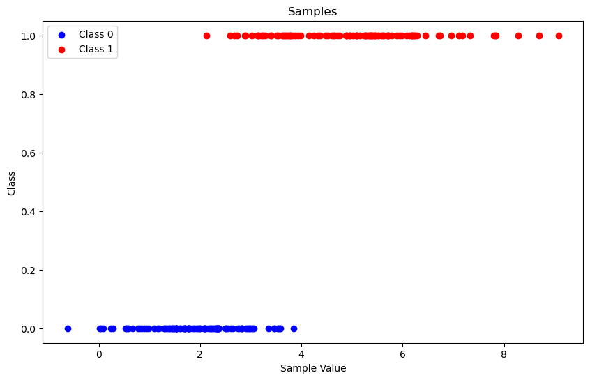
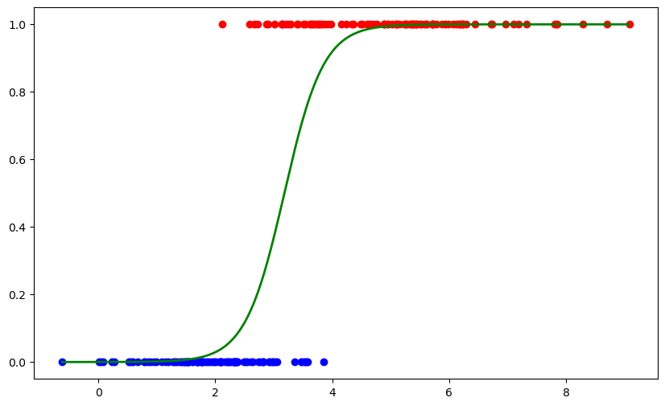

*****************************
Binary Classification Example
*****************************

.. meta::
   :description: GAMSPy User Guide
   :keywords: Machine Learning, User, Guide, GAMSPy, gamspy, GAMS, gams, mathematical modeling, sparsity, performance

Learning to classify between 2 (or more) classes is a common problem that can
arise from many real life applications. For example, you might have some
traffic data and you can try to learn depending on some parameters if some road
is congested or not. Depending on how many hours studied, you can try to learn
if a student will fail or pass.

One of the most common techniques to handle binary classification problems is
so-called logistic regression approach.

To learn more about `Logistic Regression <https://en.wikipedia.org/wiki/Logistic_regression>`_.

We start with generating a simple dataset. We have a single feature, and two
gaussian distributions where class 1 and class 2 are sampled from.

.. code-block:: python

   import numpy as np
   import matplotlib.pyplot as plt

   np.random.seed(42)

   num_samples = 100

   # Parameters for the first Gaussian distribution
   mean1 = 2.0
   std_dev1 = 1.0

   # Parameters for the second Gaussian distribution
   mean2 = 5.0
   std_dev2 = 1.5

   # Generate samples
   samples0 = np.random.normal(mean1, std_dev1, num_samples)
   samples1 = np.random.normal(mean2, std_dev2, num_samples)

   # Plot the samples
   plt.figure(figsize=(10, 6))
   plt.scatter(samples0, np.zeros_like(samples0), color='blue', label='Class 0')
   plt.scatter(samples1, np.zeros_like(samples1) + 1, color='red', label='Class 1')
   plt.xlabel('Sample Value')
   plt.ylabel('Class')
   plt.title('Samples')
   plt.legend()
   plt.show()

Our goal is to fit parameters of a function (yes, the logistic function) where
we input the feature of a sample, we calculate the probability of this sample
belonging to class 1. Since we have only two classes, 1 minus that probability
will give us the probability of that sample belonging to class 0.

Just by looking at the samples, you can guess :math:`f(0)` should be very close
to 0 whereas :math:`f(8)` should be close to 1.

The function that we are trying to fit is:

.. math::

   p(x) = \frac{1}{1 + e ^ {-(\beta_0 + \beta_1 * x)}}

We need to come-up with :math:`\beta_0` and :math:`\beta_1` values so that
samples belonging to class 1 have a higher :math:`p(x)` and samples belonging
to class 0 have :math:`p(x)` close to 0.

Let's start with passing data to GAMSPy

.. code-block:: python

   import gamspy as gp
   import sys
   from gamspy.math import dim, exp, log

   m = gp.Container()

   class_0_samples = gp.Parameter(m, name="samples_0",
                                  domain=dim([100]), records=samples0)

   class_1_samples = gp.Parameter(m, name="samples_1",
                                  domain=dim([100]), records=samples1)

   dim_100 = class_0_samples.domain[0]

Then, we are searching to optimize coefficients :math:`\beta_0` and :math:`\beta_1`
minimizing the loss.

.. code-block:: python

   b0 = gp.Variable(m, name="bias")
   b1 = gp.Variable(m, name="coefficient")
   loss = gp.Variable(m, name="loss")

We are using the log loss for guiding our optimization, which you can read more from
the wikipedia article we cited.

.. code-block:: python

   def logistic(c0, c1, x):
       return 1 / (1 + exp(-c0 - x * c1))

   def_loss = gp.Equation(m, name="calc_loss")

   # Define the loss function
   def_loss[...] = loss == gp.Sum(dim_100, - log(logistic(b0, b1, class_1_samples[...]))) + \
               gp.Sum(dim_100, - log(1 - logistic(b0, b1, class_0_samples[...])))

This is basically all we need, we put everything under logistic model and solve it
using your favourite NLP solver.

.. code-block:: python

   model_logistic = gp.Model(
           m,
           name="logistic",
           equations=m.getEquations(),
           problem="NLP",
           sense="min",
           objective=loss,
   )

   model_logistic.solve() # output=sys.stdout if you like to show the log from the solver

   class_1_accuracy = gp.Parameter(m, name="accuracy1")
   class_1_accuracy[...] = gp.Sum(dim_100, logistic(b0.l,  b1.l, class_1_samples) >= 0.5)

   class_0_accuracy = gp.Parameter(m, name="accuracy2")
   class_0_accuracy[...] = gp.Sum(dim_100, logistic(b0.l,  b1.l, class_0_samples) < 0.5)

   learned_b0 = b0.toDense()
   learned_b1 = b1.toDense()

   avg_accuracy = (class_1_accuracy.toDense() + class_0_accuracy.toDense()) / 2
   print(avg_accuracy, "% Accuracy")
   # 91.0 % Accuracy

If we plot the logistic function on top of the samples:

.. code-block:: python

   def predict_class(b0, b1, x):
       prob = 1 / (1 + np.exp(-b0 - x * b1))
       return prob

   # Create labels for the samples
   labels1 = np.ones(100)
   labels0 = np.zeros(100)

   # Combine samples and labels
   X = np.concatenate((samples1, samples0)).reshape(-1, 1)
   y = np.concatenate((labels1, labels0))

   # Generate a range of values for plotting the logistic function
   x_values = np.linspace(min(X), max(X), 500).reshape(-1, 1)
   y_values = predict_class(learned_b0, learned_b1, x_values)

   plt.figure(figsize=(10, 6))
   plt.scatter(samples1, np.zeros_like(samples1) + 1, color='red')
   plt.scatter(samples0, np.zeros_like(samples0), color='blue')

   plt.plot(x_values, y_values, color='green', linewidth=2, label='Logistic Function')

You can see how nicely the function is fitted over the samples. In this example, we only
trained a logistic regression model but it is also possible to use this trained model
in your optimization models.

