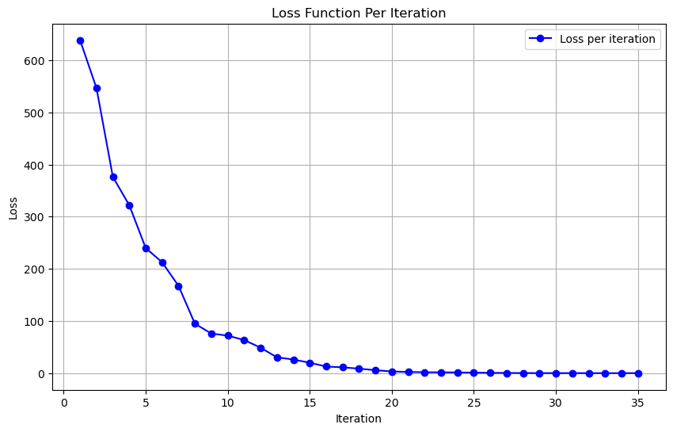

**********************
Neural Network Example
**********************

.. meta::
   :description: GAMSPy User Guide
   :keywords: Machine Learning, User, Guide, GAMSPy, gamspy, GAMS, gams, mathematical modeling, sparsity, performance

Our goal in implementing ML-related features was to provide maximum flexibility.
Although GAMSPy’s primary purpose is not neural network training, we wanted to 
demonstrate the process for those who are curious or need it for research.
Implementing a "Mini-Batch Gradient Descent" training process would be very
time-consuming and result in a non-introductory example. Therefore, we
implemented a method that trains using just a single mini-batch of data,
stopping after one mini-batch.

We will train a neural network to classify handwritten digits from MNIST
dataset. For this example we will use a simple feed-forward network since it is
easier to implement and demonstrate. Our neural network has flattened images
in the input layer, resulting in a 28x28 = 784 dimension. We will use a single 
hidden layer with 20 neurons, and the output layer will have 10 neurons 
corresponding to 10 digits.

We start with the imports:

.. code-block:: python

   import sys

   from collections import Counter

   import gamspy as gp
   import gamspy.math
   import numpy as np
   import pandas as pd
   import torch

   from gamspy.math.matrix import dim
   from torchvision import datasets, transforms

Even though, we won't use PyTorch for training the neural network, it is still
useful for loading sample training data.

Next we define `datasets and dataloaders <https://pytorch.org/tutorials/beginner/basics/data_tutorial.html>`_ :

.. code-block:: python

   hidden_layer_neurons = 20

   torch.manual_seed(7)
   np.random.seed(7)

   train_kwargs = {'batch_size': 250} # should be multiple of 10
   test_kwargs = {'batch_size': 128}

   mean = (0.1307,)
   std = (0.3081,)

   transform = transforms.Compose([
       transforms.ToTensor(),
       transforms.Normalize(mean, std)
       ])

   train_dataset = datasets.MNIST('../data', train=True, download=True, transform=transform)
   test_dataset = datasets.MNIST('../data', train=False, transform=transform)

   train_loader = torch.utils.data.DataLoader(train_dataset, **train_kwargs)
   test_loader = torch.utils.data.DataLoader(test_dataset, **test_kwargs)

   def get_balanced_batch(train_loader, sample_size):
       counts = [0] * 10
       good_data = []
       good_target = []
       finished = 0

       for data, target in train_loader:
           for row, row_label in zip(data, target):
               if counts[row_label.item()] < sample_size:
                   good_data.append(row)
                   good_target.append(row_label)
                   counts[row_label.item()] += 1
                   if [row_label.item()] == 10:
                       finished += 1

               if finished == 10:
                   break

       return torch.stack(good_data), torch.stack(good_target)

We are loading MNIST dataset since it's input size is not too large. The MNIST
dataset consists of handwritten digits that are 28x28 in size. Examples are
grayscale. Here are some examples:

.. image:: ../images/mnist.png
  :align: center

MNIST from:
LeCun, Yann, et al. "Gradient-based learning applied to document recognition."
Proceedings of the IEEE 86.11 (1998): 2278-2324.

In this example, we load only one batch of data, ensuring that each digit is
equally represented, with 10 instances of each. If we were not limiting it to a
single batch, this equal representation would not be necessary. This is
achieved by ``get_balanced_batch`` method.

Properly initializing weights is crucial for gradient descent, and this remains
true when using a non-linear solver to optimize the neural network. Without
good initial weights, the solver may take much longer to optimize or might even
fail to improve. Therefore, we define our method for weight initialization,
using `Xavier initialization <https://proceedings.mlr.press/v9/glorot10a.html>`_.

.. code-block:: python

   def uniform_xavier_init(n_input: int, n_output: int, gain: float) -> np.ndarray:
       # also https://pytorch.org/docs/stable/nn.init.html#torch.nn.init.xavier_uniform_
       a = gain * np.sqrt(6 / (n_input + n_output))
       return np.random.uniform(-a, a, (n_input, n_output))

   w1_data = uniform_xavier_init(784, hidden_layer_neurons, 5/3)
   w2_data = uniform_xavier_init(hidden_layer_neurons, 10, 1)

``w1_data`` contains the weights for the first linear layer, and ``w2_data``
contains the weights for the second linear layer. With these weights available,
we can begin describing the neural network in GAMSPy.

Let's start by defining our variables:

.. code-block:: python

   batch = train_kwargs["batch_size"]

   # Create a container
   m = gp.Container()

   w1 = gp.Variable(m, name="w1", domain=dim(w1_data.shape))
   w1.setRecords(w1_data)
   w1.lo[...] = -5
   w1.up[...] = 5

   w2 = gp.Variable(m, name="w2", domain=dim(w2_data.shape))
   w2.setRecords(w2_data)
   w2.lo[...] = -5
   w2.up[...] = 5

The ``w1`` and ``w2`` variables hold the weights of the neural network. We set
upper and lower bounds on them to speed up the learning process, as proper
bounds can be beneficial. Additionally, excessively large weight values are
often indicative of overfitting.

Then we define the rest of the variables:

.. code-block:: python

   a1 = gp.Parameter(m, name="a1", domain=dim((batch, 784))) # input

   target_set = gp.Set(
       m,
       name="targets",
       domain=dim([batch, 10]),
       uels_on_axes=True
   )

   z2 = gp.Variable(m, name="z2", domain=dim((batch, hidden_layer_neurons)))
   z2.up[...] = 10
   z2.lo[...] = -10

   z3 = gp.Variable(m, name="z3", domain=dim((batch, 10)))
   z3.up[...] = 10
   z3.lo[...] = -10

   a2 = gp.Variable(m, name="a2", domain=dim((batch, hidden_layer_neurons)))
   a2.up[...] = 1
   a2.lo[...] = -1

   loss = gp.Variable(m, name="loss")

``a1`` represents our input layer, containing a batch of images. ``target_set``
is the set that holds the expected labels for these images. ``z2`` is the
output after the first linear layer, and ``a2`` is the tanh-activated version
of ``z2``. ``z3`` is the output after the second and final linear layer.
``a3``, which we will define later, will be the log_softmax-activated version
of ``z3``, representing our log probabilities. Finally, the loss variable is
used to calculate the negative log-likelihood loss.

Now, let's define the relationships between our variables, also known as the
forward pass.

.. code-block:: python

   calc_mm_1 = gp.Equation(m, name="calc_mm_1", domain=dim((batch, hidden_layer_neurons)))
   calc_mm_1[...] = z2 == a1 @ w1

   calc_activation = gp.Equation(m, name="calc_activation", domain=dim((batch, hidden_layer_neurons)))
   calc_activation[...] = a2 == gp.math.tanh(z2)

   calc_mm_2 = gp.Equation(m, name="calc_mm_2", domain=dim((batch, 10)))
   calc_mm_2[...] = z3 == a2 @ w2

   a3 = gp.math.activation.log_softmax(z3)

   set_loss = gp.Equation(m, name="calc_loss")
   set_loss[...] = loss == gp.Sum(target_set[a3.domain[0], a3.domain[1]], -a3)

   train_nn = gp.Model(
        m,
        name="train",
        equations=m.getEquations(),
        problem="NLP",
        sense="min",
        objective=loss,
   )

``z2`` is defined as the input multiplied by the weights of the first linear
layer, using the ``@`` sign for :ref:`matrix-multiplication`. ``a2`` is the
:meth:`tanh <gamspy.math.tanh>` activation of ``z2``. Similarly, ``z3`` is
``a2`` multiplied by the weights of the second linear layer. Finally, we obtain
our log probabilities using the :meth:`log_softmax <gamspy.math.log_softmax>`
function. If you are curious about why we needed equations for ``tanh`` but not
for ``log_softmax``, you can refer to our :ref:`activation-functions` section.
We then calculate the negative log likelihood loss by summing up the negative
log probabilities of the expected neurons in the output layer for each batch.

We define ``train_nn`` with the objective of minimizing the loss function based
on the equations we provided. This problem is classified as an NLP (Nonlinear
Programming) problem.

So far, we have defined our model in GAMSPy and created data loaders. However,
our model is not yet loaded with data. We will address that next.

.. code-block:: python

   data, target = get_balanced_batch(train_loader, batch // 10)
   data = data.reshape(batch, -1)
   init_data = data.detach().numpy()

   # reshape the target, labels, so that we can provide them to GAMSPy
   target_df = pd.DataFrame(target)
   target_df["val"] = 1
   target_df = target_df.pivot(columns=[0], values="val").fillna(0).astype(bool)

   a1.setRecords(init_data)
   target_set.setRecords(target_df, uels_on_axes=True)

   z2_data = init_data @ w1.toDense()
   z2.setRecords(z2_data)

   a2_data = np.tanh(z2_data)
   a2.setRecords(a2_data)

   z3_data = a2_data @ w2.toDense()
   z3.setRecords(z3_data)

We obtain a **single** batch of data and format it to be compatible with GAMSPy.
Next, we set our input ``a1`` and labels ``target_set``. While we could stop
here, our experiments show that providing the solver with good initial
values for every variable significantly speeds up training.

Finally, we start training:

.. code-block:: python

   train_nn.solve(
       solver='knitro',
       output=sys.stdout,
       solver_options={
           "opttol": 1,
           "infeastol": 1e-3,
           "feastol": 1e-3,
           "ftol": 1e-2,
           "convex": 0,
           "algorithm": 1,
           "outlev": "4"
       }
   )

For this example, we picked `Knitro <https://www.artelys.com/solvers/knitro/>`_.
You can choose any nonlinear solver; however, selecting a local nonlinear
solver might be wise since finding a globally optimal solution could lead to
severe overfitting and is extremely challenging. We won't delve deeply into
solver settings, but we increase the tolerance for feasibility and optimality.
This problem cannot be "really" infeasible, and for our purposes, a loss of 0.1
versus 1e-7 is not significantly different. Additionally, we increase the
verbosity of the output using ``outlev`` to monitor how the loss decreases with
each iteration.

.. code-block:: none

   ...

   Problem Characteristics                                 (   Presolved)
   -----------------------
   Objective goal:  Minimize
   Objective type:  linear
   Number of variables:                              30880 (       28380)
       bounded below only:                               0 (           0)
       bounded above only:                               0 (           0)
       bounded below and above:                      15880 (       15880)
       fixed:                                            0 (           0)
       free:                                         15000 (       12500)
   Number of constraints:                            15000 (       12500)
       linear equalities:                             5000 (        5000)
       quadratic equalities:                          2500 (        2500)
       gen. nonlinear equalities:                     7500 (        5000)
       linear one-sided inequalities:                    0 (           0)
       quadratic one-sided inequalities:                 0 (           0)
       gen. nonlinear one-sided inequalities:            0 (           0)
       linear two-sided inequalities:                    0 (           0)
       quadratic two-sided inequalities:                 0 (           0)
       gen. nonlinear two-sided inequalities:            0 (           0)
   Number of nonzeros in Jacobian:                 4065000 (     4037500)
   Number of nonzeros in Hessian:                    68750 (       68750)

   Knitro using the Interior-Point/Barrier Direct algorithm.

     Iter     fCount     Objective      FeasError   OptError    ||Step||    CGits
   --------  --------  --------------  ----------  ----------  ----------  -------
          0         1    6.383119e+02   2.132e-14
          1         2    5.465513e+02   3.266e-02   6.926e-01   9.395e+00        0
          2         3    3.761933e+02   3.320e-01   5.785e-01   2.198e+01        0
          3         4    3.218762e+02   1.976e-02   7.466e-01   6.493e+00        0
          4         5    2.398709e+02   1.718e-01   5.493e-01   1.260e+01        0
          5         6    2.125516e+02   1.083e-02   6.199e-01   3.860e+00        0
          6         7    1.673361e+02   1.140e-01   3.840e-01   8.160e+00        0
          7         8    9.477115e+01   8.160e-01   8.610e-01   1.753e+01        0
          8         9    7.587466e+01   2.150e-01   6.958e-01   4.887e+00        0
          9        10    7.187535e+01   1.091e-02   3.610e-01   1.215e+00        0
         10        11    6.352846e+01   1.302e-02   2.917e-01   2.742e+00        0
         11        12    4.874760e+01   7.194e-02   2.459e-01   5.665e+00        0
         12        13    3.032177e+01   2.822e-01   2.139e-01   9.621e+00        0
         13        14    2.610510e+01   5.943e-03   1.496e-01   2.653e+00        0
         14        15    1.992969e+01   3.045e-02   8.858e-02   5.008e+00        0
         15        16    1.271561e+01   1.138e-01   6.670e-02   8.157e+00        0
         16        17    1.109149e+01   4.393e-03   5.115e-02   2.295e+00        0
         17        18    8.595899e+00   1.388e-02   3.827e-02   4.437e+00        0
         18        19    5.647239e+00   6.269e-02   3.042e-02   7.228e+00        0
         19        20    3.187763e+00   1.674e-01   2.099e-02   9.708e+00        0
         20        22    2.245543e+00   6.623e-01   4.637e-02   4.723e+01        0
         21        23    1.694679e+00   1.251e-01   4.568e-02   5.186e+00        0
         22        24    1.559829e+00   4.263e-03   7.371e-03   1.332e+00        0
         23        25    1.312447e+00   2.537e-03   6.167e-03   2.779e+00        0
         24        26    9.601326e-01   7.806e-03   4.128e-03   5.018e+00        0
         25        27    6.007453e-01   1.523e-02   3.172e-03   7.492e+00        0
         26        28    3.300432e-01   1.055e-01   2.175e-03   9.524e+00        0
         27        29    1.656870e-01   7.236e-02   1.080e-03   1.087e+01        0
         28        30    7.842546e-02   5.342e-02   6.124e-04   1.170e+01        0
         29        31    3.567968e-02   3.243e-02   2.044e-04   1.226e+01        0
         30        32    2.455381e-02   2.295e-02   1.323e-04   5.799e+00        0
         31        34    1.143481e-02   3.821e-03   4.778e-05   1.177e+01        1
         32        39    1.015334e-02   3.693e-03   4.158e-05   2.045e+00        0
         33        43    8.654184e-03   2.837e-03   3.551e-05   2.490e+00        0
         34        50    6.261056e-03   2.036e-04   2.715e-05   5.006e+00        1

   EXIT: Locally optimal solution found.

   Final Statistics
   ----------------
   Final objective value               =   6.26105572895597e-03
   Final feasibility error (abs / rel) =   2.04e-04 / 2.04e-04
   Final optimality error  (abs / rel) =   2.72e-05 / 2.72e-05
   # of iterations                     =         34
   # of CG iterations                  =          2
   # of function evaluations           =         50
   # of gradient evaluations           =         35
   # of Hessian evaluations            =         34
   Total program time (secs)           =     108.61874 (   371.535 CPU time)
   Time spent in evaluations (secs)    =       0.20345

We can visualize the loss per iteration:

Let's calculate the accuracy on the batch we trained:

.. code-block:: python

   output = np.tanh(init_data @ w1.toDense()) @ w2.toDense()

   pred = output.argmax(axis=1)
   acc = 100 * (sum([1 if pl == rl.item() else 0 for pl, rl in zip(pred, target)]) / len(pred))
   print("Training batch accuracy: ({:.0f}%)".format(acc))

.. code-block:: none

   Training batch accuracy: (100%)

As you can see, we achieved 100% accuracy on the batch we trained. Overfitting
on a small batch is typically done to verify that training is proceeding as
expected. In this case, we did it because starting training on another batch
and stopping the solver before overfitting occurs would be too advanced for an
introductory example. Now, let’s test our network on the test set:

.. code-block:: python

   def test(w1_data, w2_data, test_loader):
       test_loss = 0
       correct = 0
       for data, target in test_loader:
           data, target = data, target
           data = data.reshape(data.shape[0], -1)
           output = (np.tanh(data @ w1_data)) @ w2_data
           pred = output.argmax(dim=1, keepdim=True)  # get the index of the max logit
           correct += pred.eq(target.view_as(pred)).sum().item()

       print('\nTest set accuracy: {}/{} ({:.0f}%)\n'.format(
           correct, len(test_loader.dataset),
           100. * correct / len(test_loader.dataset)))

   test(w1.toDense(), w2.toDense(), test_loader)

.. code-block:: none

   Test set accuracy: 5201/10000 (52%)

We reached 52% accuracy on the test set. By setting a lower bound on the loss
function to stop training earlier and reduce overfitting, you can achieve up to
60% accuracy. However, the representativeness of only 250 samples imposes a
limitation. Also, setting a lower bound on loss decreases the solve time.
However, guessing a bound is not trivial.

.. code-block:: python

   # if we knew a good lower bound, training time drops to 30 seconds from 100
   stop_early = gp.Equation(m, name="stop_early")
   stop_early[...] = loss >= 100

We demonstrated the flexibility of GAMSPy by training a simple neural
network. If your primary goal is to train a neural network, using frameworks
like `PyTorch <https://pytorch.org/>`_ or `TensorFlow <https://www.tensorflow.org/>`_
would be easier and faster. However, for research purposes and curious users,
it is interesting to show how black-box solvers can handle neural network
training.

Here are some points that can help with your research:

- Avoid initializing your weights to zero; instead, use a common initialization
  function. This is crucial for gradient descent and equally important for your
  nonlinear solver.
- Set upper and lower bounds whenever possible, as these help the solver.
- Provide initial values for your variables to prevent the solver from wasting
  time on forward propagation alone.
- Unlike other optimization problems, you don't need very strict tolerances for
  feasibility and optimality.
- By default, any solver will attempt to find the best local or global solution
  for a batch, which usually indicates overfitting. Stopping early saves both
  time and accuracy.

What would be the next steps:

- Using Convolutional Neural Networks (CNNs) can reduce the number of weights,
  allowing for larger batch sizes.
- You can train on multiple batches, but ensure that the solver does not
  overfit to the batch you are training. Also, remember to update the initial
  values for layers (e.g., ``z2``, ``a2``, etc.) when you change the input.

