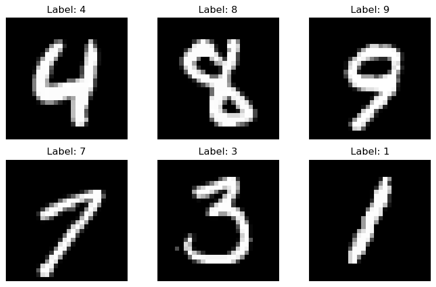

**********************
Neural Network Example
**********************

.. meta::
   :description: GAMSPy User Guide
   :keywords: Machine Learning, User, Guide, GAMSPy, gamspy, GAMS, gams, mathematical modeling, sparsity, performance

Our goal in implementing ML-related features was to provide maximum flexibility.
Although GAMSPy’s primary purpose is not neural network training, we wanted to
demonstrate the process for those who are curious or need it for research.
Implementing a "Mini-Batch Gradient Descent" training process would be very
time-consuming and result in a non-introductory example. Therefore, we
implemented a method that trains using just a single mini-batch of data,
stopping after one mini-batch.

We will train a neural network to classify handwritten digits from MNIST
dataset.

Feed-forward Neural Network
===========================
For this example we will use a simple feed-forward network since it is
easier to implement and demonstrate. Our neural network has flattened images
in the input layer, resulting in a 28x28 = 784 dimension. We will use a single
hidden layer with 20 neurons, and the output layer will have 10 neurons
corresponding to 10 digits.

We start with the imports:

.. code-block:: python

   import sys

   from collections import Counter

   import gamspy as gp
   import gamspy.math
   import numpy as np
   import pandas as pd
   import torch

   from gamspy.math.matrix import dim
   from torchvision import datasets, transforms

Even though, we won't use PyTorch for training the neural network, it is still
useful for loading sample training data.

Next we define `datasets and dataloaders <https://pytorch.org/tutorials/beginner/basics/data_tutorial.html>`_ :

.. code-block:: python

   hidden_layer_neurons = 20

   torch.manual_seed(7)
   np.random.seed(7)

   train_kwargs = {'batch_size': 500} # should be multiple of 10
   test_kwargs = {'batch_size': 128}

   mean = (0.1307,)
   std = (0.3081,)

   transform = transforms.Compose([
       transforms.ToTensor(),
       transforms.Normalize(mean, std)
       ])

   train_dataset = datasets.MNIST('../data', train=True, download=True, transform=transform)
   test_dataset = datasets.MNIST('../data', train=False, transform=transform)

   train_loader = torch.utils.data.DataLoader(train_dataset, **train_kwargs)
   test_loader = torch.utils.data.DataLoader(test_dataset, **test_kwargs)

   def get_balanced_batch(train_loader, sample_size):
       counts = [0] * 10
       good_data = []
       good_target = []
       finished = 0

       for data, target in train_loader:
           for row, row_label in zip(data, target):
               if counts[row_label.item()] < sample_size:
                   good_data.append(row)
                   good_target.append(row_label)
                   counts[row_label.item()] += 1
                   if [row_label.item()] == 10:
                       finished += 1

               if finished == 10:
                   break

       return torch.stack(good_data), torch.stack(good_target)

We are loading MNIST dataset since it's input size is not too large. The MNIST
dataset consists of handwritten digits that are 28x28 in size. Examples are
grayscale. Here are some examples:

MNIST from:
LeCun, Yann, et al. "Gradient-based learning applied to document recognition."
Proceedings of the IEEE 86.11 (1998): 2278-2324.

In this example, we load only one batch of data, ensuring that each digit is
equally represented, with 10 instances of each. If we were not limiting it to a
single batch, this equal representation would not be necessary. This is
achieved by ``get_balanced_batch`` method.

Properly initializing weights is crucial for gradient descent, and this remains
true when using a non-linear solver to optimize the neural network. Without
good initial weights, the solver may take much longer to optimize or might even
fail to improve. Therefore, we define our method for weight initialization,
using `Xavier initialization <https://proceedings.mlr.press/v9/glorot10a.html>`_.

.. code-block:: python

   def uniform_xavier_init(n_input: int, n_output: int, gain: float) -> np.ndarray:
       # also https://pytorch.org/docs/stable/nn.init.html#torch.nn.init.xavier_uniform_
       a = gain * np.sqrt(6 / (n_input + n_output))
       return np.random.uniform(-a, a, (n_input, n_output))

   w1_data = uniform_xavier_init(784, hidden_layer_neurons, 5/3)
   w2_data = uniform_xavier_init(hidden_layer_neurons, 10, 1)

``w1_data`` contains the weights for the first linear layer, and ``w2_data``
contains the weights for the second linear layer. With these weights available,
we can begin describing the neural network in GAMSPy.

Let's start by defining our variables:

.. code-block:: python

   batch = train_kwargs["batch_size"]

   # Create a container
   m = gp.Container()

   w1 = gp.Variable(m, name="w1", domain=dim(w1_data.shape))
   w1.setRecords(w1_data)
   w1.lo[...] = -5
   w1.up[...] = 5

   w2 = gp.Variable(m, name="w2", domain=dim(w2_data.shape))
   w2.setRecords(w2_data)
   w2.lo[...] = -5
   w2.up[...] = 5

The ``w1`` and ``w2`` variables hold the weights of the neural network. We set
upper and lower bounds on them to speed up the learning process, as proper
bounds can be beneficial. Additionally, excessively large weight values are
often indicative of overfitting.

Then we define the rest of the variables:

.. code-block:: python

   a1 = gp.Parameter(m, name="a1", domain=dim((batch, 784))) # input

   target_set = gp.Set(
       m,
       name="targets",
       domain=dim([batch, 10]),
       uels_on_axes=True
   )

   z2 = gp.Variable(m, name="z2", domain=dim((batch, hidden_layer_neurons)))
   z3 = gp.Variable(m, name="z3", domain=dim((batch, 10)))
   a2 = gp.Variable(m, name="a2", domain=dim((batch, hidden_layer_neurons)))

   loss = gp.Variable(m, name="loss")

``a1`` represents our input layer, containing a batch of images. ``target_set``
is the set that holds the expected labels for these images. ``z2`` is the
output after the first linear layer, and ``a2`` is the tanh-activated version
of ``z2``. ``z3`` is the output after the second and final linear layer.
``a3``, which we will define later, will be the log_softmax-activated version
of ``z3``, representing our log probabilities. Finally, the loss variable is
used to calculate the negative log-likelihood loss.

Now, let's define the relationships between our variables, also known as the
forward pass.

.. code-block:: python

   calc_mm_1 = gp.Equation(m, name="calc_mm_1", domain=dim((batch, hidden_layer_neurons)))
   calc_mm_1[...] = z2 == a1 @ w1

   calc_activation = gp.Equation(m, name="calc_activation", domain=dim((batch, hidden_layer_neurons)))
   calc_activation[...] = a2 == gp.math.tanh(z2)

   calc_mm_2 = gp.Equation(m, name="calc_mm_2", domain=dim((batch, 10)))
   calc_mm_2[...] = z3 == a2 @ w2

   a3, _ = gp.math.activation.log_softmax(z3)

   set_loss = gp.Equation(m, name="calc_loss")
   set_loss[...] = loss == gp.Sum(target_set[a3.domain[0], a3.domain[1]], -a3)

   train_nn = gp.Model(
        m,
        name="train",
        equations=m.getEquations(),
        problem="NLP",
        sense="min",
        objective=loss,
   )

``z2`` is defined as the input multiplied by the weights of the first linear
layer, using the ``@`` sign for :ref:`matrix-multiplication`. ``a2`` is the
:meth:`tanh <gamspy.math.tanh>` activation of ``z2``. Similarly, ``z3`` is
``a2`` multiplied by the weights of the second linear layer. Finally, we obtain
our log probabilities using the :meth:`log_softmax <gamspy.math.log_softmax>`
function. If you are curious about why we needed equations for ``tanh`` but not
for ``log_softmax``, you can refer to our :ref:`activation-functions` section.
We then calculate the negative log likelihood loss by summing up the negative
log probabilities of the expected neurons in the output layer for each batch.

We define ``train_nn`` with the objective of minimizing the loss function based
on the equations we provided. This problem is classified as an NLP (Nonlinear
Programming) problem.

So far, we have defined our model in GAMSPy and created data loaders. However,
our model is not yet loaded with data. We will address that next.

.. code-block:: python

   data, target = get_balanced_batch(train_loader, batch // 10)
   data = data.reshape(batch, -1)
   init_data = data.detach().numpy()

   # reshape the target, labels, so that we can provide them to GAMSPy
   target_df = pd.DataFrame(target)
   target_df["val"] = 1
   target_df = target_df.pivot(columns=[0], values="val").fillna(0).astype(bool)

   a1.setRecords(init_data)
   target_set.setRecords(target_df, uels_on_axes=True)

   z2_data = init_data @ w1.toDense()
   z2.setRecords(z2_data)

   a2_data = np.tanh(z2_data)
   a2.setRecords(a2_data)

   z3_data = a2_data @ w2.toDense()
   z3.setRecords(z3_data)

We obtain a **single** batch of data and format it to be compatible with GAMSPy.
Next, we set our input ``a1`` and labels ``target_set``. While we could stop
here, our experiments show that providing the solver with good initial
values for every variable significantly speeds up training.

Finally, we start training:

.. code-block:: python

   train_nn.solve(
       solver='conopt',
       output=sys.stdout,
   )

For this example, we picked `Conopt <https://conopt.gams.com/>`_.
You can choose any nonlinear solver; however, selecting a local nonlinear
solver might be wise since finding a globally optimal solution could lead to
severe overfitting and is extremely challenging.

.. code-block:: none

   ...
   CONOPT 4         50.3.0 5a352073 Jul 30, 2025          LEG x86 64bit/Linux
   C O N O P T   version 4.37
   Copyright (C) GAMS Software GmbH
                 GAMS Development Corporation

   Will use up to 4 threads.

   The user model has 30001 constraints and 45881 variables
   with 8130501 Jacobian elements, 260000 of which are nonlinear.
   The Hessian of the Lagrangian has 15000 elements on the diagonal,
   122500 elements below the diagonal, and 25200 nonlinear variables.

   Iter Phase   Ninf   Infeasibility   RGmax      NSB   Step  InItr MX OK
      0   0          1.3114504934E+04 (Input point)

   The post-triangular part of the model has 30001 constraints and variables.

   Preprocessed model has no constraints and 15880 variables.

   Iter Phase   Ninf   Infeasibility   RGmax      NSB   Step  InItr MX OK
                     0.0000000000E+00 (Full preprocessed model)
                     0.0000000000E+00 (After scaling)

   ** Feasible solution. Value of objective =    1268.79215357

    Iter Phase   Ninf     Objective     RGmax      NSB   Step  InItr MX OK
       1   4          7.9480833012E+02 5.4E+01   15880 1.0E+00     2 F  T
       2   4          6.3703062619E+02 4.3E+01   15880 6.6E-01     2 F  T
       3   4          5.1730468682E+02 3.1E+01   15880 4.9E-01     3 F  T
       4   4          4.2877298531E+02 3.4E+01   15880 1.0E+00     2 F  T
       5   4          4.0455589931E+02 2.4E+01   15880 6.4E-01     1 F  T
       6   4          3.0516840899E+02 2.4E+01   15880 2.4E-01     4 F  T
       7   4          2.6072377008E+02 2.4E+01   15880 5.6E-02     3 F  T
       8   4          2.2009534240E+02 2.7E+01   15880 2.2E-01     3 F  T
       9   4          1.8674435558E+02 2.7E+01   15880 6.9E-01     2 F  T
      10   4          1.2090601386E+02 1.7E+01   15880 3.4E-01     4 F  T

    Iter Phase   Ninf     Objective     RGmax      NSB   Step  InItr MX OK
      11   4          9.5285144244E+01 1.4E+01   15880 6.0E-01     3 F  T
      12   4          8.6722139688E+01 9.7E+00   15880 4.0E-03    25 F  T
      13   4          6.5546219326E+01 1.1E+01   15880 1.0E+00     9 F  T
      14   4          4.5501230397E+01 7.0E+00   15880 6.6E-01     3 F  T
      15   4          2.9958480845E+01 5.8E+00   15880 5.4E-01     7 F  T
      16   4          2.2066082695E+01 6.2E+00   15880 5.2E-01     5 F  T
      17   4          1.6801705243E+01 3.6E+00   15880 1.8E-01    12 F  T
      18   4          1.2218322153E+01 3.7E+00   15880 1.0E+00     3 F  T
      19   4          8.8761584923E+00 4.1E+00   15880 2.1E-01     9 F  T
      20   4          6.4697692798E+00 3.8E+00   15880 1.0E+00     4 F  T

    Iter Phase   Ninf     Objective     RGmax      NSB   Step  InItr MX OK
      21   4          4.4806826778E+00 1.4E+00   15880 2.1E-01    12 F  T
      22   4          3.5702970824E+00 1.9E+00   15880 4.1E-01     7 F  T
      23   4          2.6617260967E+00 2.2E+00   15880 1.0E+00     4 F  T
      24   4          1.5591133598E+00 5.3E-01   15880 4.4E-01    10 F  T
      25   4          1.0895366071E+00 6.6E-01   15880 1.0E+00     5 F  T
      26   4          9.2131860350E-01 2.4E-01   15880 2.4E-02    14 F  T
      27   4          7.0704833407E-01 3.1E-01   15880 1.0E+00     3 F  T
      28   4          6.0728995605E-01 1.7E-01   15880 1.1E-02    25 F  T
      29   4          5.0301240915E-01 1.8E-01   15880 2.0E-01     9 F  T
      30   4          4.3518414509E-01 1.5E-01   15880 1.3E-01    14 F  T

    Iter Phase   Ninf     Objective     RGmax      NSB   Step  InItr MX OK
      31   4          3.4182763503E-01 1.3E-01   15880 3.1E-01     8 F  T
      32   4          2.6180229003E-01 1.8E-01   15880 6.0E-01     6 F  T
      33   4          2.2488788314E-01 1.0E-01   15880 3.5E-01     4 F  T
      34   4          8.2170876460E-02 1.2E-01   15880 1.0E+00    19 F  T
      35   4          7.8156727787E-02 7.2E-02   15880 2.4E-02    17 F  T
      36   4          2.9215108676E-02 6.5E-02   15880 1.0E+00    19 F  T
      37   4          1.6476352179E-02 2.5E-02   15880 1.0E+00    11 F  T
      38   4          1.5806302678E-02 8.3E-03   15880 1.3E-02    16 F  T
      39   4          1.5039449389E-02 8.3E-03   15880 6.7E-03    26 F  T
      40   4          1.1805048591E-02 7.0E-03   15880 7.0E-01     8 F  T

    Iter Phase   Ninf     Objective     RGmax      NSB   Step  InItr MX OK
      41   4          1.0709580500E-02 5.1E-03   15880 1.2E-01     8 F  T
      42   4          8.1725246609E-03 5.2E-03   15880 2.3E-01    21 F  T
      43   4          8.0942821370E-03 4.4E-03   15880 5.2E-04    20 F  T
      44   4          6.3004269825E-03 4.4E-03   15880 3.8E-01    10 F  T
      45   4          4.1778350811E-03 4.0E-03   15880 2.5E-01    16 F  T
      46   4          2.5334705070E-03 3.4E-03   15880 1.0E+00    10 F  T
      47   4          2.3896586290E-03 1.3E-03   15880 3.2E-03    14 F  T
      48   4          2.3497057462E-03 1.3E-03   15880 1.0E-03    20 F  T
      49   4          2.0465050059E-03 1.3E-03   15880 6.0E-02    11 F  T
      50   4          9.0459121006E-04 1.3E-03   15880 1.0E+00    19 F  T

    Iter Phase   Ninf     Objective     RGmax      NSB   Step  InItr MX OK
      51   4          7.6421461815E-04 5.0E-04   15880 2.7E-01    21 F  T
      52   4          5.5603019205E-04 8.6E-04   15880 1.0E+00     3 F  T
      53   4          4.9514237667E-04 3.1E-04   15880 1.2E-01     1 F  T
      54   4          3.9356203057E-04 2.0E-04   15880 1.7E-01    24 F  T
      55   4          3.0287011909E-04 2.0E-04   15880 2.3E-01    19 F  T
      56   4          2.9704041784E-04 2.6E-04   15880 3.7E-03    34 F  T
      57   4          1.6991249844E-04 2.5E-04   15880 1.0E+00    15 F  T
      58   4          1.4060212557E-04 9.5E-05   15880 1.9E-01    20 F  T
      59   4          9.9018352270E-05 8.3E-05   15880 1.0E+00     6 F  T
      60   4          6.7376892616E-05 3.4E-05   15880 2.7E-01    21 F  T

    Iter Phase   Ninf     Objective     RGmax      NSB   Step  InItr MX OK
      61   4          6.1554147788E-05 2.6E-05   15880 1.5E-02    22 F  T
      62   4          4.5489449921E-05 2.5E-05   15880 6.1E-01    18 F  T
      63   4          3.6545511325E-05 4.6E-05   15880 1.0E+00     4 F  T
      64   4          3.5892981060E-05 1.6E-05   15880 2.7E-03     1 F  T
      65   4          2.4897946851E-05 1.7E-05   15880 1.0E+00     8 F  T
      66   4          2.1156176892E-05 1.6E-05   15880 1.0E+00     3 F  T
      67   4          1.9675296802E-05 6.5E-06   15880 3.8E-03     1 F  T
      68   4          1.6978461996E-05 3.8E-06   15880 9.9E-02    19 F  T
      69   4          1.0952386528E-05 7.4E-06   15880 4.2E-01    18 F  T
      70   4          1.0167424637E-05 6.1E-06   15880 3.5E-02    14 F  T

    Iter Phase   Ninf     Objective     RGmax      NSB   Step  InItr MX OK
      71   4          9.9907088504E-06 6.2E-06   15880 1.8E-03    31 F  T
      72   4          5.7163009544E-06 6.1E-06   15880 1.0E+00    17 F  T
      73   4          5.4233103235E-06 2.2E-06   15880 1.9E-02    43 F  T
      74   4          2.7513649421E-06 2.2E-06   15880 1.0E+00    19 F  T
      75   4          9.7835780721E-07 8.2E-07   15880 1.0E+00    18 F  T
      76   4          9.5771803288E-07 3.2E-07   15880 2.7E-03    21 F  T
      77   4          5.8858897134E-07 3.3E-07   15880 1.0E+00     8 F  T
      78   4          5.5434200164E-07 1.5E-07   15880 1.0E+00     1 F  T
      79   4          5.5434200164E-07 8.3E-08   15880

We can visualize the loss per iteration:

Let's calculate the accuracy on the batch we trained:

.. code-block:: python

   output = np.tanh(init_data @ w1.toDense()) @ w2.toDense()

   pred = output.argmax(axis=1)
   acc = 100 * (sum([1 if pl == rl.item() else 0 for pl, rl in zip(pred, target)]) / len(pred))
   print("Training batch accuracy: ({:.0f}%)".format(acc))

.. code-block:: none

   Training batch accuracy: (100%)

As you can see, we achieved 100% accuracy on the batch we trained. Overfitting
on a small batch is typically done to verify that training is proceeding as
expected. In this case, we did it because starting training on another batch
and stopping the solver before overfitting occurs would be too advanced for an
introductory example. Now, let’s test our network on the test set:

.. code-block:: python

   def test(w1_data, w2_data, test_loader):
       test_loss = 0
       correct = 0
       for data, target in test_loader:
           data, target = data, target
           data = data.reshape(data.shape[0], -1)
           output = (np.tanh(data @ w1_data)) @ w2_data
           pred = output.argmax(dim=1, keepdim=True)  # get the index of the max logit
           correct += pred.eq(target.view_as(pred)).sum().item()

       print('\nTest set accuracy: {}/{} ({:.0f}%)\n'.format(
           correct, len(test_loader.dataset),
           100. * correct / len(test_loader.dataset)))

   test(w1.toDense(), w2.toDense(), test_loader)

.. code-block:: none

   Test set accuracy: 8122/10000 (81%)

We reached 81% accuracy on the test set and demonstrated the flexibility
of GAMSPy by training a simple neural network. For research purposes and
curious users, it is interesting to see how black-box solvers can handle
neural network training.

Convolutional Neural Network
============================

We can have a similar example that uses convolutional neural networks.
Let's start by copying the common code from the previous example:

.. code-block:: python

   import sys

   import gamspy as gp
   import gamspy.math
   import numpy as np
   import pandas as pd
   import torch
   import torch.nn as nn
   from gamspy.math.matrix import dim
   from torchvision import datasets, transforms

   torch.manual_seed(7)
   np.random.seed(7)

   train_kwargs = {'batch_size': 500} # should be multiple of 10
   test_kwargs = {'batch_size': 128}

   mean = (0.1307,)
   std = (0.3081,)

   transform = transforms.Compose([
       transforms.ToTensor(),
       transforms.Normalize(mean, std)
       ])

   train_dataset = datasets.MNIST('../data', train=True, download=True, transform=transform)
   test_dataset = datasets.MNIST('../data', train=False, transform=transform)

   train_loader = torch.utils.data.DataLoader(train_dataset, **train_kwargs)
   test_loader = torch.utils.data.DataLoader(test_dataset, **test_kwargs)

   batch = train_kwargs["batch_size"]
   def get_balanced_batch(train_loader, sample_size):
       counts = [0] * 10
       good_data = []
       good_target = []
       finished = 0

       for data, target in train_loader:
           for row, row_label in zip(data, target):
               if counts[row_label.item()] < sample_size:
                   good_data.append(row)
                   good_target.append(row_label)
                   counts[row_label.item()] += 1
                   if [row_label.item()] == 10:
                       finished += 1

               if finished == 10:
                   break

       return torch.stack(good_data), torch.stack(good_target)

We will use `formulations` to define formulations needed by our CNN. Just to have an
idea about how it would look like in PyTorch, you can look at the following code:

.. code-block:: python

   class Flatten(torch.nn.Module):
       def __init__(self, dims_to_flatten: list[int]):
           super().__init__()
           self.dims_to_flatten = dims_to_flatten

       def forward(self, x):
           return torch.flatten(
               x,
               self.dims_to_flatten[0],
               self.dims_to_flatten[-1]
           )

   torch_model = nn.Sequential(
       nn.Conv2d(1, 2, 5),
       nn.Tanh(),
       nn.AvgPool2d(2),
       nn.Conv2d(2, 3, 5),
       nn.Tanh(),
       nn.AvgPool2d(2),
       nn.Conv2d(3, 10, 4),
       Flatten([1, 2, 3])
   )

We define the corresponding formulations:

.. code-block:: python

   m = gp.Container()

   # create formulations
   avg_pool = gp.formulations.AvgPool2d(m, 2)

   conv1 = gp.formulations.Conv2d(m, 1, 2, 5)
   conv1.make_variable(init_weights=True)

   conv2 = gp.formulations.Conv2d(m, 2, 3, 5)
   conv2.make_variable(init_weights=True)

   conv3 = gp.formulations.Conv2d(m, 3, 10, 4)
   conv3.make_variable(init_weights=True)

Since we use the `formulations` all we need to define is the input variable and the
loss variable. The rest of the variables will be declared and defined by the formulations
we use.

.. code-block:: python

   a1 = gp.Parameter(m, name="a1", domain=dim((batch, 1, 28, 28))) # input
   z2, _ = conv1(a1)

   a2, _ = gamspy.math.activation.tanh(z2)
   a2.lo[...] = "-inf" # in these cases, we do not need implied bounds
   a2.up[...] = "inf"

   z3, _ = avg_pool(a2)
   z4, _ = conv2(z3)
   a4, _ = gamspy.math.activation.tanh(z4)
   a4.lo[...] = "-inf"
   a4.up[...] = "inf"

   z5, _ = avg_pool(a4)
   z6, _ = conv3(z5)
   output, _ = gp.formulations.flatten_dims(z6, [1, 2, 3])

   target_set = gp.Set(
       m,
       name="targets",
       domain=dim([batch, 10]),
       uels_on_axes=True
   )

   loss = gp.Variable(m, name="loss")

Formulations return output variable and the list of equations, hence the repeating
`var_name, _ = convn(...)`. We ignore the returned list of equations because in this
example, we will use all the generated equations and we do not need to pick certain
ones.

Since formulations also take care of the most of the eqations, we need to just define
loss function.

.. code-block:: python

   log_probs, _ = gamspy.math.activation.log_softmax(output)

   set_loss = gp.Equation(m, name="calc_loss")
   set_loss[...] = loss == gp.Sum(target_set[log_probs.domain[0], log_probs.domain[1]], -log_probs)

   train_nn = gp.Model(
        m,
        name="train",
        equations=m.getEquations(),
        problem="NLP",
        sense="min",
        objective=loss,
   )

Let's load our model with data and start training:

.. code-block:: python

   data, target = get_balanced_batch(train_loader, batch // 10)
   init_data = data.detach().numpy()

   # reshape the target, labels, so that we can provide them to GAMSPy
   target_df = pd.DataFrame(target)
   target_df["val"] = 1
   target_df = target_df.pivot(columns=[0], values="val").fillna(0).astype(bool)

   a1.setRecords(init_data)
   target_set.setRecords(target_df, uels_on_axes=True)

   train_nn.solve(
       solver='conopt',
       output=sys.stdout,
   )

We will not wait until the global optimum is reached but break the training in between:

.. code-block::
   
       CONOPT 4         50.4.0 c55df396 Aug 12, 2025          LEG x86 64bit/Linux    
    
       C O N O P T   version 4.37
       Copyright (C) GAMS Software GmbH
                     GAMS Development Corporation
    
       Will use up to 4 threads.
    
    
       The user model has 1527001 constraints and 1527696 variables
       with 28083501 Jacobian elements, 10802000 of which are nonlinear.
       The Hessian of the Lagrangian has 677000 elements on the diagonal,
       5062500 elements below the diagonal, and 845630 nonlinear variables.
    
       Iter Phase   Ninf   Infeasibility   RGmax      NSB   Step  InItr MX OK
          0   0          2.5091871555E+05 (Input point)
    
       The post-triangular part of the model has 1527001 constraints and variables.
    
       Preprocessed model has no constraints and 695 variables.
    
       Iter Phase   Ninf   Infeasibility   RGmax      NSB   Step  InItr MX OK
                         0.0000000000E+00 (Full preprocessed model)
                         0.0000000000E+00 (After scaling)
    
    ** Feasible solution. Value of objective =    1149.05219597
    
       Iter Phase   Ninf     Objective     RGmax      NSB   Step  InItr MX OK
          1   4          1.0630657623E+03 1.8E+01     695 4.8E-02    25 F  T
          2   4          6.7418753792E+02 1.8E+02     695 6.6E-01    19 F  T
          3   4          4.0736035285E+02 7.3E+01     695 1.0E+00    20 F  T
          4   4          2.2923161526E+02 8.8E+01     695 1.0E+00    17 F  T
          5   4          1.2657426225E+02 4.1E+01     695 1.0E+00    22 F  T
          6   4          5.2481273660E+01 5.2E+01     695 1.0E+00    16 F  T
          7   4          4.7678172951E+01 3.1E+01     695 3.6E-04    24 F  T
          8   4          4.4340661314E+01 3.6E+01     695 1.7E-02    14 F  T
          9   4          4.2112698991E+01 4.5E+01     695 1.9E-02     5 F  T
    
    ** User Interrupt.
    
   --- Reading solution for model train
   --- _so0O_AQST0e5md_9iKZOnQ.gms(815) 1827 Mb  34 secs
   --- Executing after solve: elapsed 0:00:44.966
   --- _so0O_AQST0e5md_9iKZOnQ.gms(816) 1827 Mb
   --- _so0O_AQST0e5md_9iKZOnQ.gms(874) 1827 Mb
   --- GDX File /tmp/tmp0jbosfgf/_so0O_AQST0e5md_9iKZOnQout.gdx
   *** Status: Normal completion
   --- Job _so0O_AQST0e5md_9iKZOnQ.gms Stop 08/18/25 16:30:52 elapsed 0:00:45.332
   [MODEL - WARNING] The solve was interrupted! Solve status: UserInterrupt. For further information, see https://gamspy.readthedocs.io/en/latest/reference/gamspy._model.html#gamspy.SolveStatus.

Let's test the accuracy by utilizing the Sequential module:

.. code-block:: python

   my_weights = {
       '0.weight': torch.tensor(conv1.weight.toDense()),
       '0.bias': torch.tensor(conv1.bias.toDense()),
       '3.weight': torch.tensor(conv2.weight.toDense()),
       '3.bias': torch.tensor(conv2.bias.toDense()),
       '6.weight': torch.tensor(conv3.weight.toDense()),
       '6.bias': torch.tensor(conv3.bias.toDense()),
   }

   torch_model.load_state_dict(my_weights)

   def test(test_loader):
       test_loss = 0
       correct = 0
       with torch.no_grad():
           for data, target in test_loader:
               data, target = data, target
               output = torch_model(data)
               pred = output.argmax(dim=1, keepdim=True)  # get the index of the max logit
               correct += pred.eq(target.view_as(pred)).sum().item()

       print('\nTest set accuracy: {}/{} ({:.0f}%)\n'.format(
           correct, len(test_loader.dataset),
           100. * correct / len(test_loader.dataset)))

   test(test_loader)

   # Outputs: Test set accuracy: 8414/10000 (84%)

Depending on when you cancel the training, you might get a different test set accuracy.
The most methodical way would be doing a test/dev/train split and use development set
while training but for the case of this example we just use early termination.

Conclusion
==========

We have showcased two examples where we trained a feed-forward neural
network and a convolutional neural network. In the second example, we
utilized `formulations` since writing down convolution operation is
more involved. Although

Here are some points that can help with your research:

- Avoid initializing your weights to zero; instead, use a common initialization
  function. This is crucial for gradient descent and equally important for your
  nonlinear solver.
- Whenever possible, specify only the bounds that are not already implied, since
  redundant bounds can (and will in this case) limit solver optimizations.
- Provide initial values for your variables to prevent the solver from wasting
  time on forward propagation alone.
- Unlike other optimization problems, you don't need very strict tolerances for
  feasibility and optimality.

What would be the next steps:

- Using Convolutional Neural Networks (CNNs) can reduce the number of weights,
  allowing for larger batch sizes.
- You can train on multiple batches, but ensure that the solver does not
  overfit to the batch you are training. Also, remember to update the initial
  values for layers (e.g., ``z2``, ``a2``, etc.) when you change the input.

