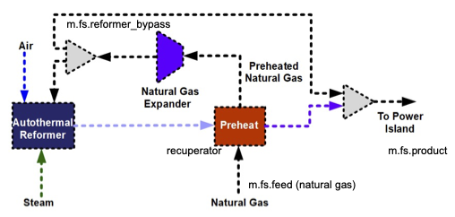

*****************************
Auto-Thermal Reformer Example
*****************************

.. meta::
   :description: Auto-Thermal Reformer Example in GAMSPy
   :keywords: Auto-Thermal Reformer, Example, GAMSPy, gamspy, GAMS, gams, mathematical modeling, sparsity, performance, neural networks, surrogate models, chemical engineering

.. note::
   This example is adapted from the `OMLT (Optimization and Machine Learning Toolkit) <https://omlt.readthedocs.io/en/latest/>`_
   project's auto-thermal reformer example. The original example can be found in their 
   `GitHub repository <https://github.com/cog-imperial/OMLT/blob/main/docs/notebooks/neuralnet/auto-thermal-reformer-relu.ipynb>`_.
   We have modified it to use GAMSPy instead of Pyomo/OMLT while maintaining the same 
   core functionality and approach.

Machine learning surrogate models are becoming increasingly important in chemical 
engineering applications. They can replace complex, computationally expensive 
process models with simpler, faster approximations while maintaining acceptable 
accuracy.

In this example, we demonstrate how to create and use a neural network 
surrogate model for an auto-thermal reformer process using GAMSPy.

  Reformer process as modeled in `IDAES <https://idaes-pse.readthedocs.io/en/latest/>`_

*Learn more about auto-thermal reformers* `here <https://en.wikipedia.org/wiki/Autothermal_reforming>`_.

*To follow along with this example, you can download the dataset used*
:download:`data <../_data/reformer.csv>`.

The Auto-thermal Reformer Process
=================================

An auto-thermal reformer **(ATR)** is a key component in many chemical processes, particularly 
in hydrogen and syngas production. It combines two processes:

1. **Partial Oxidation**: Where natural gas reacts with oxygen
2. **Steam Reforming**: Where natural gas reacts with steam

These combined reactions produce a mixture of hydrogen, carbon monoxide, and other gases.
The process is "*auto-thermal*" because the heat released by the partial oxidation reaction
provides the energy needed for the steam reforming reaction.

In our example, we have data from a detailed process model with the following:

- **Input variables**: 
  
  - Bypass Fraction (fraction of natural gas that bypasses the reformer, range: 0-1).
  - Natural Gas to Steam Ratio (molar ratio of natural gas to steam feed).

- **Output variables**:
  
  - Steam Flow
  - Reformer Duty
  - Outlet stream composition:
    
    * **AR** (Argon)
    * **C2H6** (Ethane)
    * **C3H8** (Propane)
    * **C4H10** (Butane)
    * **CH4** (Methane)
    * **CO** (Carbon Monoxide)
    * **CO2** (Carbon Dioxide)
    * **H2** (Hydrogen)
    * **H2O** (Water)
    * **N2** (Nitrogen)

Our goal is to train a neural network that can predict these outputs based on the 
input variables, and then use this surrogate model in an optimization problem to 
maximize hydrogen production while meeting constraints on nitrogen concentration.

Data Preparation
================

The first step in creating a surrogate model is preparing our data. This involves:

1. Loading the data
2. Normalizing the inputs and outputs
3. Setting up the data structures for training

Here's how we do this:

.. code-block:: python

   import pandas as pd
   import gamspy as gp
   
   # Define the columns in our dataset
   # These represent all the variables we're tracking in the reformer
   columns = [
       "Bypass Fraction",
       "NG Steam Ratio",
       "Steam Flow",
       "Reformer Duty",
       "AR",
       "C2H6",
       "C3H8",
       "C4H10",
       "CH4",
       "CO",
       "CO2",
       "H2",
       "H2O",
       "N2",
   ]
   
   # Separate input and output columns
   # We'll use the first two columns as inputs and the rest as outputs
   input_cols = columns[:2]  # Bypass Fraction and NG Steam Ratio
   output_cols = columns[2:]  # Everything else
   
   # Load the data from our CSV file
   df = pd.read_csv("reformer.csv", usecols=columns)
   
   # Extract input and output data into numpy arrays
   x = df[input_cols].to_numpy()
   y = df[output_cols].to_numpy()
   
   # Calculate statistics for normalization
   # Normalization is crucial for neural network training
   x_mean, x_std = x.mean(axis=0), x.std(axis=0)  # Input statistics
   y_mean, y_std = y.mean(axis=0), y.std(axis=0)  # Output statistics
   
   # Normalize the data to have zero mean and unit variance
   # This helps the neural network train more effectively
   x = (x - x_mean) / x_std  # Normalize inputs
   y = (y - y_mean) / y_std  # Normalize outputs
   
   # Record the bounds of normalized inputs
   # We'll need these later for the optimization problem
   x_lb, x_ub = x.min(), x.max()

Neural Network Training
=======================

For this example, we'll use PyTorch to train our neural network. PyTorch is a 
popular deep learning framework that provides a flexible and intuitive way to 
define and train neural networks.

Our network architecture consists of:

- **Input layer**: 2 neurons (for our 2 input variables)
- **4 hidden layers**: 10 neurons each
- **Output layer**: 12 neurons (for our 12 output variables)
- ReLU activation functions between layers

**ReLU (Rectified Linear Unit)** is a common activation function that helps neural 
networks learn non-linear relationships. It's defined as:

.. math::

   f(x) = \max(0, x)

Here's how we implement and train the network:

.. code-block:: python

   import torch
   import torch.nn.functional as F
   import torch.optim as optim
   from torch import nn
   from torch.optim.lr_scheduler import StepLR
   from torch.utils.data import DataLoader, TensorDataset
   
   # Convert numpy arrays to PyTorch tensors
   # PyTorch uses its own data types for efficient computation
   x = torch.Tensor(x)
   y = torch.Tensor(y)
   
   # Create dataset and data loader
   # DataLoader helps us batch the data for training
   my_dataset = TensorDataset(x, y)  # Combines inputs and outputs
   train_loader = DataLoader(
       my_dataset, 
       batch_size=64,  # Process 64 samples at a time
       shuffle=True    # Randomize the order of samples
   )
   
   # Define the neural network architecture
   class NeuralNetwork(nn.Module):
       def __init__(self):
           super().__init__()
           # Define the layers
           self.l1 = nn.Linear(2, 10)    # Input layer: 2 -> 10
           self.l2 = nn.Linear(10, 10)   # Hidden layer 1
           self.l3 = nn.Linear(10, 10)   # Hidden layer 2
           self.l4 = nn.Linear(10, 10)   # Hidden layer 3
           self.l5 = nn.Linear(10, 12)   # Output layer: 10 -> 12
   
       def forward(self, x):
           # Define how data flows through the network
           relu = nn.ReLU()
           x = self.l1(x)     # First linear transformation
           x = relu(x)        # Apply ReLU activation
           x = self.l2(x)     # Second linear transformation
           x = relu(x)        # Apply ReLU activation
           x = self.l3(x)     # Third linear transformation
           x = relu(x)        # Apply ReLU activation
           x = self.l4(x)     # Fourth linear transformation
           x = relu(x)        # Apply ReLU activation
           x = self.l5(x)     # Final linear transformation
           return x
   
   # Define the training function
   def train(model, train_loader, optimizer, epoch):
       model.train()  # Set model to training mode
       for batch_idx, (data, target) in enumerate(train_loader):
           # Zero the parameter gradients
           optimizer.zero_grad()
           
           # Forward pass
           output = model(data)
           
           # Calculate loss (mean squared error)
           loss = F.mse_loss(output, target)
           
           # Backward pass and optimize
           loss.backward()
           optimizer.step()
           
           # Print training progress
           if batch_idx % 10 == 0:
               print(
                   f"Train Epoch: {epoch} "
                   f"[{batch_idx * len(data)}/{len(train_loader.dataset)}"
                   f"({100.0 * batch_idx / len(train_loader):.0f}%)]"
                   f"\tLoss: {loss.item():.6f}"
               )
   
   # Create and train the model
   model = NeuralNetwork()
   
   # Use Adadelta optimizer with learning rate of 1
   # Adadelta is an adaptive learning rate method
   optimizer = optim.Adadelta(model.parameters(), lr=1)
   
   # Learning rate scheduler
   # Reduces learning rate by 30% every epoch
   scheduler = StepLR(optimizer, step_size=1, gamma=0.7)
   
   # Train for 50 epochs
   for epoch in range(1, 50 + 1):
       train(model, train_loader, optimizer, epoch)
       scheduler.step()

Implementing the Neural Network in GAMSPy
=========================================

After training our neural network in PyTorch, we need to transfer it to GAMSPy 
for use in optimization. GAMSPy provides special tools to represent neural 
networks with ReLU activations as **mixed-integer programming (MIP)** formulations.

Here's how we implement the trained network in GAMSPy:

.. code-block:: python

   # Create a GAMSPy container
   # This will hold all our variables, parameters, and equations
   m = gp.Container()
   
   # Extract the weights and biases from the trained PyTorch model
   # We use torch.no_grad() because we don't need gradients anymore
   with torch.no_grad():
       # Get the ReLU formulation helper from GAMSPy
       relu = gp.math.relu_with_binary_var
   
       # Create linear layers in GAMSPy and load the weights from PyTorch
       # Each layer needs its weights and biases transferred
       lin1 = gp.formulations.Linear(m, in_features=2, out_features=10)
       lin1.load_weights(model.l1.weight.numpy(), model.l1.bias.numpy())
   
       lin2 = gp.formulations.Linear(m, in_features=10, out_features=10)
       lin2.load_weights(model.l2.weight.numpy(), model.l2.bias.numpy())
   
       lin3 = gp.formulations.Linear(m, in_features=10, out_features=10)
       lin3.load_weights(model.l3.weight.numpy(), model.l3.bias.numpy())
   
       lin4 = gp.formulations.Linear(m, in_features=10, out_features=10)
       lin4.load_weights(model.l4.weight.numpy(), model.l4.bias.numpy())
   
       lin5 = gp.formulations.Linear(m, in_features=10, out_features=12)
       lin5.load_weights(model.l5.weight.numpy(), model.l5.bias.numpy())
   
   # Define variables for the original (unnormalized) inputs
   # These are what we'll actually optimize
   a0 = gp.Variable(m, name="a0", domain=gp.math.dim([2]))
   
   # Define variables for the normalized inputs
   # These are what the neural network will use
   a1 = gp.Variable(m, name="a1", domain=gp.math.dim([2]))
   
   # Create parameters for normalization
   # These store the statistics we calculated earlier
   x_mean_par = gp.Parameter(
       m,
       name="x_mean_par",
       domain=gp.math.dim([2]),
       records=x_mean,
   )
   
   x_std_par = gp.Parameter(
       m,
       name="x_std_par",
       domain=gp.math.dim([2]),
       records=x_std,
   )
   
   y_mean_par = gp.Parameter(
       m, name="y_mean_par", domain=gp.math.dim([12]), records=y_mean
   )
   
   y_std_par = gp.Parameter(m, name="y_std_par", domain=gp.math.dim([12]), records=y_std)
   
   # Define the normalization equation
   # This converts our actual inputs to normalized inputs
   normalize_input = gp.Equation(m, name="normalize_input", domain=a0.domain)
   normalize_input[...] = a1 == (a0 - x_mean_par) / x_std_par
   
   # Set bounds on normalized inputs
   # This ensures we stay within the range of our training data
   a1.lo[...] = x_lb
   a1.up[...] = x_ub
   
   # Implement the neural network layers with ReLU activations
   # Each layer consists of a linear transformation followed by ReLU
   z2, _ = lin1(a1)    # First linear layer
   a2, _ = relu(z2)    # First ReLU activation
   
   z3, _ = lin2(a2)    # Second linear layer
   a3, _ = relu(z3)    # Second ReLU activation
   
   z4, _ = lin3(a3)    # Third linear layer
   a4, _ = relu(z4)    # Third ReLU activation
   
   z5, _ = lin4(a4)    # Fourth linear layer
   a5, _ = relu(z5)    # Fourth ReLU activation
   
   z6, _ = lin5(a5)    # Output layer (no ReLU)
   
   # Define variables for the unnormalized outputs
   # These will be our final predictions
   z7 = gp.Variable(m, name="z7", domain=z6.domain)
   
   # Define the unnormalization equation
   # This converts normalized outputs back to actual values
   unnormalize_output = gp.Equation(m, domain=z7.domain)
   unnormalize_output[...] = z7 == (z6 * y_std_par) + y_mean_par

Optimization Problem
====================

Now that we have our neural network implemented in GAMSPy, we can use it to solve
an optimization problem. Our goal is to find the operating conditions that maximize
hydrogen production while keeping nitrogen concentration below a specified threshold.

**The goal is to:**

- Maximize hydrogen production.
- Keep nitrogen concentration below a specified threshold (34% in this example).

Here's how we formulate and solve the optimization problem:

.. code-block:: python

   # Get indices for hydrogen and nitrogen in the output
   # These tell us which outputs correspond to H2 and N2
   h2_idx = output_cols.index("H2")
   n2_idx = output_cols.index("N2")
   
   # Add constraint on nitrogen concentration
   # We want to keep N2 below 34%
   eq1 = gp.Equation(m, name="n2_limit")
   eq1[...] = z7[n2_idx] <= 0.34
   
   # Create and solve the model
   model = gp.Model(
       m,
       name="thermal_reformer",
       objective=z7[h2_idx],  # Maximize hydrogen concentration
       equations=m.getEquations(),
       sense="max",
       problem="mip",  # Mixed Integer Programming problem
   )
   
   # Solve using the CPLEX solver
   model.solve(solver="cplex")
   
   # Print the results
   print("Bypass Fraction:", a0.toDense()[0])
   print("NG Steam Ratio:", a0.toDense()[1])
   print("H2 Concentration:", z7.toDense()[h2_idx])
   print("N2 Concentration:", z7.toDense()[n2_idx])

The optimization results show the optimal operating conditions for the reformer:

.. code-block:: text

   Bypass Fraction: 0.19
   NG Steam Ratio: 1.17
   H2 Concentration: 0.33
   N2 Concentration: 0.34

This solution tells us that to maximize hydrogen production while keeping nitrogen 
concentration below 0.34, we should:

1. **Use a bypass fraction of 0.19**

   - This means only **19%** of the natural gas should bypass the reformer.
   - Lower bypass generally means **more conversion to hydrogen**.

2. **Use a natural gas to steam ratio of approximately 1.17**

   - This provides enough steam for the reforming reaction
   - But not so much that it dilutes the product stream

The model predicts these conditions will achieve:

- **33.0% hydrogen concentration**
- **34.0% nitrogen concentration** (at the constraint limit)

.. note::
   The results will vary each time the model is run due to
   the stochastic nature of the neural network training.
   To avoid this, you need to fix the random seed using ``torch.manual_seed()``.

Some potential extensions of this work could include:

- Adding more operating constraints
- Considering multiple objectives (e.g., maximizing H2 while minimizing energy use)
- Incorporating economic factors
- Using larger neural networks for more complex processes

Being able to use machine learning models right inside optimization problems is one of 
the coolest things about GAMSPy, especially for chemical engineering. It means we can 
do all sorts of neat stuff - make processes work better, control them more easily, 
and find smarter ways to run chemical plants. Pretty awesome, right?
