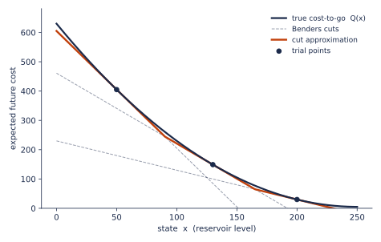
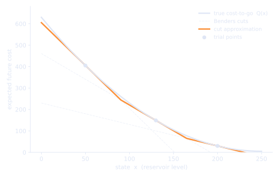
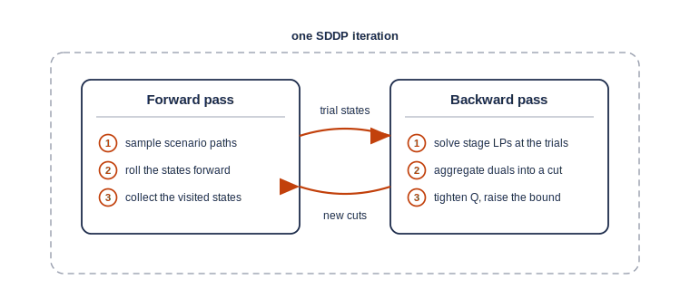
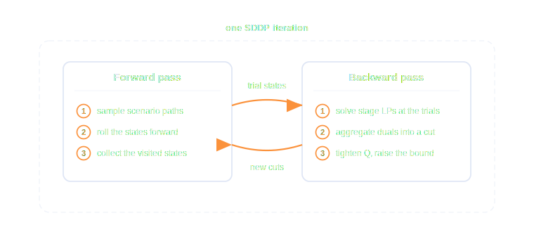

.. _sddp_how_it_works:

.. meta::
   :description: How the SDDP algorithm works: Benders cuts, the backward and forward passes, trial trajectories, and the lower bound
   :keywords: SDDP, Benders cuts, cost-to-go, backward pass, forward pass, lower bound, duals, GUSS, Pereira, Pinto, GAMSPy, gamspy

**************
How SDDP Works
**************

The :doc:`introduction <introduction>` showed the obstacle in solving a
multistage stochastic program: computing the **cost-to-go** function
:math:`Q_t(x)` exactly means enumerating an exploding scenario tree. SDDP
(Pereira and Pinto, 1991) never builds that tree. Instead it approximates the
cost-to-go from below, one linear piece at a time, and refines the
approximation only where the policy actually goes. This page works through
the algorithm as the sddp module implements it: the future-cost variable, the
cuts, the backward and forward passes, and the lower bound that measures
progress.

The future-cost variable
========================

``build()`` adds one **future-cost variable** :math:`\alpha_{t+1}` for each
stage transition in your model. It stands in for the cost-to-go
:math:`Q_{t+1}(x_t)`: the expected cost from stage :math:`t+1` onward, as a
function of the state :math:`x_t` that stage :math:`t` hands over. Every
per-stage solve then minimises

.. math::

   \underbrace{c_t(u_t, \xi_t)}_{\texttt{stage\_cost}} \;+\; \alpha_{t+1} :

the immediate cost of this stage's decision, plus the current estimate of
what the resulting state will cost later. The last stage has no future, so it
carries no :math:`\alpha` term. One :math:`\alpha` per transition is enough
because the noise is drawn fresh at every stage (stagewise independence, see
:doc:`scenarios`): the state alone carries everything the future needs to
know about the past.

At the start of training, the model knows only one thing about
:math:`\alpha_{t+1}`: it is declared nonnegative, so before any cuts exist the
future cost is estimated as zero. That is a valid under-estimate, just a
useless one. Training then adds linear constraints, the **cuts**, that push it
up toward the true function. The nonnegativity is permanent, though, not just a
starting value: the cuts only ever raise :math:`\alpha_{t+1}`, so it can
represent the cost-to-go only where that cost is itself nonnegative.

.. note::
   :math:`\alpha_{t+1} \ge 0` is a modelling requirement. It holds
   automatically when every remaining stage cost is nonnegative, as in
   ClearLake. A model whose downstream cost can turn negative (revenues,
   salvage credits, negative operating costs) must shift its stage costs by a
   valid constant to restore nonnegativity before training; otherwise the true
   cost-to-go can fall below the bound and the lower-bound guarantee fails.

Approximating the cost-to-go with cuts
======================================

For the linear stage problems SDDP targets, :math:`Q_{t+1}` is **convex** in
the state. A convex function lies above every one of its tangent planes. Each
plane is therefore a safe under-estimate, and so is the highest of any set of
planes taken together. SDDP builds its approximation exactly that way, as the
upper envelope of a growing collection of planes:

Each cut is built at a **trial state** :math:`\bar{x}`, a particular value of
the state leaving stage :math:`t`. Suppose we can compute two things there:
the expected cost-to-go itself, call it :math:`V(\bar{x})`, and its slope
:math:`g` (a subgradient), with one component :math:`g_s` per state variable
:math:`s`. Convexity then guarantees

.. math::

   Q_{t+1}(x) \;\ge\; V(\bar{x}) + \sum_s g_s\,(x_s - \bar{x}_s)
         \;=\; \underbrace{\Big(V(\bar{x}) - \sum_s g_s\,\bar{x}_s\Big)}_{\text{intercept}\ d}
               \;+\; \sum_s g_s\,x_s ,

which enters the stage-:math:`t` LP as a constraint on the future-cost
variable:

.. math::

   \alpha_{t+1} \;-\; \sum_s g_s\,x_s \;\ge\; d .

Two things are worth noting. Each cut is a single plane: the slope term sums
over *all* state variables, one slope per state, and there is one shared
intercept per cut, not one per state. And a cut can only help: adding a plane
can only raise the envelope, and every plane stays below the true function,
so the approximation improves monotonically and never over-estimates the
cost-to-go.

.. note::
   Each cut averages over all scenarios and yields one plane (the
   *single-cut* form of SDDP; other variants add one cut per scenario).
   Every cut is kept: the sddp module does no cut selection or pruning. An
   iteration adds ``n_trials`` cuts per stage transition, so a trained model
   carries at most ``n_iter * n_trials`` cuts on each :math:`\alpha_{t+1}`.

The backward pass
=================

The backward pass is where cuts are made. It walks the stages in reverse,
from the last one back to stage 2, and at each stage it computes the two
ingredients above, the value :math:`V(\bar{x})` and the slope :math:`g`. To
do that it fixes the state entering stage :math:`t+1` at the trial value
:math:`\bar{x}` and solves stage :math:`t+1` once per scenario :math:`\xi`;
the cuts already collected at the deeper stages stand in for the rest of the
future. From those scenario solves:

- the probability-weighted average of the optimal values estimates the
  expected cost-to-go, :math:`V(\bar{x}) = \sum_{\xi} p_{\xi}\, v_{\xi}`;
- fixing :math:`x_s = \bar{x}_s` gives that constraint a dual value
  (marginal) :math:`\pi_{s,\xi}` in each scenario, and the weighted dual is
  the cut slope for state :math:`s`,
  :math:`g_s = \sum_{\xi} p_{\xi}\, \pi_{s,\xi}`;
- the intercept follows, :math:`d = V(\bar{x}) - \sum_s g_s\,\bar{x}_s`.

**A cut in numbers.** Take the last stage of the :doc:`ClearLake model
<clearlake>`, ``apr``, in the first iteration, at the trial state
:math:`\bar{x} = 250` (a full reservoir). The
April inflow scenarios are :math:`-50`, :math:`100` and :math:`250` with
probabilities :math:`0.25`, :math:`0.50` and :math:`0.25`. In the dry and the
medium scenarios the stage balances the water at zero cost, so
:math:`v_{\xi} = 0` and :math:`\pi_{\xi} = 0`. In the wet scenario the stage
faces :math:`250 + 250 = 500` units of water: releasing the maximum 200 and
storing 250 still leaves 50 to spill at cost 10 each. So
:math:`v_{\xi} = 500`, and one extra unit of incoming water would mean one
more unit spilled, so :math:`\pi_{\xi} = 10`. The recipe above gives

.. math::

   V(250) = 0.25 \cdot 500 = 125, \qquad
   g = 0.25 \cdot 10 = 2.5, \qquad
   d = 125 - 2.5 \cdot 250 = -500,

and the cut :math:`\alpha_{\text{apr}} - 2.5\, L_{\text{mar}} \ge -500` now
warns the March solve: every unit of water stored beyond 200 carries an
expected flood cost of 2.5.

At the last stage, as in this example, the scenario values are exact. At
earlier stages each solve leans on the deeper stages' cuts, which
under-estimate their own cost-to-go, so each :math:`v_{\xi}` is itself an
under-estimate. The new plane therefore lies below :math:`Q_{t+1}` from the
very first iteration: cuts are safe long before the approximation has
converged.

The weight :math:`p_{\xi}` in these sums is also the only place where risk
enters the algorithm. Risk-neutral training weighs scenarios by their
probabilities. Training with ``risk=CVaR(...)`` swaps in the
Rockafellar-Uryasev weights instead, which shift mass onto the costliest
scenarios at every stage after the first (see :doc:`risk`). Nothing else in
the cut algebra changes.

.. note::
   The sddp module submits all of a stage's backward LPs, every trial point
   crossed with every scenario, as **one** batch through GUSS (the GAMS
   scenario solver). A whole stage is solved, and its duals returned, in a
   single round-trip. For ClearLake (``n_trials=2``, three scenarios) a full
   iteration is 27 small LPs in seven GUSS batches: three backward batches of
   six, one stage-1 batch of three, and three forward batches of two.

The forward pass
================

A cut is only useful at states the policy actually visits, so the forward
pass decides *where* the next cuts are made. It samples ``n_trials`` scenario
paths (one per trial point, drawn with the scenario probabilities from the
instance's ``seed``) and walks them stage by stage. Each stage is solved with
the cuts learned so far, one GUSS batch per stage, and each path's
end-of-stage state becomes its incoming state for the next stage. The states
visited on the way become the trial points of the next backward pass, so the
two passes feed each other:

The forward pass also records the realised total cost of each sampled path.
Averaged over the ``n_trials`` paths, that is the ``sim cost`` column printed
during training. It is a useful *diagnostic* of what the current policy pays,
but it averages a few random paths, so it is noisy; SDDP does not use it to
decide convergence (see the lower bound below).

Trial points: trajectories, not a grid
======================================

SDDP keeps a fixed budget of ``n_trials`` trial trajectories per iteration;
it never builds a grid over the state space. The first iteration has no
forward states yet, so it spreads the trials evenly between each state's
lower and upper bound (see :doc:`state_variables`): ClearLake's two trials
start at an empty and a full reservoir. Every later iteration **replaces**
the trials with the states the forward pass just visited, clamped back into
bounds. The number of trial trajectories therefore stays fixed however many
state variables the model has, because SDDP never forms a grid over the state
space (the work *within* each trajectory still grows with the state dimension,
as every LP fixes one more state and every cut carries one more slope). The
cuts concentrate on the region where the trained policy actually operates.

The lower bound
===============

Each iteration ends by measuring the approximation where it matters most: at
the initial state, where the true optimum is :math:`Q_1(x_0)`. The stage-1
problem is solved once per scenario, in one GUSS batch: the state is fixed at
its ``initial_state``, the scenario's noise is injected, and the cuts bound
:math:`\alpha_2`. The probability-weighted average of the optimal values is
the iteration's **lower bound**:

.. math::

   \underline{z} \;=\; \sum_{\xi} p_{\xi}\, v^{(1)}_{\xi} .

Three facts make :math:`\underline{z}` a true bound rather than an estimate.
No sampling is involved: *all* stage-1 scenarios are enumerated, with their
exact probabilities. Each :math:`v^{(1)}_{\xi}` is an under-estimate, because
the cuts never over-estimate :math:`Q_2`. And an average of under-estimates
is an under-estimate. Since cuts only accumulate, the bound can also only
rise from one iteration to the next; training even treats a falling bound as
an internal error and raises rather than report a wrong number.

.. note::
   The forward-pass ``sim cost`` is not a second bound. It averages a handful
   of random paths, its confidence interval is wide, and a stopping rule
   built on it can fire at almost any iteration; Shapiro (2011, Remark 1)
   makes this point precisely. Training therefore watches only the lower
   bound: a plateau means the approximation has stopped improving at the
   initial state, a practical stopping signal rather than a proof that the
   policy is optimal. That plateau is the basis of the ``rel_tol`` /
   ``patience`` early-stopping rule in :doc:`training`.

On ClearLake the bound climbs from 107.42 at the first iteration to its
converged value 112.3046875, where the plateau rule stops training after
eight iterations. To measure how far the trained policy actually sits above
the bound, evaluate it on fresh out-of-sample paths with
``train(gap_paths=...)``; the resulting *optimality gap* is covered in
:doc:`training` as well.

When training risk-averse, the stage-1 average keeps the plain scenario
probabilities (the standard first-stage-neutral convention, see
:doc:`risk`), and the bound then applies to the risk-adjusted objective
rather than to the expected cost.

.. _sddp_further_reading:

Further reading
===============

The algorithm on this page comes from Pereira and Pinto: forward sampling,
backward Benders cuts, and the first-stage lower bound. Shapiro's analysis
covers the statistical properties of the bounds and the risk-averse
extension.

- M. V. F. Pereira and L. M. V. G. Pinto,
  *Multi-stage stochastic optimization applied to energy planning*,
  Mathematical Programming 52 (1991) 359-375.
  `doi:10.1007/BF01582895 <https://doi.org/10.1007/BF01582895>`_
- A. Shapiro,
  *Analysis of stochastic dual dynamic programming method*,
  European Journal of Operational Research 209 (2011) 63-72.
  `doi:10.1016/j.ejor.2010.08.007 <https://doi.org/10.1016/j.ejor.2010.08.007>`_

.. seealso::
   The :doc:`introduction <introduction>` motivates the cost-to-go at a
   conceptual level; the :doc:`ClearLake tutorial <clearlake>` shows the
   lower bound climbing to its converged value; :doc:`training` covers the
   ``train()`` arguments and the optimality gap; :doc:`risk` covers CVaR.
