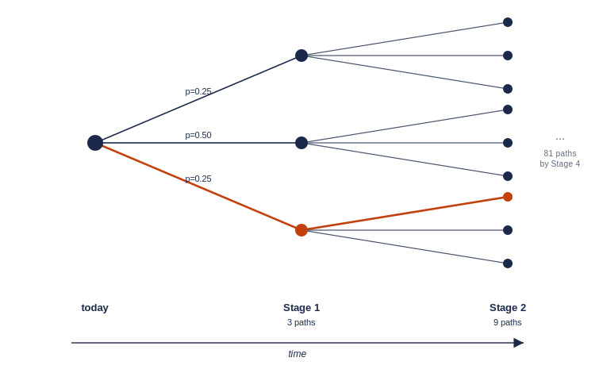
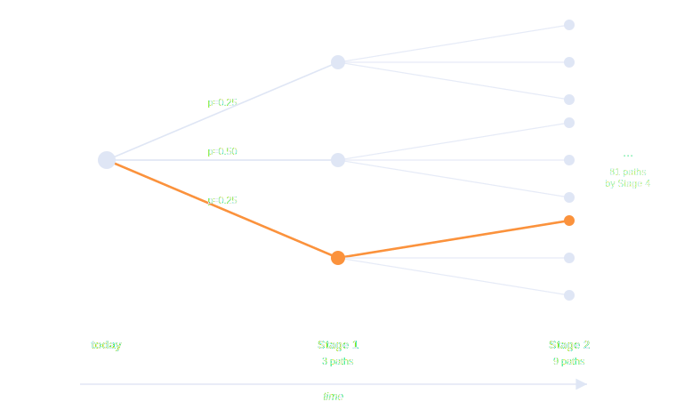

.. _sddp_introduction:

.. meta::
   :description: Introduction to Stochastic Dual Dynamic Programming (SDDP) in GAMSPy
   :keywords: SDDP, stochastic programming, multistage, cost-to-go, scenarios, GAMSPy, gamspy, GAMS, reservoir, uncertainty

************
Introduction
************

Many planning problems play out over time and under uncertainty. You make a
decision today, the world then reveals one of many possible outcomes, and
tomorrow you decide again with that new information in hand. A reservoir
operator releases water this month without knowing next month's rainfall; a
utility commits generation today without knowing tomorrow's demand. These are
*multistage stochastic* problems, and **Stochastic Dual Dynamic Programming**
(SDDP) is a method for solving them.

This page introduces the ideas behind SDDP. The :doc:`ClearLake tutorial
<clearlake>` then puts them to work on a small reservoir model you can run
end to end.

A motivating example
====================

ClearLake is a reservoir managed over four months (``jan``, ``feb``, ``mar``,
``apr``). Each month the operator chooses how much water to release, how much
to spill in a controlled flood, and how much to import to avoid running dry.
Spilling and importing are both costly, so the operator would rather do
neither. The catch is the **inflow**: the rainfall feeding the reservoir each
month is uncertain, and the decision must be made *before* it is seen.

The goal is a *policy* (a rule that, for any reservoir level and any realised
inflow, tells the operator what to do) that minimises the expected total cost
over the season.

Stages, states, and decisions
=============================

SDDP describes such a problem with three ingredients.

**Stages** are the discrete points in time at which decisions are made, the
four months of ClearLake. Stage *t* happens before stage *t+1*.

**State** is the information carried from one stage to the next. For ClearLake
it is the reservoir level: the level you end ``jan`` with is the level you
begin ``feb`` with. The state is what links the stages together: everything
the future needs to know about the past is summarised in it.

**Decisions** (or *recourse*) are the actions taken at each stage (release,
spill, import), subject to the physics of the problem (here, water balance)
and to bounds (reservoir capacity, maximum release).

Uncertainty: noise and scenarios
================================

At each stage a random **noise** is revealed: the inflow. SDDP works with a
*finite* set of possible noise outcomes per stage, called **scenarios**, each
with a probability. ClearLake uses three inflow scenarios per month, with
probabilities ``0.25``, ``0.50`` and ``0.25``.

Because a fresh outcome is drawn at every stage, the possible futures fan out
into a **scenario tree**: one outcome branches into three, each of those into
three again, and so on.

Every stage that reveals a new outcome multiplies the number of paths by *S*.
ClearLake draws a fresh inflow at each of its four stages, so the paths pile up
fast: :math:`3 \to 9 \to 27 \to 81`, giving :math:`3^4 = 81` distinct scenarios.
In general, *S* outcomes at each of *T* stages give :math:`S^T` of them, and a
year-long weekly model is astronomically larger. Enumerating the whole tree is
hopeless, and avoiding that enumeration is exactly what SDDP is for.

.. note::
   The exponent is the number of stages that carry uncertainty. ClearLake's
   first stage is itself random, so all four branch (:math:`S^4`). If instead the
   first decision is fixed before any uncertainty is revealed, as in a classic
   two-stage program (which has :math:`S` scenarios, not :math:`S^2`), the tree
   branches one fewer time, :math:`S^{T-1}`.

The cost-to-go function
=======================

The central object is the **cost-to-go** (or *value*) function
:math:`Q_t(x)`: the expected cost of operating optimally from stage *t* onward,
given that you arrive at stage *t* with state :math:`x`. It satisfies a
recursion: at each stage, given the incoming state, you pay this stage's cost
and inherit the expected cost-to-go of wherever you land:

.. math::

   Q_t(x_{t-1}) \;=\; \mathbb{E}_{\xi_t}\!\left[\;
       \min_{u_t}\; c_t(u_t, \xi_t) \;+\; Q_{t+1}(x_t)
   \;\right]
   \quad\text{s.t.}\quad x_t = f(x_{t-1}, u_t, \xi_t),

where :math:`u_t` is the stage decision, :math:`\xi_t` the realised noise, and
:math:`x_t` the outgoing state.

If we knew :math:`Q_{t+1}` exactly, every stage would be a simple one-step
optimisation. We don't: computing it exactly is the very tree explosion we
just saw. SDDP's idea is to **approximate** the cost-to-go instead.

How SDDP approximates the cost-to-go
====================================

For the convex (linear) problems SDDP targets, each :math:`Q_{t+1}` is a convex
function, and a convex function is the upper envelope of its tangent planes.
SDDP builds the cost-to-go from below, one **cut** (a supporting hyperplane) at
a time, by alternating two passes:

- a **forward pass** samples a path through the scenario tree and rolls the
  state forward, producing trial states to examine; and
- a **backward pass** solves the stage problems at those trial states and uses
  their linear-programming duals to add a new cut that tightens the
  approximation.

Each iteration also yields a **lower bound** on the optimal expected cost. As
cuts accumulate the approximation sharpens and the bound rises; when it stops
improving, the policy has converged. The exact algebra of the cuts, the bound,
and the sampling is left to the topic pages; the recursion above is all you
need to read the tutorial.

The workflow in GAMSPy
======================

The whole method lives behind the :meth:`SDDP <gamspy.formulations.SDDP>`
class. You write your stage problem as ordinary GAMSPy variables and equations,
register the state and the noise, and then:

- ``build()`` injects the SDDP machinery into your model,
- ``train()`` runs the forward/backward iterations to learn the cuts,
- ``policy()`` queries the trained policy at a single situation, and
- ``simulate()`` evaluates it on fresh Monte Carlo paths.

.. seealso::
   The :doc:`ClearLake tutorial <clearlake>` builds, trains, and queries a
   complete SDDP model in a few dozen lines.
