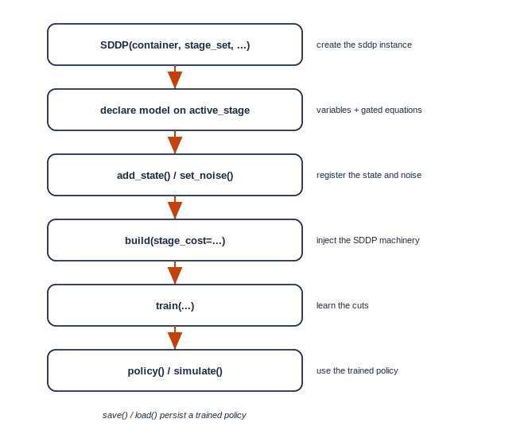
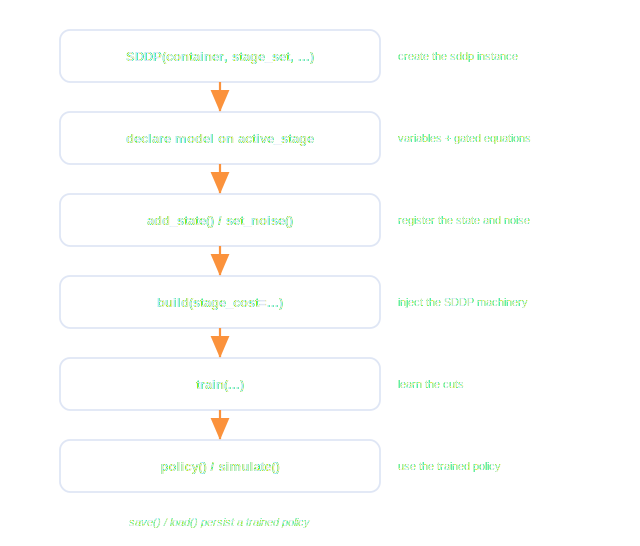

.. _sddp_workflow:

.. meta::
   :description: The SDDP workflow in GAMSPy: lifecycle, the active-stage gating pattern, build
   :keywords: SDDP, workflow, lifecycle, active stage, build, stage_cost, GAMSPy, gamspy, GAMS

*****************
The SDDP Workflow
*****************

Using SDDP in GAMSPy means writing your stage problem as an ordinary GAMSPy
model and letting an :meth:`SDDP <gamspy.formulations.SDDP>` instance drive it.
This page walks the lifecycle and the one pattern that is specific to SDDP: the
**active-stage gate**. The :doc:`ClearLake tutorial <clearlake>` shows every
step running end to end.

The lifecycle
=============

A model goes through the same sequence every time:

You create the instance first (it owns the active-stage set the equations need),
declare your variables and equations, register the state and the noise, and call
``build()``. From there ``train()`` learns the policy, and ``policy()`` /
``simulate()`` put it to work, with ``save()`` / ``load()`` to keep a trained
policy between sessions.

Creating the instance
=====================

.. code-block:: python

   sddp = SDDP(container, stage_set=t, n_trials=5, seed=42)

The constructor takes:

- ``container``: the ``gp.Container`` holding your symbols.
- ``stage_set``: the set of stages; its length is the number of stages.
- ``time_set``: the full time domain, only needed when each stage spans several
  time steps (see below). Defaults to ``stage_set``.
- ``n_trials``: the number of trial trajectories explored per iteration.
- ``seed``: the forward-pass sampler seed, for reproducible runs.
- ``verbose``: print one convergence row per iteration during training.

The active-stage gating pattern
===============================

SDDP solves your model **one stage at a time**. To make that possible, the
instance owns a dynamic singleton set, exposed as ``sddp.active_stage``, that
always contains exactly the stage currently being solved. You reference it in a
``.where[...]`` clause on every stage-indexed equation:

.. code-block:: python

   stage = sddp.active_stage

   balance[t].where[stage[t]] = (
       L[t] - L[t.lag(1, "circular")] + R[t] + F[t] - Z[t] == precip
   )

During each per-stage solve the engine flips ``active_stage`` to the current
stage, so only that stage's equations are active. You never assign to it
yourself; you only read it in the gate.

.. note::
   ``active_stage`` holds **one** stage at a time, never "all stages" or "all
   but the first". Gating every stage-indexed equation on it is what lets the
   same algebra serve every stage in turn.

Stages and a finer time grid
============================

By default each stage is a single time step, so ``stage_set`` is all SDDP needs.
Some models carry several time steps inside one stage, for example hourly
detail within a weekly stage. In that case pass the full time domain as
``time_set``; its length must be a whole multiple of the number of stages, and
the state is linked across the *last* time step of each stage.

Building the model
==================

.. code-block:: python

   sddp.build(stage_cost=cost)

``build()`` injects the SDDP machinery (the future-cost variable, the cut
constraints, and the batch-solve scaffolding) into your container. Two things
to know:

- ``stage_cost`` is the variable holding the **per-stage operational cost only**,
  without any future-cost term. SDDP adds the future cost itself. At least one of
  your equations must define ``stage_cost``, or ``build()`` raises.
- ``equations`` defaults to every equation in the container; pass an explicit
  list to include only some.

``build()`` is a one-shot step: ``add_state()`` and ``set_noise()`` must come
before it, and cannot be called afterwards.

Training and using the policy
=============================

With the model built, ``train()`` runs the iterations and returns a result
object carrying the lower bound and convergence history; ``policy()`` answers a
single "what should I do here?" query, and ``simulate()`` evaluates the policy
over many Monte Carlo paths. A trained instance can be written to a ``.sddp``
file with ``save()`` and reloaded with ``SDDP.load()`` for inference without
retraining.

.. seealso::
   The :doc:`ClearLake tutorial <clearlake>` runs the whole lifecycle on a
   concrete model.
