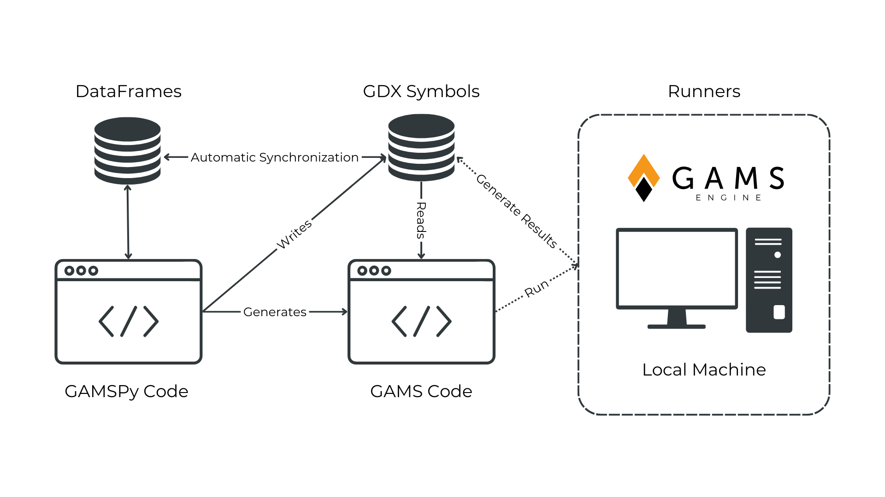

.. _whatisgamspy:

***************
What is GAMSPy?
***************

GAMSPy is a mathematical optimization package that combines the power of high performance 
GAMS execution system and flexible Python language. It is a Python library that provides GAMS 
symbols (`Set`, `Alias`, `Parameter`, `Variable`, and `Equation`) to compose mathematical 
models, and various utility functions for math and I/O operations.

Symbols are at the heart of the GAMSPy package. Each symbol is associated with
a `Container`. Every time a symbol is created, it is automatically added to the
specified container. This allows the automatic synchronization of GAMSPy dataframes
and GAMS database.

Why is GAMSPy Fast?
-------------------

`GAMSPy` generates `GAMS` code and executes it by using the `GAMS` 
backend to resolve assignment operations, generate and solve models. Since `GAMS` 
have been optimized for decades (since 1970s), and supports many solvers
that have been developed by optimization experts, it provides good performance
for model generation and solving models. This is the main source of the speed of
`GAMSPy`.

Why is GAMSPy Flexible?
-----------------------

GAMSPy opens up entirely new opportunities to streamline optimization and data pipelines:

**Seamless Pipeline Management**
- No switching of environments: Manage data preprocessing and optimization tasks within a single, intuitive environment.
- Leverage your favorite Python libraries (e.g. Numpy, Pandas, Networkx) to comfortably manipulate and visualize data.
- Import and export data and optimization results to many data formats.

**Mathematical Modeling in Python**
- Write complex mathematical models directly in Python.
- Leverage the convenience of the GAMS syntax.
- Switch to another solver with one argument.

**Different Runner Options***
You can run your model on:
- Your local machine
- GAMS Engine One (you host your own server hardware)
- GAMS Engine SASS (you don't even need to run a server. We make sure you have access to the right resources, any time.)