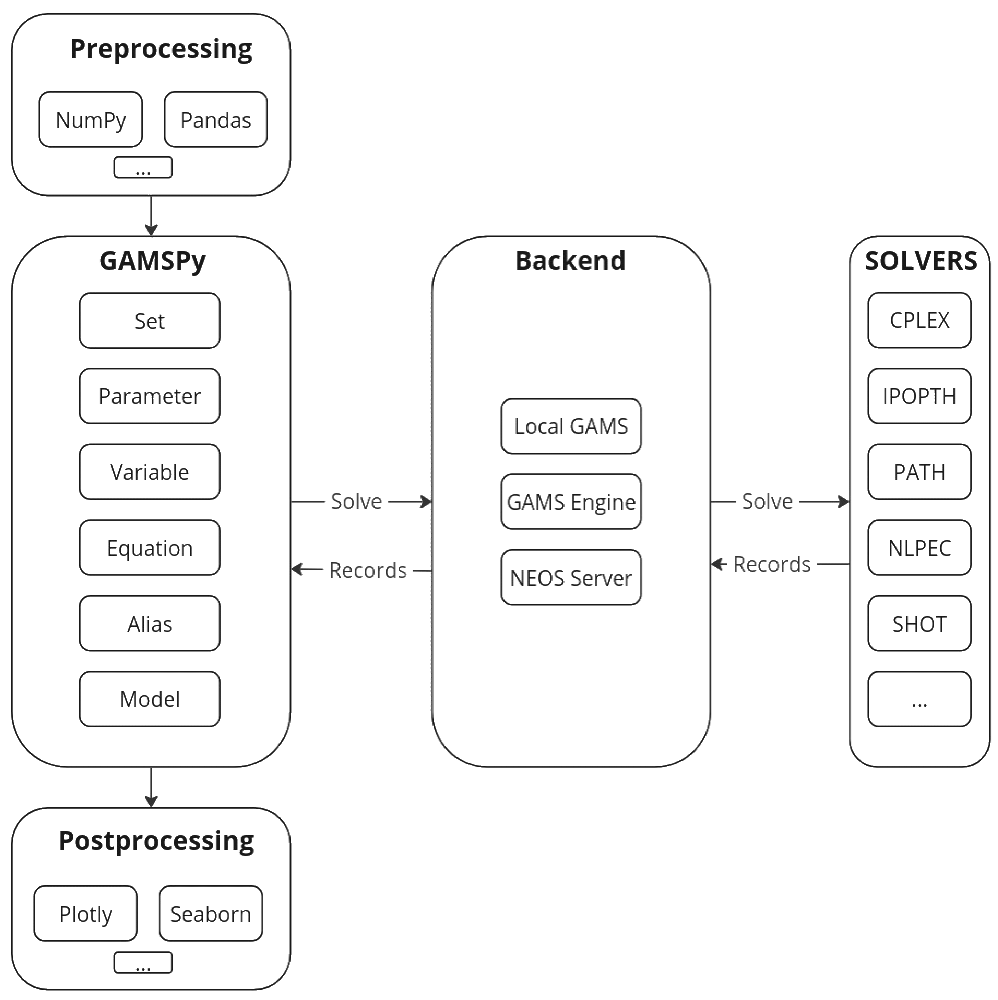

.. _whatisgamspy:

===============
What is GAMSPy?
===============

GAMSPy combines the high-performance GAMS execution system with the flexible Python language, creating 
a powerful mathematical optimization package. It serves as a bridge between the expressive Python language 
and the robust GAMS system, enabling you to create complex mathematical models effortlessly. This allows 
creating full pipelines in Python by using your favorite packages for preprocessing (e.g. data cleaning) and 
postprocessing (e.g. visualization) along with GAMSPy.

Why is GAMSPy fast?
===================

GAMSPy delegates the expensive assignment and solve statements to the GAMS execution system. Set-based operations 
are at the core of the GAMSPy and GAMS execution system. For example, in many optimization libraries, you would 
write your equations as shown in the ``Other Libraries`` block below: 

.. tab-set-code::

    .. code-block:: Other-Libraries

        import other_library as ol
        from numpy.random import uniform

        m = ol.Model()
        m.i = ol.Set(records=range(500))
        m.i = ol.Set(records=range(1000))
        data = uniform(0, 1, (500, 1000))
        data[data > 0.01] = 0
        m.a = ol.Parameter(m.i, m.j, records=data)
        m.b = ol.Parameter(m.i, records=uniform(0,1, 500))
        m.x = ol.Variable(m.i, m.j)

        def e_definition(m, i):
          return sum(m.a[i, j] * m.x[i, j] for j in m.j) >= m.b[i]
        m.e = ol.Equation(m.i, definition=e_definition)

    .. code-block:: GAMSPy

        import gamspy as gp
        from numpy.random import uniform

        m = gp.Container()
        i = gp.Set(m)
        j = gp.Set(m)
        a = gp.Parameter(m, domain=[i, j])
        b = gp.Parameter(m, domain=[i])
        x = gp.Variable(m, domain=[i, j])
        e = gp.Equation(m, domain=[i])
        e[i] = gp.Sum(j, a[i, j] * x[i, j]) >= b[i]

        data = uniform(0, 1, (500, 1000))
        data[data > 0.01] = 0
        i.setRecords(range(500))
        j.setRecords(range(1000))
        a.setRecords(data)
        b.setRecords(uniform(0, 1, 500))

With the approach of other libraries, you iterate over all items of ``I`` and ``J``. This approach has certain disadvantages:

- It can get pretty verbose for long statements with many loops which decreases the readability.
- The performance might suffer severely (depending on the implementation) if there are lots of items to iterate through since Python loops are known to be very slow.

In contrast, the GAMSPy implementation employs set-based operations, which results in:

- Concise and easier to read definitions.
- GAMSPy definitions closely resemble mathematical notation that you would put in a paper making it easier to correctly code mathematical equations.
- Great performance since the actual operation is performed by GAMS using robust and highly optimized low level code. 

.. seealso::
    `Performance in Optimization Models: A Comparative Analysis of GAMS, Pyomo, GurobiPy, and JuMP <https://www.gams.com/blog/2023/07/performance-in-optimization-models-a-comparative-analysis-of-gams-pyomo-gurobipy-and-jump/>`_

Model Instances vs. Mathematical Models
---------------------------------------

Creating robust, readable, and maintainable models is an art rooted in algebraic formulation. 
The ability to express mathematical models in a language that retains the essence of algebraic 
notation and is machine-processable is paramount. 

With this goal in mind GAMSPy has been developed to be able to generate mathematical models instead
of model instances. Think of a mathematical model as a pure representation of mathematical symbols, 
devoid of specific data. In contrast, a model instance is the unrolled and 
constant folded representation of a model with its actual data.
In a model instance, sum expressions are resolved into its individual components, and equation 
domains are resolved to individual scalar equations.

Mathematical Model

.. math::

    \sum_{i \in \mathcal{I}} \frac{p_{i,j} - q_i}{a_j} \cdot x_{i,j} \le \sum_{k \in \mathcal{K}} d_{k,j} \hspace{1cm} \forall \: j \in \mathcal{J}

Model Instance

.. math::

    5 \cdot x_{i1,j1} + 3 \cdot x_{i2,j1} + 2 \cdot x_{i3,j1} \le 7 
    
    2 \cdot x_{i1,j2} + 6 \cdot x_{i2,j2} + 4 \cdot x_{i3,j2} \le 10

Especially for complex models with many variables and equations, a model instance can become 
hard to manage. Therefore, GAMSPy leverages the concept of a standalone,
data independent, and indexed representation of a mathematical model, which is very close 
to the original mathematical algebraic formulation.

Sparsity
--------

A key aspect of any modeling language is how it handles sparse multidimensional data structures.
Many optimization problems are subject to a particular structure in which the data cube 
has a lot of zeros and only a few non-zeros, a characteristic referred to as sparsity. In 
optimization problems, it is often necessary to account for complex mappings of indices 
to subsets.

While you might be used to taking on the full responsibility to make sure only the relevant combinations
of indices go into your variable definition in the Python modeling world, we especially focused on 
transferring the convenience and mindset of GAMS into Python by designing GAMSPy. As a result, GAMSPy 
automatically takes care of generating variables only for the relevant combinations of indices based 
on the algebraic formulation. This feature is particularly useful when working with a large multidimensional 
index space, where generating all possible combinations of indices would be both computationally expensive and unnecessary. 
GAMSPy handles this task quietly in the background, allowing us to focus on the formulation of the model.

Which backends does GAMSPy support?
====================================

GAMSPy currently supports three backends: your local GAMS installation, `GAMS Engine <https://www.gams.com/sales/engine_facts/>`_ and `NEOS Server <https://neos-server.org/neos/>`_. 
The default backend is the local GAMS installation that comes with GAMSPy. With GAMS Engine backend, you can run hundreds of jobs in the cloud in parallel to speed up your pipeline. 
You can also send your jobs to the NEOS Server, a free service for solving optimization problems. Make sure you understand the `NEOS Terms of Use <https://neos-server.org/neos/termofuse.html>`_ 
before you use this backend.

GAMSPy is also integrated with `GAMS MIRO <https://www.gams.com/sales/miro_facts/>`_, allowing you to create fully interactive applications. 
The extensive visualization options in GAMS MIRO support decision-making based on optimization.

Interoperability of GAMSPy
==========================

A mathematical optimization model written with GAMSPy can be converted to GAMS or LaTeX format. Converting GAMSPy models to GAMS can be useful for rapid prototyping in GAMSPy and 
converting the model to GAMS to utilize certain features of GAMS (e.g., EMP models) that are missing in GAMSPy. GAMSPy to LaTeX conversion can be convenient for including your 
equations in an academic paper or verifying that the equations you have written match your mathematical intentions. 
